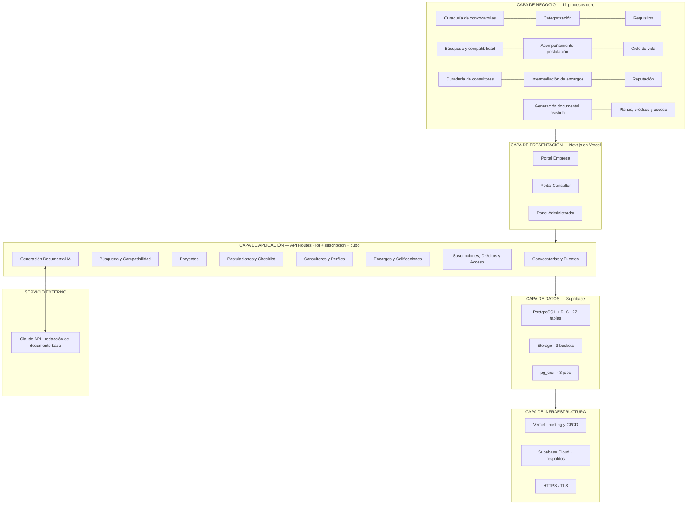

# Arquitectura de la solución

> Parte de la especificación del MVP **v6** · Plataforma de Gestión de Convocatorias.
> Índice general en `docs/README.md`. Contexto rápido en `CLAUDE.md`.

---

## 8. Arquitectura de la solución

### 8.1 Vista general por capas

### 8.2 Capa de presentación — rutas

Cada ruta declara los roles que admite (RNF-30). El rol se verifica en el servidor mediante `requireRole(...)`; ocultar un enlace de navegación no constituye autorización.

**Identidad** *(nuevo v6, sesión 004)* — Supabase Auth con correo y contraseña. Un `proxy.ts` refresca la sesión en cada petición; cada layout de portal vuelve a leer el usuario en el servidor y redirige a `/login` si no hay sesión. Registro, inicio de sesión y cierre son *Server Actions*; el login fallido se escribe en `eventos_seguridad` (RF-65).

| Ruta | Pantalla | Rol | CU |
|---|---|---|---|
| `/registro` | Registro por una de las **dos puertas** —"Soy empresa o entidad" o "Soy consultor"—, que fija el rol; exige confirmar el correo antes de entrar. `?puerta=consultor` preselecciona esa puerta; sin parámetro, la de empresa *(mod. v6)* | pública | CU-14 |
| `/login` | Inicio de sesión con las mismas dos puertas (`?puerta=` como en el registro), que solo orientan: la cuenta va al inicio de su rol (`/convocatorias`, `/consultor/perfil`) con aviso si la puerta no coincidía —el inicio recibe `?aviso=puerta`, el portal lo muestra y lo quita de la dirección—; el administrador va a `/mfa` sin aviso (RF-84) | pública | CU-14 |
| `/auth/confirmar` | Destino del enlace de confirmación de correo (intercambia el código por la sesión) | pública | CU-14 |
| `/auth/recuperar` | Pedir el enlace de recuperación de contraseña con el correo. Responde lo mismo exista o no la cuenta; el enlace lleva a `/auth/definir-contrasena` (RF-03) *(nuevo v6, sesión 010)* | pública | CU-14 |
| `/auth/definir-contrasena` | Definir contraseña al aceptar una invitación de administrador (y al recuperar la contraseña, RF-03) | con enlace válido | CU-42 |
| `/mfa` | Enrolamiento TOTP (código QR) o verificación del segundo factor; toda sesión de administrador sin `aal2` termina aquí. **404 para cualquier otro usuario** (RF-85) | administrador | CU-38 |

**Portal Empresa** (navbar: Convocatorias · Mis proyectos · Mis documentos · Mis postulaciones · Consultores · Mi suscripción). **Rol admitido: `empresa`** en todas las rutas del grupo, salvo `/` que es pública:

| Ruta | Pantalla | Rol | CU |
|---|---|---|---|
| `/` | Landing con **indicadores agregados del catálogo** —ninguna convocatoria visible sin cuenta de empresa, RN-33— y las dos puertas de entrada | pública | CU-14, CU-36 |
| `/convocatorias` | Catálogo con búsqueda, filtros y **chips sugeridos**; las cerradas quedan fuera por defecto y solo aparecen bajo filtro explícito (RF-11, RN-02) | empresa | CU-07 |
| `/convocatorias/[id]` | Ficha con botones **"Postular"**, **"Generar documento con IA"** e **"Ir al portal de la entidad"** *(v5)* | empresa | CU-08, 11, 33 |
| `/convocatorias/[id]/generar` | Selección de proyecto, aviso de cupo y confirmación | empresa | CU-33 |
| `/proyectos` · `/proyectos/[id]` | Lista y ficha del proyecto con **indicador de completitud accionable —los campos faltantes se editan aquí mismo (RF-81)**—, botón "Solicitar consultor" y "Generar documento para..." | empresa | CU-09, 19, 33 |
| `/proyectos/[id]/sugerencias` | Sugerencias con **% de compatibilidad** y desglose | empresa | CU-10 |
| `/documentos` | Documentos generados: proyecto, convocatoria, pendientes, versión — **solo los de la empresa de la sesión (RN-30)** | empresa | CU-34 |
| `/documentos/[id]` | Vista previa editable, ajustes con IA, exportar a Word, **interruptor de compartir con el consultor del encargo `en_curso`** | empresa (dueña) | CU-34 |
| `/consultores` · `/consultores/[id]` | Directorio y perfil — **redes/web/CV solo con solicitud activa de la empresa de la sesión (RF-80)**; **botón "Solicitar a este consultor" con selector de proyecto o postulación (RF-74)** | empresa | CU-20, 21 |
| `/encargos` | Solicitudes y encargos + calificar | empresa | CU-22..24 |
| `/postulaciones` · `/postulaciones/[id]` | Panel y detalle con checklist, historial, botón **"Generar/Editar documento con IA"** y **"Ir al portal de la entidad"** —**acción primaria de la pantalla (RF-73)**—, con el cambio de estado limitado al grafo de transiciones (RF-83) *(v5; mod. v6)* | empresa | CU-12, 13 |
| `/suscripcion` | Plan, **cupo de créditos**, historial de pagos y comparador de planes **con los atributos que los diferencian leídos del dato del plan (RF-82)** | empresa | CU-28..30 |

**Portal Consultor** — **rol admitido: `consultor`** en todo el grupo: `/consultor/perfil` (editor + estado de revisión), `/consultor/encargos` (bandeja en 3 pestañas), `/consultor/documentos` (**solo los autorizados explícitamente — lectura, edición y ajustes con IA; sin botón de exportar**, RF-71/72) y `/consultor/suscripcion` (sin cupo de créditos: el plan de consultor no lo incluye — RN-28). **Ninguna ruta del Portal Empresa es accesible con rol `consultor`** (RNF-30): en particular `/convocatorias/[id]/generar` y `/documentos`, cuyo acceso desde ese rol devuelve 403.

**Panel Administrador:** dashboard ampliado con perfiles en revisión, encargos por asignar, suscripciones y **consumo de IA**; `/admin/fuentes`, `/admin/convocatorias/[id]`, `/admin/categorias`, `/admin/consultores/revision`, `/admin/consultores`, `/admin/encargos`, `/admin/planes` (con créditos), `/admin/suscripciones` (con paquetes adicionales), **`/admin/plantillas`** (editor y versiones del prompt de generación — CU-37) y **`/admin/seguridad`** (activación de MFA, eventos de seguridad y bloqueos por límite de tasa — CU-38..40, *nuevo v5*). **Rol admitido: `admin`** en todo el grupo. Ninguna ruta bajo `/admin` es accesible sin rol administrador (RNF-30) **ni** sin MFA verificado (RNF-28); son dos comprobaciones independientes y ambas se hacen en el servidor. **Para quien no es administrador —anónimo, empresa o consultor— el panel responde 404, como una ruta inexistente, y nada fuera del panel lo enlaza** (RF-85, RNF-35) *(mod. v6)*. **`/admin/administradores`** (invitar, reenviar o cancelar invitaciones y revocar accesos — CU-41) admite solo al **Propietario**; a los demás administradores también les responde 404 (RF-86).

### 8.3 Capa de aplicación — servicios y endpoints

| Servicio | Endpoints principales | Reglas |
|---|---|---|
| **Autorización** *(nuevo v6)* | *(Mecanismo, sesión 007:* `proxy.ts` *aplica una matriz única rol × prefijo de ruta a cada petición —páginas, peticiones RSC, Server Actions y `/api`—; la ruta que no figura en la matriz responde 404. Los layouts de cada portal repiten la comprobación con `exigirRol()`. *Sesión 009:* la matriz marca las rutas solo del Propietario (`/admin/administradores`, `/api/admin/administradores`, `/api/admin/invitaciones`); el proxy, después del rol y del MFA, consulta `soy_propietario()` y responde 404 si no lo es. La página y cada endpoint lo repiten con `exigirPropietario()`, y las funciones SQL lo comprueban una tercera vez — docs/05 §9.12.)* Middleware `requireRole(...roles)` aplicado a **toda** ruta de portal y **todo** endpoint: declara los roles admitidos, responde 403 al resto —**404 en `/admin`, `/mfa` y `/api/admin`** (RF-85)— y escribe el evento `acceso_denegado` en `eventos_seguridad`. Se compone con `requireMFA()` en `/admin`, con **`requirePropietario()`** en la gestión de administradores (RF-86), y con `requireSubscription()` / `requireCredits()` donde aplique | RNF-30, RNF-01, RN-06 |
| Convocatorias y Fuentes | *(Sesión 011: las escrituras y lecturas de administración viven bajo `/api/admin`, para que hereden el 404 del panel —RF-85— y la exigencia de MFA; la lectura del catálogo por las empresas es `GET /api/convocatorias`, Sprint 2 paso 4.)* **Administración:** `GET/POST /api/admin/fuentes` · `PATCH /api/admin/fuentes/[id]` (editar y activar/desactivar; no se borran, RN-07) · `GET/POST /api/admin/categorias` · `PATCH /api/admin/categorias/[id]` (renombrar y activar/desactivar) · `GET/POST /api/admin/convocatorias` (crear exige una fuente activa, CU-02; nace en `borrador`) · `GET/PATCH /api/admin/convocatorias/[id]` (datos, categorías y requisitos en una sola transacción con `guardar_convocatoria` — docs/05 §9.13; `urlPostulacion` validada como `http`/`https` en el servidor antes de guardar — RNF-29; el estado no se cambia por aquí) · `POST /api/admin/convocatorias/[id]/publicar` y `.../despublicar` (400 con la lista de lo que falta — RF-09, paso 3) · **adjuntos (RF-07, CU-03, *sesión 012*):** `GET /api/admin/convocatorias/[id]/documentos` · `POST .../documentos/subida` (valida nombre, tipo y tamaño y devuelve una **URL firmada de subida** de un solo uso con la ruta que le toca al archivo; el navegador sube directo a Storage, porque una función de Vercel no admite un cuerpo de 20 MB) · `POST .../documentos` (registra la fila solo si el objeto existe de verdad en el bucket) · `PATCH .../documentos/[docId]` (renombrar) · `DELETE .../documentos/[docId]` (quita la fila y el objeto) · `GET .../documentos/[docId]/enlace` (URL firmada de descarga, 15 min — RNF-16). **Empresa (*sesión 016, Sprint 2 paso 4*):** `GET /api/convocatorias` (publicadas y vigentes, con filtros) · `GET /api/convocatorias/[id]` (ficha: datos, categorías, requisitos y documentos — CU-08) · `GET /api/convocatorias/[id]/documentos/[docId]/enlace` (URL firmada de descarga, 15 min — RNF-16). Los tres leen con la sesión de quien pide: **la RLS decide qué existe** (RN-33) y el endpoint no añade otra lista de permisos. Declarados solo para el rol `empresa` en `lib/autorizacion/matriz.ts` (RNF-30) y con segunda barrera en el propio endpoint: sin sesión, 401 (el proxy redirige a `/login`); con otro rol, 403, como el resto del portal Empresa | RN-01, RN-07, RN-33, RNF-29 |
| Búsqueda y Compatibilidad | `GET /api/convocatorias?q=&tipoProyecto=&sector=&entidad=&ubicacion=&montoHasta=&cierraAntesDe=&incluirCerradas=` (texto libre y filtros combinables de RF-12; **las cerradas solo vienen con `incluirCerradas=true`**, después de las vigentes y marcadas como `cerrada` —RF-11, RN-02, *sesión 017*—; las categorías van como ids separados por comas; `montoHasta` en pesos, en formato colombiano) · `GET /api/proyectos/[id]/sugerencias` (devuelve % y desglose) · `GET /api/indicadores` (landing: las cuatro cifras de `indicadores_catalogo()`, con caché de 1 hora; **pública**, porque son agregados que no exponen ninguna convocatoria — RN-33) | RN-05, RF-16, RF-44 |
| Proyectos | `GET/POST/PATCH/DELETE /api/proyectos` (incluye campos de contenido y completitud) | RLS por usuario |
| Postulaciones | `POST /api/postulaciones` (**verifica estado y vigencia de la convocatoria en el servidor, RF-78**) · `PATCH /api/checklist/[itemId]` · `POST /api/postulaciones/[id]/estado` | RN-03, RN-04 |
| Consultores y Perfiles | `GET/PATCH /api/consultor/perfil` · `POST .../enviar-revision` · `GET /api/consultores` · `GET /api/consultores/[id]` (**omite web, redes y CV salvo solicitud activa de la empresa autenticada — RF-80**) · `GET /api/consultores/[id]/cv` | RN-08, RN-12, RNF-16 |
| Encargos y Calificaciones | `POST /api/encargos` (incluye `tipoAyuda` + `convocatoriaId?` — adjunta contexto automáticamente, RF-68/69) · `.../responder` (revela `correoContacto` de la contraparte al aceptar, RF-70) · `.../avances` · `.../completar` · `.../calificar` · `POST /api/admin/encargos/[id]/asignar` (revela `correoContacto` al asignar) | RN-09, RN-10, RN-25, RN-26 |
| Suscripciones, Créditos y Acceso | `GET /api/planes` · `GET /api/suscripcion` (incluye cupo) · `POST /api/admin/suscripciones/activar` · `POST /api/admin/suscripciones/[id]/creditos` · middlewares `requireSubscription()` y **`requireCredits()`** | RN-11, RN-16, RN-17, RN-18 |
| **Generación Documental IA** | `POST /api/documentos/generar` (proyectoId + convocatoriaId — **verifica en el servidor que la convocatoria siga `publicada` y vigente antes de actuar, RF-78**) · `GET/PATCH /api/documentos/[id]` · `POST /api/documentos/[id]/ajustar` (**valida el cupo de la empresa dueña antes de aplicar, también cuando lo pide el consultor — RF-77; sin cupo, 402/403 sin modificar el documento**) · `POST /api/documentos/[id]/compartir` / `.../revocar` (autoriza o quita al consultor — solo el dueño, solo con encargo `en_curso`, RF-71). **El acceso se evalúa como (autorización ∧ encargo `en_curso`) en cada petición, no como permiso almacenado (RN-27), y se revoca en cascada al cerrarse el encargo, suspenderse el perfil o vencer la suscripción (RF-76)** · `GET /api/documentos/[id]/exportar` (devuelve .docx — **403 si quien llama no es el dueño**, RF-72) · `GET/POST /api/admin/plantillas` | RN-17, RN-19..22, 27, 28, RNF-23 |
| **Seguridad y auditoría** *(nuevo v5)* | Enrolamiento y verificación de MFA vía Supabase Auth (`mfa.enroll`, `mfa.challengeAndVerify`) en `/mfa`; al verificar, una *Server Action* comprueba `aal2` en la sesión y solo entonces marca `perfiles.mfa_habilitado` y escribe `mfa_activado` con `service_role` (un fallo escribe `mfa_fallido`) · `GET /api/admin/eventos-seguridad?filtros` · `POST /api/admin/eventos-seguridad/[id]/liberar` · **Gestión de administradores** *(nuevo v6)*, solo Propietario y 404 al resto: `GET /api/admin/administradores` · `POST /api/admin/administradores/invitar` (rechaza correos con cuenta, RN-32; inserta la invitación, envía la invitación de Auth y convierte la cuenta con `aceptar_invitacion_admin`; si algo falla, borra la cuenta — docs/05 §9.12, *sesión 008*) · `POST /api/admin/invitaciones/[id]/reenviar` (reinvita, o envía la recuperación si la cuenta ya confirmó el correo) · `POST /api/admin/invitaciones/[id]/cancelar` (borra la cuenta vinculada sin activar; si ya había invitación vencida para ese correo, invitar la resuelve igual) · `POST /api/admin/administradores/[id]/revocar` (marca la revocación, cierra sesiones y bloquea la cuenta en Auth, RF-87) · middlewares `requireRole()` (toda ruta y endpoint — RNF-30), `requireMFA()` (toda ruta `/admin`) y `requireRateLimit()` (endpoints públicos y de generación con IA; **fail-closed si su almacén no responde — RNF-33**) | RNF-25..28, RN-23, RN-24 |

**Flujo interno del servicio de generación:** valida suscripción y cupo → **verifica límite de tasa (RNF-27)** → arma el contexto (proyecto + convocatoria + requisitos + texto del TDR **saneado de instrucciones incrustadas**, con tope de tamaño — RN-23) → invoca Claude API con instrucciones de veracidad y estructura → parsea el resultado y extrae los pendientes → guarda el documento y registra el consumo → descuenta el crédito. Si algo falla antes del guardado, **no se descuenta**. El .docx se genera bajo demanda desde el contenido guardado, sin ocupar un cuarto bucket.

### 8.4 Capa de datos

27 tablas con RLS **habilitado y con política explícita en todas, sin excepción** (RNF-25 — ver `docs/05-modelo-de-datos.md` §9.10 para las tablas base y §9.5 para las del módulo de IA) · Storage con 3 buckets **privados los tres** (`documentos-convocatorias`, `fotos-consultores`, `hojas-de-vida`), servidos siempre por URL firmada de máximo 15 minutos — RNF-16 *(corregido en v6, sesión 012: hasta v5 solo la hoja de vida figuraba como privada, lo que habría dejado los adjuntos de una convocatoria al alcance de cualquiera que adivinara la ruta, en contra de RN-33; el detalle de rutas y políticas está en `docs/05-modelo-de-datos.md` §9.14)* · **pg_cron con 3 jobs diarios**: cierre de convocatorias, vencimiento de suscripciones con gracia y **reinicio mensual de créditos** · triggers para el rating del consultor.

La `service_role key` de Supabase —que puede saltarse RLS— se usa **únicamente** dentro de las API routes de servidor y los jobs de `pg_cron`; nunca se referencia en código de cliente ni en variables `NEXT_PUBLIC_*` (RNF-26). El límite de tasa (RNF-27) se implementa en un almacén rápido fuera de Postgres (p. ej. Upstash Redis o Vercel Edge Config); solo el bloqueo confirmado se persiste en `eventos_seguridad` para auditoría. **Si ese almacén no responde, la operación protegida se rechaza en lugar de permitirse (fail-closed, RNF-33)**: un control de seguridad que depende de un servicio externo no puede volverse opcional cuando el servicio cae.

Toda tabla con datos de usuario lleva su columna de propietario y ningún listado se sirve sin filtrar por ella (RN-30); el filtrado en la capa de aplicación y la política RLS son controles complementarios, no alternativos.

---

