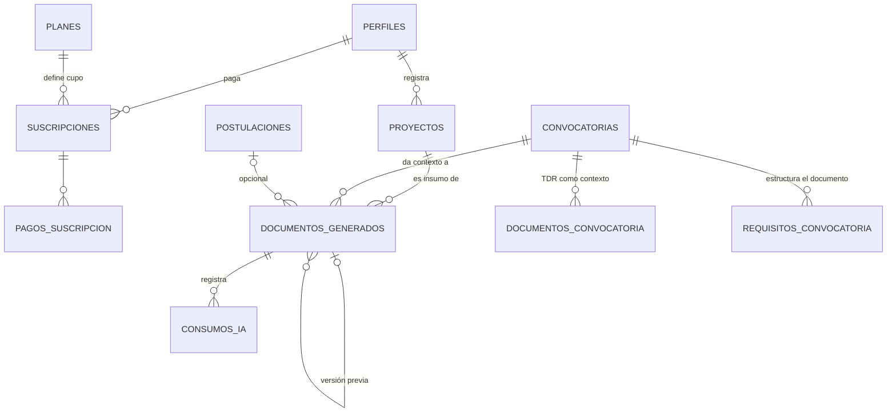

# Modelo de datos (29 tablas)

> Parte de la especificación del MVP **v6** · Plataforma de Gestión de Convocatorias.
> Índice general en `docs/README.md`. Contexto rápido en `CLAUDE.md`.

---

## 9. Modelo de datos

**27 tablas**: 12 base de la v2 (incluida `perfiles`), 10 del módulo de consultores y suscripciones de la v3, 3 del módulo de IA y `eventos_seguridad` de la extensión de seguridad v5, más columnas nuevas en proyectos, planes, suscripciones y perfiles. *Hasta la sesión 003 el documento decía "24 tablas": la cifra no contaba `perfiles` ni `eventos_seguridad`; el conjunto de tablas no cambió.* *(v6, sesión 005: se agrega `invitaciones_admin`, §9.12)* *(v6, sesión 019: se agregan `departamentos` y `convocatoria_departamento`, §9.18; son 29)*

### 9.1 Diagrama entidad–relación (módulo de IA y su conexión)



### 9.2 Columnas nuevas en tablas existentes

**PROYECTOS** *(enriquecido — RF-45)*

| Campo | Tipo | Nota |
|---|---|---|
| problema | text | Problema que resuelve |
| objetivo_general | text | |
| objetivos_especificos | text[] | Lista |
| poblacion_beneficiaria | text | |
| actividades | text | Actividades principales |
| resultados_esperados | text | |
| duracion_meses | int | |
| presupuesto_estimado | numeric | |
| experiencia_empresa | text | Trayectoria y capacidad |
| completitud | int | 0–100, calculado sobre los campos de contenido (RF-46). **Lo calcula la base con un trigger al guardar** (§9.17); la aplicación no puede fijarlo |

**PLANES** — se agrega `creditos_ia_mensuales` (int, RF-36). *(mod. v6, sesión 004)* Se agregan también `es_trial` (boolean, default false) y `dias_trial` (int, not null si y solo si `es_trial`): el trial es **un plan más**, con precio 0, rol `empresa`, 3 créditos y 7 días. Hay como máximo un plan trial (índice único parcial) y no aparece en el comparador de planes. Así el cupo del trial se calcula igual que el de cualquier plan, y el administrador puede ajustar sus créditos o su duración sin migración (RF-37, RN-11)

**SUSCRIPCIONES** — se agregan `creditos_usados_periodo` (int), `creditos_extra` (int, paquetes adicionales que no se reinician) y `periodo_creditos_inicio` (date, ancla del reinicio mensual). *(mod. v6, sesión 004)* `plan_id` es **not null también en el trial**: la suscripción trial apunta al plan con `es_trial`, y su `fecha_vencimiento` es `fecha_inicio + dias_trial`

**Registro de cuentas** *(nuevo v6, sesión 004)* — un trigger `after insert` sobre `auth.users` crea en la misma transacción:
- la fila de `perfiles`, con el rol leído de los metadatos del registro. **Solo `consultor` produce consultor; cualquier otro valor —incluido `administrador`— produce `empresa`** (RN-06). La cuenta invitada como administrador también nace así y el servidor la convierte después con `aceptar_invitacion_admin` (§9.12, *rediseñado en la sesión 008*);
- si es empresa: la suscripción trial contra el plan trial (RF-37). Si no existe plan trial activo, el registro **falla** en lugar de crear una empresa sin trial;
- si es consultor: la fila de `consultor_perfiles` en estado `incompleto`, sin suscripción (RN-11, CU-14).

### 9.3 Tablas nuevas

**DOCUMENTOS_GENERADOS**

| Campo | Tipo | Restricción |
|---|---|---|
| id | uuid | PK |
| usuario_id | uuid | FK → perfiles, not null · **RLS** |
| proyecto_id | uuid | FK → proyectos, not null |
| convocatoria_id | uuid | FK → convocatorias, not null |
| postulacion_id | uuid | FK → postulaciones, **nullable** (se vincula si existe) |
| titulo | text | |
| contenido | text | Markdown estructurado por secciones |
| pendientes | text[] | Lista de campos marcados como pendientes (RF-57) |
| estado | text | check: `generando` \| `generado` \| `editado` \| `exportado` \| `error` |
| version | int | default 1 |
| documento_padre_id | uuid | FK → documentos_generados (regeneraciones) |
| plantilla_id | uuid | FK → plantillas_generacion (versión del prompt con que se generó) |
| ajustes_usados | int | default 0 (hasta 3 gratis — RN-17) |
| compartido_con_consultor_id | uuid | FK → perfiles, **nullable** — consultor autorizado a leer/editar; se limpia al revocar o si el encargo deja de estar `en_curso` (RN-22, RN-27, RF-71) |
| ultima_edicion_por | uuid | FK → perfiles, **nullable** — quién hizo el último cambio: la empresa o el consultor autorizado (RNF-11) *(nuevo v5)* |
| creado_at / actualizado_at | timestamptz | |

**PLANTILLAS_GENERACION** — la instrucción del generador como dato versionado (RF-63, CU-37)

| Campo | Tipo | Restricción |
|---|---|---|
| id | uuid | PK |
| nombre | text | not null |
| version | int | not null |
| contenido | text | **Aquí se carga el prompt propio**: instrucciones de estructura, tono, reglas de veracidad y manejo de pendientes |
| activa | boolean | solo una activa a la vez |
| creada_por | uuid | FK → perfiles (admin) |
| creado_at | timestamptz | default now() |

> `documentos_generados` guarda `plantilla_id` para saber con qué versión se produjo cada documento y poder comparar calidad entre iteraciones del prompt.

**CONSUMOS_IA** — bitácora de costo y auditoría (RF-52, RNF-24)

| Campo | Tipo | Restricción |
|---|---|---|
| id | uuid | PK |
| usuario_id | uuid | FK → perfiles |
| documento_id | uuid | FK → documentos_generados, nullable si falló antes de crearse |
| tipo | text | check: `generacion` \| `ajuste` |
| tokens_entrada / tokens_salida | int | |
| costo_estimado | numeric | |
| exito | boolean | **false ⇒ no descontó crédito** (RN-17) |
| mensaje_error | text | |
| fecha | timestamptz | default now() |

> `usuario_id` registra **quién originó** el consumo (puede ser el consultor autorizado que pidió el ajuste). El crédito descontado, sin embargo, siempre sale del cupo de la **empresa dueña del documento** — la capa de aplicación resuelve la suscripción a débitar por `documentos_generados.usuario_id` (el dueño), no por quien disparó la acción (RN-28) *(nuevo v5)*.

### 9.4 Índices adicionales

`documentos_generados (usuario_id)`, `documentos_generados (proyecto_id, convocatoria_id)`, `consumos_ia (usuario_id, fecha)`, `suscripciones (periodo_creditos_inicio)` para el job de reinicio.

### 9.5 Políticas RLS adicionales

| Tabla | Política |
|---|---|
| documentos_generados | La empresa dueña (`usuario_id = auth.uid()`) lee y edita `titulo`, `contenido` y `pendientes`. **El consultor con `compartido_con_consultor_id = auth.uid()` y encargo `en_curso` sobre ese proyecto puede leer y editar `contenido`/`pendientes`, nunca exportar** (RN-22, RN-27, RF-71/72, *ampliado en v5*). **Crear el documento, `ajustes_usados`, `estado`, `version`, `plantilla_id` y la autorización del consultor los escribe solo el servidor** al generar, ajustar, exportar, compartir o revocar: si el cliente pudiera escribir el contador de ajustes, podría ponerlo en 0 y saltarse RN-17 *(precisado en v6, sesión 003)*; admin puede leer para soporte |
| consumos_ia | Solo lectura del propio usuario; escritura desde el servidor; admin lee todo |

### 9.6 Cálculo del porcentaje de compatibilidad (RF-16) *(reescrito en v6, sesión 019 — Sprint 3 paso 2)*

Implementa CU-10, RF-15 y RF-16 en el servidor. El cálculo es un cruce determinístico de atributos, **sin IA** (RN-05).

**`public.sugerencias_proyecto(p_proyecto uuid)`** devuelve una fila por convocatoria **publicada y vigente** (`fecha_cierre >= privado.hoy_colombia()`, RF-15: una vencida queda fuera aunque el job de RF-10 no la haya cerrado) con un booleano por criterio, `coincidencias` y `porcentaje`.

- **`security invoker`**: corre con la sesión de la empresa. La RLS decide qué proyecto es suyo (uno ajeno responde `no_existe`, como si no existiera) y qué convocatorias puede ver (RN-33).
- **Exige suscripción vigente** (CU-10, precondición; RNF-20) con `privado.tiene_suscripcion_vigente(auth.uid())`; sin ella rechaza con `hint = 'sin_suscripcion'` y el endpoint responde 402.
- **Cinco criterios, siempre evaluados los cinco**; `porcentaje = round(coincidencias × 100 / 5)`:

| Criterio | Coincide si |
|---|---|
| Tipo de proyecto, sector, tipo de entidad | el proyecto y la convocatoria comparten **al menos una categoría de ese tipo** |
| Monto | `monto_buscado` no es nulo y cae en `[monto_min, monto_max]`; un extremo nulo no pone límite |
| Ubicación | la convocatoria es de **cobertura nacional**, o su lista de departamentos incluye el **departamento del proyecto** (RN-34, §9.18) |

- Un criterio sobre el que el proyecto **no tiene dato** (sin categoría de ese tipo, sin monto, sin departamento) **no coincide**. El endpoint lo distingue en el desglose (`sin_dato`) para decirle a la empresa qué completar.
- Devuelve **también las convocatorias con 0 coincidencias**: el endpoint las usa para CU-10 2a y no las muestra. Orden: porcentaje de mayor a menor y, a igual porcentaje, la que cierra antes.
- **CU-10 2a** lo arma el endpoint: si ninguna convocatoria tiene coincidencias, devuelve **los datos que le faltan al proyecto** (en el orden de la tabla) y **hasta 5 vigentes cercanas**, en 0 % y en el orden de la función. *Se descartó "el criterio que menos vigentes cumplen": sin coincidencias, los cinco empatan en cero.*
- **Índices** (RNF-05, < 3 s): `convocatorias (estado, fecha_cierre)`, las claves primarias de `convocatoria_categoria` y `convocatoria_departamento` y la de `proyecto_categoria`. La prueba mide la función con 2 000 convocatorias.

El resultado se acompaña siempre de la aclaración de RN-05: es un cálculo de coincidencias, no una predicción de éxito.

### 9.7 Jobs automáticos (pg_cron)

**"Hoy" es el día en Colombia** *(sesión 017)*: una convocatoria vence al terminar su día de cierre en hora de Bogotá. `privado.hoy_colombia()` —`(now() at time zone 'America/Bogota')::date`— es la única definición, y la usan el cierre, la política de inserción de postulaciones (RF-78), `publicar_convocatoria` (RN-03), `indicadores_catalogo()` (RF-44) y el catálogo del servidor. Antes se usaba `current_date`, que en Supabase va en UTC: desde las 7 p. m. de Colombia, una convocatoria que cerraba ese día ya contaba como vencida. Las suscripciones siguen con `current_date` y se revisan en el Sprint 5.

**RF-78 en la base** *(sesión 017, Sprint 2 paso 7)*: un trigger `before insert or update of convocatoria_id` en `postulaciones` y en `documentos_generados` —`privado.exigir_convocatoria_vigente()`, `security definer`— rechaza con `hint = 'convocatoria_no_vigente'` cualquier fila cuya convocatoria no esté `publicada` y con `fecha_cierre >= privado.hoy_colombia()`. A diferencia de las políticas RLS, **también frena a `service_role`**, que es con lo que escribirán los endpoints de generar (Sprint 4). La política de inserción de postulaciones conserva su propia comprobación (defensa en profundidad). Los endpoints `POST /api/postulaciones` (Sprint 3) y `POST /api/documentos/generar` (Sprint 4) traducen esa clave a **409** con un mensaje claro; **ninguno la sustituye con una comprobación propia que pueda divergir**. Editar o ajustar un documento ya generado no pasa por aquí: la regla es para crear.

El job 1 ejecuta `privado.cerrar_convocatorias_vencidas()`, que devuelve cuántas cerró (lo muestra el historial de `pg_cron`). Corre a las 05:00 UTC, que es medianoche en Colombia.

```sql
-- Job 1 · cierre de convocatorias vencidas (RF-10) — privado.cerrar_convocatorias_vencidas()
UPDATE convocatorias SET estado='cerrada'
WHERE estado='publicada' AND fecha_cierre < privado.hoy_colombia();

-- Job 2 · vencimiento de suscripciones con gracia (RF-39, RN-16)
UPDATE suscripciones SET estado='en_gracia'
WHERE estado IN ('activa','trial') AND fecha_vencimiento < CURRENT_DATE;
UPDATE suscripciones SET estado='vencida'
WHERE estado='en_gracia' AND fecha_vencimiento < CURRENT_DATE - INTERVAL '5 days';

-- Job 3 · reinicio mensual de créditos (RF-49, RN-18)
UPDATE suscripciones
SET creditos_usados_periodo = 0,
    periodo_creditos_inicio = periodo_creditos_inicio + INTERVAL '1 month'
WHERE estado IN ('activa','trial')
  AND periodo_creditos_inicio + INTERVAL '1 month' <= CURRENT_DATE;
```

### 9.8 Indicadores públicos de la landing (RF-44)

```sql
SELECT COUNT(*) AS convocatorias_vigentes,
       SUM(COALESCE(monto_max, monto_min)) AS monto_disponible,
       COUNT(DISTINCT entidad_convocante) AS entidades
FROM convocatorias
WHERE estado='publicada' AND fecha_cierre >= CURRENT_DATE;
```

Más el conteo de consultores aprobados. Se sirve con caché de una hora.

*(mod. v6, sesión 006)* Como el catálogo es solo para empresas (RN-33), `anon` no puede leer `convocatorias`. El cálculo vive en la función `public.indicadores_catalogo()` (`security definer`), **la única lectura del catálogo abierta a `anon`**, y devuelve solo las cuatro cifras.

### 9.8b Extensión v5 — enlace oficial de postulación

**Columna nueva en CONVOCATORIAS** (RF-05, RF-09, RF-73, RN-01, RNF-29)

| Campo | Tipo | Restricción |
|---|---|---|
| url_postulacion | text | Validada en el servidor como `http`/`https` bien formada (RNF-29); **obligatoria para publicar** (RN-01) |

No requiere tabla ni política RLS nueva: hereda la misma política de `convocatorias` ya documentada en §9.10 (lectura para cuentas de empresa si está publicada y vigente — RN-33).

### 9.9 Extensión v5 — seguridad y auditoría

Cierra los vacíos detectados en la auditoría de seguridad de la arquitectura: cobertura de RLS incompleta, ausencia de MFA para administradores y falta de visibilidad sobre eventos de abuso (RNF-25..28).

**Nueva tabla EVENTOS_SEGURIDAD** (RNF-11, RNF-25..27, RF-65)

| Campo | Tipo | Restricción |
|---|---|---|
| id | uuid | PK |
| tipo | text | check: `login_fallido` \| `acceso_denegado` \| `limite_tasa` \| `mfa_activado` \| `mfa_fallido` \| `admin_invitado` \| `invitacion_cancelada` \| `admin_revocado` *(los tres últimos, v6 — RF-65)* |
| usuario_id | uuid | FK → perfiles, **nullable** (un login fallido puede no resolver a un usuario existente) |
| ip | inet | |
| ruta | text | endpoint o recurso afectado |
| detalle | text | |
| bloqueado_hasta | timestamptz | **nullable**; solo para `tipo = limite_tasa` — el bloqueo se evalúa comparando contra este valor, sin necesitar un job adicional |
| fecha | timestamptz | default now() |

Índices: `eventos_seguridad (usuario_id, fecha)`, `eventos_seguridad (tipo, fecha)`.

**Columna nueva en PERFILES**

| Campo | Tipo | Nota |
|---|---|---|
| mfa_habilitado | boolean | default false; debe ser `true` antes de que un perfil con rol administrador pueda operar funciones administrativas (RNF-28, CU-38) |

**Política RLS — EVENTOS_SEGURIDAD**

| Tabla | Política |
|---|---|
| eventos_seguridad | Solo lectura para el rol administrador; sin acceso de lectura para empresa o consultor; escritura únicamente desde código de servidor (nunca desde el cliente) |

> El conteo y bloqueo en tiempo real de RNF-27 (límite de tasa) vive en un almacén rápido fuera de Postgres (p. ej. Upstash Redis o Vercel Edge Config), para no sobrecargar la base con una escritura por request; solo el resultado — el bloqueo confirmado — se persiste en `eventos_seguridad` para auditoría y para que el administrador pueda liberarlo (CU-40).

### 9.9b Extensión v5 — contexto y contacto en encargos

Cierra el vacío del marketplace de consultores: la solicitud llevaba solo título y descripción libres, sin el contenido del proyecto ni una convocatoria asociada, y el contacto entre las partes no tenía un punto de revelación definido (RF-68..70).

**Columnas nuevas en ENCARGOS**

| Campo | Tipo | Restricción |
|---|---|---|
| tipo_ayuda | text | check: `convocatoria_especifica` \| `buscar_convocatoria` |
| convocatoria_id | uuid | FK → convocatorias, **nullable** (solo si `tipo_ayuda = convocatoria_especifica`) |
| postulacion_id | uuid | FK → postulaciones, **nullable** — autovinculado si ya existía una postulación en curso para ese par proyecto-convocatoria |
| motivo_cancelacion | text | **nullable** — se completa solo cuando `estado = cancelado`; lo escribe el trigger/job que produce la cancelación (suspensión del consultor o vencimiento de su suscripción, RN-29), nunca el usuario |

No se agrega tabla ni columna para el correo de contacto: se usa el que ya administra Supabase Auth (`auth.users.email`); la capa de aplicación decide **cuándo mostrarlo** (RF-70, RN-26), no dónde guardarlo.

**Política RLS adicional**

| Tabla | Política |
|---|---|
| proyectos, convocatorias (lectura por un consultor) | Un consultor puede leer el proyecto y la convocatoria vinculados a un `encargo` propio **solo mientras ese encargo esté `pendiente`, `en_curso` o `esperando_asignacion`** — no de forma permanente ni sobre otros proyectos de la misma empresa (RN-25) |

### 9.10 Cobertura de RLS — tablas base (v2/v3)

Hasta v4 solo estaba documentada la política de las tablas nuevas del módulo de IA (§9.5); las 21 tablas base no tenían su política explícita por escrito, aunque el diagrama y la arquitectura ya asumían "RLS por usuario". Esta sección traduce las reglas de aislamiento ya establecidas en RNF-03, RN-01, RN-04, RN-07, RN-08, RN-09, RN-12 y RN-22 a política explícita por tabla, cerrando ese vacío (RNF-25).

> Los nombres de tabla aquí usados son los referidos en los casos de uso, los requerimientos y el diagrama entidad–relación de v2/v3. Concílialos con el esquema real al escribir la migración del Sprint 0 si difieren en el detalle.

> **Precondición de todas estas políticas (RN-30, *nuevo v6*):** cada tabla con datos de usuario debe declarar su columna de propietario —`proyectos.usuario_id`, `postulaciones.usuario_id`, `documentos_generados.usuario_id`, `encargos.empresa_id` / `consultor_id`— antes de que la política pueda escribirse. La política RLS y el filtrado por propietario en la capa de aplicación son controles **complementarios**: se exigen los dos, no uno u otro.

| Tabla | Política |
|---|---|
| perfiles | Cada usuario lee y edita solo su propio registro (`id = auth.uid()`); el administrador lee todos |
| proyectos | Solo el dueño (`usuario_id = auth.uid()`) lee, edita y elimina; el administrador lee para soporte (RNF-03) |
| convocatorias, convocatoria_categoria, requisitos_convocatoria, documentos_convocatoria | Lectura **solo para cuentas con rol empresa** de las **publicadas y de las cerradas** —estado `cerrada`, o `publicada` con la fecha de cierre ya vencida— (RN-33, *mod. v6 sesión 006*; **cerradas desde la sesión 017**, para el filtro explícito de RF-11 y RN-02). Borradores y despublicadas siguen invisibles para la empresa. Leer una cerrada no permite actuar sobre ella: crear una postulación exige en su propia política que la convocatoria esté `publicada` y vigente (RF-78), y generar documentos pasa por el servidor. El listado por defecto filtra las vigentes en la consulta, no en la RLS; las tablas hijas heredan la visibilidad de su convocatoria. Escritura exclusiva del administrador (RN-01, RN-07) |
| categorias | Lectura pública de las activas (las usan el registro del consultor y los filtros); escritura exclusiva del administrador |
| proyecto_categoria | Sigue la misma regla que `proyectos`: visible y editable solo por el dueño del proyecto asociado |
| postulaciones y su checklist/historial | Solo la empresa dueña de la postulación (`usuario_id = auth.uid()`); el administrador lee para soporte (RN-04, RNF-03) |
| perfil de consultor (portafolio, especialidades, descripción) | Lectura pública si `estado_perfil = aprobado`; edición solo por el propio consultor. **Sitio web, redes y hoja de vida quedan excluidos de la lectura pública en todos los casos: solo administrador, o la empresa que tenga una solicitud activa con ese consultor — la condición se evalúa sobre la pareja (empresa de la sesión, consultor), no sobre la existencia de cualquier solicitud** (RN-12, RF-80, RNF-16, *ampliado en v5; precisado en v6*) |
| encargos y sus avances | Visibles solo para la empresa y el consultor del encargo; el administrador lee todos (RN-08, RN-10, RNF-03) |
| calificaciones | Lectura pública (componen el rating); escritura solo por la empresa dueña del encargo calificado, una única vez, inmutable (RN-09, RNF-17) |
| planes | Lectura pública; escritura exclusiva del administrador |
| suscripciones, pagos_suscripcion | Cada suscriptor lee solo las propias; el administrador lee y escribe todas (RNF-20) |

### 9.11 Cómo se aplican las políticas *(nuevo v6, sesión 003)*

Decisiones de mecanismo tomadas al escribir las migraciones (`supabase/migrations/`). No cambian qué puede ver cada rol; fijan cómo se garantiza.

1. **Mínimo privilegio en escritura.** *(Sesión 007: `service_role` necesita `usage` sobre el esquema `privado` y `execute` sobre sus funciones, porque los triggers de las tablas que escribe el servidor las invocan; sin ese permiso sus escrituras sobre `perfiles` fallaban.)* Lo que §9.5 y §9.10 no conceden expresamente al usuario lo escribe solo el servidor (API routes con `service_role`, RNF-26, o jobs de `pg_cron`): encargos y sus avances, calificaciones fuera de la inserción única, consumos de IA, eventos de seguridad, suscripciones y pagos. Esas tablas tienen política de lectura, sin política de escritura para `authenticated`.
2. **Columnas protegidas en filas editables.** Donde el usuario puede editar su propia fila, un trigger rechaza el cambio de las columnas que no le corresponden: en `perfiles`, `rol`, `mfa_habilitado`, `es_propietario`, `admin_revocado_at` y `admin_revocado_por`; en `consultor_perfiles`, `estado_perfil`, `motivo_rechazo`, `es_equipo_interno`, `revisado_por`/`revisado_at`, `rating_promedio` y `total_encargos_completados`; en `proyectos` y `postulaciones`, el propietario; en `documentos_generados`, todo salvo `titulo` (solo dueño), `contenido` y `pendientes`. El `service_role` no queda sujeto a estos triggers.
3. **Administrador = rol + MFA verificado + acceso no revocado.** Toda política que concede algo al administrador exige además `aal2` en el JWT de la sesión (RNF-28, RN-24) y `admin_revocado_at is null` en su perfil (RF-87, *sesión 005*). Un administrador sin segundo factor verificado, o revocado, se trata como un usuario sin privilegios. **Propietario = administrador + `es_propietario`.**
4. **Contacto del consultor por columna.** RLS filtra filas, no columnas. `sitio_web` y `cv_path` quedan sin permiso de lectura directa para `anon` y `authenticated`, y se leen con la función `public.contacto_consultor(consultor_id)`, que los devuelve solo al propio consultor, al administrador o a la empresa con solicitud activa con él (RF-80). `consultor_redes` sigue la misma condición con RLS por fila.
5. **Solicitud activa** (RF-80) = existe un encargo de la pareja (empresa de la sesión, consultor) en estado `pendiente` o `en_curso`.
6. **Acceso derivado del consultor a documentos** (RN-27): la política no se fía de `compartido_con_consultor_id` sola; exige además un encargo `en_curso` de ese consultor sobre el proyecto del documento, evaluado en cada consulta.
7. **Lecturas agregadas por necesidad.** La empresa sigue viendo las convocatorias cerradas o despublicadas que están vinculadas a sus postulaciones, encargos o documentos, porque si no su historial quedaría sin nombre. También ve el perfil de los consultores con los que tuvo encargos, aunque estén suspendidos (RN-15). Estos vínculos se resuelven con funciones `security definer` para evitar recursión entre políticas.
8. **`fuentes` solo para el administrador.** Son configuración interna (notas de parametrización) y el portal público no las muestra; la "lectura pública" de §9.10 aplica a convocatorias, categorías y a las tablas hijas de la convocatoria.
9. **La cuenta la crea la base, no el cliente** *(sesión 004; ampliado en la sesión 005 con las invitaciones de administrador, §9.12)*. `perfiles`, la suscripción trial y `consultor_perfiles` nacen del trigger de registro sobre `auth.users` (ver §9.2), que corre con los privilegios de su dueño. Ninguna de esas tablas gana política de insert para usuarios.


### 9.12 Propietario y administradores por invitación *(nuevo v6, sesión 005)*

Implementa RN-06, RN-31, RN-32 y RF-85..87: el rol administrador deja de asignarse "a mano" y pasa a otorgarlo solo el Propietario, con registro de cada alta y baja.

**Columnas nuevas en PERFILES**

| Campo | Tipo | Restricción |
|---|---|---|
| es_propietario | boolean | not null, default false · **índice único parcial `where es_propietario`**: como máximo uno · check: `not es_propietario or rol = 'administrador'` · solo se escribe desde la consola con `service_role` (RN-31) |
| admin_revocado_at | timestamptz | nullable · no nulo = acceso revocado; `privado.admin_vigente()` lo exige nulo (RF-87) · check: `admin_revocado_at is null or not es_propietario` |
| admin_revocado_por | uuid | FK → perfiles, nullable · quién revocó |

**Nueva tabla INVITACIONES_ADMIN**

| Campo | Tipo | Restricción |
|---|---|---|
| id | uuid | PK |
| correo | text | not null, en minúsculas · índice único parcial `where estado = 'pendiente'` |
| nombre | text | |
| estado | text | check: `pendiente` \| `aceptada` \| `cancelada` \| `vencida` |
| invitado_por | uuid | FK → perfiles, not null (el Propietario) |
| usuario_id | uuid | FK → perfiles **on delete set null** *(sesión 009: cancelar borra la cuenta sin activar)*, nullable · la cuenta creada para la invitación |
| creada_at | timestamptz | default now() |
| expira_at | timestamptz | not null, `creada_at + 72 horas` |
| resuelta_at | timestamptz | nullable · aceptación, cancelación o vencimiento |

**Políticas RLS**

| Tabla | Política |
|---|---|
| invitaciones_admin | Lectura solo para el Propietario con `aal2`; **sin escritura para `authenticated`**: la escriben el servidor (`service_role`) y `aceptar_invitacion_admin` *(sesión 008)* |
| perfiles | Se mantiene §9.10. Ninguna política deja a un administrador cambiar el rol, la revocación ni la marca de Propietario de otro perfil |

**Cómo nace un administrador** *(rediseñado en la sesión 008)*. El diseño anterior reconocía la invitación dentro del trigger de registro, leyendo `app_metadata.invitacion_id`, y no funcionaba: `auth.admin.createUser` e `inviteUserByEmail` insertan el usuario **sin** `app_metadata` y lo añaden después con un `update`, así que el trigger nunca veía la invitación (hallazgo de la sesión 007). Ahora la conversión es un paso explícito del servidor. El trigger de registro vuelve a no saber nada de invitaciones.

1. **Invitar** (endpoint solo del Propietario con `aal2`):
   - con `public.correo_tiene_cuenta(correo)` comprueba que el correo no tenga cuenta (RN-32);
   - inserta la invitación `pendiente`, vigente 72 horas;
   - llama a `auth.admin.inviteUserByEmail(correo, { redirectTo: <origen>/auth/definir-contrasena })`, que crea la cuenta en Auth y envía el correo de invitación. El trigger de registro la crea como empresa con trial, como a cualquier cuenta.
2. **Convertir**, en la misma petición: el servidor llama a `public.aceptar_invitacion_admin(invitacion, usuario)`. La función es `security definer` y **solo la ejecuta `service_role`**. En una transacción exige que:
   - la invitación esté `pendiente` y no vencida;
   - el correo de la cuenta coincida;
   - la cuenta se haya creado **después** de la invitación, lo que garantiza que se creó para ella y no es una cuenta previa;
   - la cuenta no tenga todavía un perfil de administrador.

   Si todo se cumple, pone `rol = 'administrador'`, borra la suscripción trial y el perfil de consultor si los hubiera, y vincula `usuario_id`. Si la función o el envío fallan, el servidor borra la cuenta recién creada y no deja una empresa huérfana.
3. **Activar** (CU-42): la persona abre el enlace, define su contraseña en `/auth/definir-contrasena` y enrola el MFA. `confirmarMfa`, en el servidor y con `aal2` comprobado, marca la invitación `aceptada` y `resuelta_at`.

**Vigencia de los privilegios.** `privado.admin_vigente(usuario)` es la única definición de "administrador con privilegios":
- rol `administrador`;
- `admin_revocado_at` nulo;
- sin invitación vinculada que esté `pendiente` y vencida, `cancelada` o `vencida` *(sesión 009: antes solo excluía la pendiente vencida; así, una invitación cancelada deja la cuenta sin privilegios aunque todavía no se haya borrado)*.

La usan `privado.es_admin()` (RLS, junto con `aal2`) y `public.rol_efectivo()`, que devuelve el rol de la sesión o nulo si es un administrador sin vigencia y que leen `proxy.ts` y `obtenerSesion()`. Así, una invitación que vence sin activarse deja la cuenta sin privilegios en ninguna parte, sin depender de un job.

**Enlace y vigencia son cosas distintas.** El enlace del correo caduca según la configuración de Auth (por defecto, 1 hora); la invitación dura 72 horas. Mientras la invitación esté vigente, el Propietario puede **reenviar** el enlace. Si Auth no admite reenviar una invitación a una cuenta existente, se envía el correo de recuperación de contraseña, que lleva a la misma pantalla.

**Cancelar** una invitación `pendiente` la marca `cancelada` y borra la cuenta vinculada, que nunca llegó a activarse. Una invitación vencida se muestra como tal y se resuelve igual al cancelarla o al invitar de nuevo a ese correo: en ambos casos queda `vencida` y su cuenta se borra. *(Sesión 009.)* Primero se marca la invitación y después se borra la cuenta: si el borrado falla, la cuenta ya no tiene privilegios (`admin_vigente`) y cancelar de nuevo reintenta el borrado.

**Las reglas viven en la base** *(sesión 009)*. Invitar, cancelar y revocar pasan por funciones `security definer` que solo ejecuta `service_role` y que reciben el id del Propietario que actúa. Cada una comprueba que ese id sea el Propietario con privilegios vigentes. El endpoint ya lo comprobó con la sesión; la función lo repite para que ninguna llamada del servidor salte la regla. Lo que no es SQL —enviar el correo, borrar o bloquear la cuenta en Auth— lo hace el endpoint con la API de administración de Auth.

**Funciones nuevas**

| Función | Ejecuta | Qué hace |
|---|---|---|
| `privado.admin_vigente(uuid)` | interna | Regla única de administrador con privilegios (ver arriba) |
| `privado.propietario_vigente(uuid)` | interna | `admin_vigente` y `es_propietario` *(sesión 009)* |
| `public.rol_efectivo()` | `authenticated` | Rol de la sesión; nulo si es administrador sin vigencia |
| `public.soy_propietario()` | `authenticated` | Si la sesión es del Propietario vigente **con `aal2`**. La lee `proxy.ts` para las rutas solo del Propietario (RF-86) *(sesión 009)* |
| `public.correo_tiene_cuenta(text)` | solo `service_role` | Si ya existe una cuenta en Auth con ese correo (RN-32) |
| `public.crear_invitacion_admin(uuid, text, text)` | solo `service_role` | Propietario, correo y nombre. Rechaza correo inválido, correo con cuenta (RN-32) e invitación pendiente para ese correo; inserta la invitación (paso 1) *(sesión 009)* |
| `public.aceptar_invitacion_admin(uuid, uuid)` | solo `service_role` | Convierte la cuenta recién invitada en administrador (paso 2) |
| `public.cancelar_invitacion_admin(uuid, uuid)` | solo `service_role` | Propietario e invitación. Marca `cancelada` (o `vencida` si ya venció) y devuelve la cuenta que el servidor debe borrar. Sobre una ya resuelta con cuenta todavía vinculada, solo la devuelve (reintento) *(sesión 009)* |
| `public.revocar_admin(uuid, uuid)` | solo `service_role` | Propietario y administrador. Rechaza revocarse a sí mismo, revocar al Propietario, a quien no es administrador, a quien ya está revocado y a quien aún tiene la invitación pendiente (eso se cancela). Marca la revocación y **borra sus sesiones de Auth** (`auth.sessions`, con sus *refresh tokens*) *(sesión 009)* |

Los rechazos llevan en `hint` una clave estable (`correo_con_cuenta`, `invitacion_pendiente`, `no_es_propietario`, …) que el endpoint traduce a un mensaje y a un código HTTP.

**Cómo se revoca.** El endpoint de revocación, solo para el Propietario y nunca sobre sí mismo, llama a `revocar_admin`, que escribe `admin_revocado_at`/`admin_revocado_por` y cierra sus sesiones. Con eso la RLS le niega todo en la siguiente consulta y el *refresh token* deja de servir. Después bloquea la cuenta en Auth (`ban_duration`) y registra `admin_revocado`. Si el bloqueo en Auth falla, la revocación ya surtió efecto en la base; el endpoint lo informa.

**Cómo se reenvía.** Mientras la invitación esté `pendiente` y vigente, el endpoint vuelve a llamar a `inviteUserByEmail`, que Auth admite para una cuenta que aún no confirmó su correo. Si la persona ya confirmó (definió la contraseña pero no activó el MFA), Auth lo rechaza y se envía el correo de recuperación hacia `/auth/definir-contrasena`.

**Qué se registra** en `eventos_seguridad`, con `usuario_id` = el Propietario que actuó (RF-65): `admin_invitado` al invitar, `invitacion_cancelada` al cancelar (también cuando se resuelve una vencida al invitar de nuevo) y `admin_revocado` al revocar. El reenvío no tiene tipo propio y no se registra.

**Cómo se designa el Propietario.** *(Ejecutado en la sesión 006.)* Se crea la cuenta con la API de administración de Auth, sin contraseña. Desde la consola se le asigna `rol = 'administrador'` y `es_propietario = true` y se retira el trial que creó el trigger. Después se le envía el correo de recuperación, que lleva a `/auth/definir-contrasena`, y al entrar activa el MFA en `/mfa`. En resumen, una sola vez, desde la consola de la base de datos: `update perfiles set es_propietario = true where id = …`, sobre una cuenta de administrador ya creada. Ninguna migración de la aplicación lo fija a un usuario concreto. El primer administrador —el Propietario— se crea igualmente desde la consola, porque todavía no hay quién invite.

---

### 9.13 Guardar una convocatoria desde el panel *(nuevo v6, sesión 011)*

Implementa RF-05, RF-06 y RF-08 en el servidor. El editor de `/admin/convocatorias/[id]` guarda juntos los datos, las categorías y los requisitos; si se guardaran por separado, un fallo a mitad dejaría una convocatoria con categorías nuevas y requisitos viejos.

**`public.guardar_convocatoria(p_id uuid, p_datos jsonb, p_categorias uuid[], p_requisitos jsonb)`**

- **`security invoker`**: corre con la sesión del administrador, así que la RLS de §9.10 sigue aplicando (administrador vigente con `aal2`). La función además lo comprueba al entrar y rechaza con `hint = 'no_es_admin'`.
- Una sola transacción:
  - actualiza las columnas editables (nombre, entidad convocante, descripción, montos, cobertura —`cobertura_nacional` y el detalle `ubicacion_cobertura`—, fechas, enlace oficial y fuente) y **reemplaza los departamentos** por los de `p_datos -> 'departamentos'` (§9.18) *(sesión 019)*. **No toca `estado`, `creado_por`, `publicado_por` ni `publicada_at`**: publicar y despublicar tienen su propio endpoint (RF-09);
  - reemplaza las categorías (`convocatoria_categoria`) por las recibidas. Solo admite categorías **activas** o que la convocatoria ya tenía (una desactivada después sigue asignada hasta que se quite);
  - sincroniza los requisitos: actualiza los que traen `id` de esa convocatoria, inserta los nuevos y borra los que ya no vienen. El `orden` es la posición en la lista. Borrar un requisito no altera los checklists ya copiados (RN-04; `postulacion_checklist.requisito_id` es `on delete set null`).
- Rechazos con clave estable en `hint`: `no_es_admin`, `no_existe`, `fuente_invalida` (la fuente no existe o está inactiva y no es la que ya tenía), `categoria_invalida`, `requisito_ajeno` (un `id` de requisito de otra convocatoria) y `publicada_incompleta`: una convocatoria `publicada` no puede quedar incompleta según RN-01. La comprobación va **al final**, sobre lo que quedó escrito, con la misma `privado.ficha_publicable` que usa publicar (§9.15), para que las dos reglas no puedan divergir *(restaurada en la sesión 016)*. Para quitarle algo, primero se despublica. Las restricciones de la tabla —montos, fechas, formato del enlace— siguen vigentes.
- **Fecha de cierre ya pasada en una publicada (CU-05 3e, *sesión 017*).** Se permite: la entidad puede cerrar antes de lo anunciado. El endpoint responde 200 con un `aviso` —la convocatoria sigue publicada hasta la medianoche de Colombia, cuando la cierra el job de RF-10— y la pantalla pide confirmación antes de guardar. Publicar, en cambio, sigue rechazando una fecha vencida (RN-03).
- **Montos (CU-02 2b, RF-05).** El endpoint los lee **antes** de llamar a la función: pesos enteros, con puntos cada tres cifras (`1.000.000`) o sin puntos (`1000000`), admitiendo `$` y espacios. Rechaza con 400 los puntos mal agrupados (`1.5`, `1.000000`), la coma decimal, las letras y los negativos. Antes se usaba `Number()`, que convertía `1.000000` en **1 peso** sin avisar (sesión 016). A la columna `numeric` llega siempre un entero.
- **Crear** no pasa por aquí: `POST /api/admin/convocatorias` inserta con la sesión del administrador, `estado = 'borrador'` y `creado_por = auth.uid()` (RNF-11), exigiendo una fuente activa (CU-02, precondición).

**Fuentes y categorías.** Se crean y editan con la sesión del administrador directamente sobre la tabla (§9.10). No hay borrado (RN-07): se desactivan con `activa = false`. Una fuente inactiva no admite convocatorias nuevas; una categoría inactiva deja de ofrecerse para clasificar.

---

### 9.14 Storage: buckets, rutas y adjuntos de convocatoria *(nuevo v6, sesión 012)*

Implementa RF-07 (CU-03) y fija cómo se guarda y se entrega **todo** archivo de la plataforma (RNF-16, RNF-18, RNF-02).

#### Los tres buckets

Los tres son **privados** (`public = false`): ningún archivo se sirve por una URL permanente, sino por URLs firmadas de **máximo 15 minutos** (RNF-16). Hasta v5 solo la hoja de vida figuraba como privada; se corrigió porque un bucket público entrega el archivo a quien adivine la ruta, y los adjuntos de una convocatoria solo pueden verlos las cuentas de empresa (RN-33).

| Bucket | Contenido | Límite | Tipos admitidos | Ruta del objeto |
|---|---|---|---|---|
| `documentos-convocatorias` | TDR, términos, anexos y formatos (RF-07) | 20 MB | PDF, Word (`.doc`, `.docx`), Excel (`.xls`, `.xlsx`), ZIP | `{convocatoria_id}/{documento_id}.{ext}` |
| `fotos-consultores` | Foto del perfil (RF-22) | 5 MB | JPG, PNG | `{perfil_id}/foto.{ext}` |
| `hojas-de-vida` | Hoja de vida del consultor (RNF-16) | 10 MB | PDF | `{perfil_id}/hoja-de-vida.pdf` |

El **tamaño máximo y la lista de tipos se declaran en el bucket**, no solo en el código: una subida que los incumpla la rechaza Storage aunque nadie la haya revisado antes (RNF-18). El nombre del objeto **no es** el nombre del archivo original —así ningún nombre raro llega a la ruta—; el nombre descriptivo que ve el usuario vive en la columna `nombre` y se le devuelve al descargar.

#### Políticas sobre `storage.objects`

Una política por bucket y operación, nunca una regla general (RNF-25):

- **`documentos-convocatorias`**: `select`, `insert`, `update` y `delete` **solo para un administrador vigente con `aal2`** (`privado.es_admin()`). Las empresas **no leen el bucket**: su descarga pasa siempre por el servidor (abajo).
- **`fotos-consultores`** y **`hojas-de-vida`**: escritura y borrado solo del consultor dueño —el primer segmento de la ruta es su `perfil_id`— y lectura solo suya. Igual que arriba, quien más las ve lo hace por URL firmada emitida por el servidor.

#### Cómo se sube un adjunto (RF-07)

Una función de Vercel no admite un cuerpo de 20 MB, así que el archivo **nunca pasa por el servidor**: viaja del navegador a Storage. El control no se pierde, porque la ruta la decide el servidor y la RLS del bucket exige administrador en los dos pasos.

1. `POST /api/admin/convocatorias/[id]/documentos/subida` — el servidor valida el nombre descriptivo, el tipo de documento (`TDR`, `terminos`, `anexo`, `formato`), la extensión y el tamaño declarado; reserva un `documento_id`, arma la ruta y devuelve una **URL firmada de subida** de un solo uso, emitida con la sesión del administrador.
2. El navegador sube el archivo a esa URL.
3. `POST /api/admin/convocatorias/[id]/documentos` — el servidor **comprueba que el objeto existe de verdad** en el bucket y **lee de Storage su tamaño y su tipo reales** (no los que declaró el navegador) antes de insertar la fila.

Si el paso 3 no llega a ocurrir, queda un objeto sin fila: **invisible para todos**, porque no hay descarga que no parta de la fila. La pantalla pide borrarlo si el registro falla.

#### Cómo se descarga

`GET /api/admin/convocatorias/[id]/documentos/[docId]/enlace` devuelve una URL firmada de 15 minutos, con el nombre descriptivo como nombre de descarga. **La autorización la decide la RLS**: el servidor lee primero la fila de `documentos_convocatoria` con la sesión de quien pide —si no puede verla, no existe para él— y solo entonces firma. El mismo endpoint sirve a la empresa cuando llegue el catálogo (Sprint 2, paso 4), sin cambiar la regla: la fila es visible o no lo es.

#### La empresa descarga los adjuntos *(sesión 016, Sprint 2 paso 4)*

Hasta aquí solo el administrador podía leer objetos del bucket `documentos-convocatorias`, y firmar una URL de descarga exige poder leer el objeto con la sesión de quien la pide. Se añade una política de `select` sobre `storage.objects` para `authenticated`: **un objeto se puede leer si su fila de `documentos_convocatoria` es visible para quien pide** (`exists (select 1 from documentos_convocatoria d where d.storage_path = name)`). Así Storage hereda la visibilidad de la tabla, que a su vez hereda la de `convocatorias`: la empresa descarga los adjuntos de las publicadas y vigentes (RN-33), y nadie más gana acceso. No se abre el bucket ni se firma con `service_role`.

#### Columnas nuevas en `documentos_convocatoria`

| Columna | Tipo | Para qué |
|---|---|---|
| `tipo_mime` | `text not null default ''` | El tipo real leído de Storage, no el declarado |
| `tamano_bytes` | `bigint` | Se muestra junto al nombre; también permite detectar una subida truncada |
| `actualizado_at` | `timestamptz not null default now()` | Cambia al renombrar |

`storage_path` pasa a ser **único**: dos filas no pueden apuntar al mismo objeto.

#### Modificar y quitar (CU-03 1a)

- **Renombrar** (`PATCH`): nueva política de `update` para el administrador. Un **trigger** impide que ese update cambie `convocatoria_id`, `storage_path` o `tamano_bytes`: renombrar es cambiar el rótulo, no el archivo. Para reemplazar el archivo se quita el adjunto y se sube otro.
- **Quitar** (`DELETE`): borra la fila y el objeto. Aquí sí hay borrado, a diferencia de fuentes y categorías (RN-07): un adjunto equivocado no es historia que valga la pena conservar, y CU-03 1a lo pide.
- Renombrar no depende del estado de la convocatoria. **Quitar sí, en un caso** *(sesión 016)*: a una convocatoria `publicada` no se le puede quitar **su último adjunto**, porque RN-01 exige al menos uno para estar publicada (CU-03 1b). Un trigger `before delete` en `documentos_convocatoria` lo hace cumplir en la base, también para `service_role`. Bloquea antes la fila de la convocatoria (`for update`, como `guardar_convocatoria`), para que dos borrados simultáneos no la dejen en cero. Rechaza con `hint = 'publicada_incompleta'`, que el endpoint traduce a **409**. Para reemplazar el único adjunto de una publicada se sube el nuevo y después se quita el viejo. El borrado en cascada de la convocatoria entera no se ve afectado: la fila padre ya no existe cuando se evalúa.

---

### 9.15 Publicar y despublicar una convocatoria *(nuevo v6, sesión 013)*

Implementa RF-09 y RN-01 en el servidor. Cambiar el estado es lo único que `guardar_convocatoria` (§9.13) deja fuera a propósito: la ficha se edita todo lo que haga falta sin que la convocatoria se vuelva visible por accidente.

**`public.publicar_convocatoria(p_id uuid, p_publicar boolean)`**

- **`security invoker`**, igual que §9.13: corre con la sesión del administrador y la RLS sigue aplicando; la función lo comprueba además al entrar.
- **Publicar** (`p_publicar = true`) exige, en una sola lectura con bloqueo de la fila, **la ficha completa de RN-01** *(lista ampliada en la sesión 015)*:
  - nombre y entidad convocante (la tabla ya los pide);
  - **cobertura: nacional o al menos un departamento** (RN-34, §9.18; *hasta la sesión 018 se exigía el texto `ubicacion_cobertura`, que pasa a ser un detalle opcional*) y **descripción u objeto**;
  - **enlace oficial de postulación** presente y bien formado (RNF-29). La restricción `convocatorias_publicada_con_enlace` lo repite;
  - **al menos una categoría** en `convocatoria_categoria`;
  - **al menos un documento adjunto** en `documentos_convocatoria`;
  - **al menos dos requisitos** en `requisitos_convocatoria`;
  - **fecha de cierre no vencida**: no se publica algo que ya cerró, porque el job de RF-10 lo cerraría esa misma noche y porque RN-03 prohíbe postular sobre ello.

  Cobertura y categorías son además los filtros del catálogo (RF-12): sin ellas la convocatoria no aparecería al filtrar. El adjunto **volvió a ser obligatorio** en la sesión 015, después de haber dejado de serlo en la 012.

  Al publicar: `estado = 'publicada'`, `publicada_at = now()` y `publicado_por = auth.uid()` (RNF-11). Se puede publicar desde **cualquier** estado que no sea `publicada`, incluido `cerrada` — si alguien corrige la fecha de cierre de una cerrada, debe poder volver a publicarla sin quedarse sin salida.
- **Despublicar** (`p_publicar = false`) exige que esté `publicada` y la deja en `despublicada`, conservando `publicada_at` y `publicado_por` como rastro de que estuvo publicada. No se borra nada (RN-07). A partir de ahí no se puede postular ni generar sobre ella (RN-03), y las postulaciones ya iniciadas conservan su checklist (RN-04).
- Rechazos con clave estable en `hint`: `no_es_admin`, `no_existe`, `ya_publicada`, `no_publicada`, `publicada_incompleta` y `vencida`.

**Editar una publicada tiene la misma vara** *(sesión 016)*: `guardar_convocatoria` (§9.13) rechaza con `publicada_incompleta` cualquier edición que deje a una publicada sin algo de la lista anterior (salvo la fecha de cierre vencida, que es asunto del job de RF-10). En la sesión 015 esta comprobación se retiró porque se creyó que causaba un cuelgue de ~20 s al guardar. La sesión 016 demostró que el cuelgue venía de la red de la máquina de desarrollo (`docs/incidentes/2026-09-22-cuelgue-al-guardar-convocatoria.md`) y se restauró. El adjunto no se quita por `guardar_convocatoria` sino por `DELETE` sobre `documentos_convocatoria`; ese camino tiene su propio trigger desde la sesión 016 (§9.14, *Modificar y quitar*).

**Publicar guarda primero.** La pantalla envía el formulario a `PATCH` y solo llama a `publicar` si ese guardado pasa (RF-09, CU-05 3d). Sin eso, publicar tomaba lo último guardado e ignoraba lo que el administrador tenía delante: se podía ver un campo vacío en pantalla y publicar con el valor viejo. Lo detectó el Product Owner en la sesión 015.

**Por qué la lista de lo que falta la arma el servidor y no el SQL.** La función rechaza con una sola clave; el endpoint lee antes la ficha y responde 400 enumerando **todo** lo que falta de una vez, para que el administrador no descubra los problemas de uno en uno. La función es la barrera; el enunciado es cortesía.

---

### 9.16 Nombres repetidos y borrado de categorías *(nuevo v6, sesión 014)*

Implementa RF-04, RF-06 y la precisión de RN-07. Nace de dos cosas que el Product Owner encontró probando el panel: pudo crear `Transformación digital` y `Transformacion digital` como dos categorías distintas, y no tuvo forma de quitar la sobrante.

#### Comparación de nombres

`unique (tipo, nombre)` comparaba letra por letra, así que una tilde de diferencia bastaba para colar un duplicado. En español no son nombres distintos. Se compara ahora por el **nombre normalizado**:

**`privado.nombre_normalizado(text)`** — `immutable`, para que sirva de índice: recorta espacios de los extremos, quita los acentos con `unaccent` y pasa a minúsculas. Se fija el diccionario explícitamente (`'extensions.unaccent'::regdictionary`) porque de otro modo `unaccent` depende del `search_path` y no podría declararse inmutable.

- `categorias`: índice único sobre `(tipo, privado.nombre_normalizado(nombre))`. Se conserva además el `unique (tipo, nombre)` original, que es un caso particular.
- `fuentes`: índice único sobre `privado.nombre_normalizado(nombre)`. **Antes no tenía ninguno**: se podían crear dos fuentes idénticas.

**El nombre se guarda tal como se escribió.** La normalización solo decide si dos nombres chocan; lo que se muestra es lo que tecleó el administrador, con sus tildes.

**Duplicados que ya existan** al aplicar la migración se fusionan, no se pierden: las convocatorias que apuntaban a la copia se reasignan a la fila **más antigua** y la copia se borra. En `convocatoria_categoria` la reasignación es `on conflict do nothing`, por si una convocatoria tenía las dos. Si dos fuentes duplicadas traían notas distintas, gana la más antigua.

#### Borrar una categoría (RN-07)

Fuentes y convocatorias siguen sin borrarse: guardan historia. Una categoría **que ninguna convocatoria usa** no guarda nada, así que se borra. La regla vive en la política RLS, no en la pantalla:

```
categorias: el administrador borra las no usadas
  delete · es_admin() ∧ no existe convocatoria_categoria con esta categoría
```

Si ya clasifica algo, la política no encuentra la fila y el borrado devuelve **0 filas** — no un error. Por eso el endpoint cuenta el uso **antes** y responde 409 diciendo cuántas convocatorias la usan, en vez de un 404 que haría pensar que no existe. El listado del panel trae ese conteo, de modo que el botón de borrar solo aparece donde borrar es posible; el servidor lo vuelve a comprobar igual (RNF-20).

`DELETE /api/admin/categorias/[id]`.

---

### 9.17 Proyectos de la empresa *(nuevo v6, sesión 018 — Sprint 3 paso 1)*

Implementa RF-14, RF-45, RF-46 y RF-81 en el servidor (CU-09). La RLS de §9.10 ya limitaba `proyectos` y `proyecto_categoria` a su dueño (RN-30); aquí se añade cómo se guardan.

**`public.guardar_proyecto(p_id uuid, p_datos jsonb, p_categorias uuid[]) returns uuid`**

- **`security invoker`**: corre con la sesión de la empresa, así que la RLS decide. Con `p_id` nulo crea el proyecto (`usuario_id` lo fija la base con `auth.uid()`); con un id, lo edita si es suyo, y si no lo es responde `no_existe`, como si no existiera.
- Una sola transacción para los datos y las categorías: se reemplazan por las recibidas. Solo admite categorías **activas** o que el proyecto ya tenía (`categoria_invalida`).
- Rechazos con clave estable en `hint`: `no_existe` y `categoria_invalida`. La forma de los datos —longitudes, montos en formato colombiano (CU-02 2b), duración entera— la valida antes el endpoint.

**`completitud` la calcula un trigger** (`before insert or update`) con la misma regla que `lib/proyectos.ts`: nueve campos de contenido; un texto cuenta si no está en blanco, `objetivos_especificos` si tiene alguno no vacío, duración y presupuesto si son mayores que cero; `round(completos × 100 / 9)`. Lo que envíe la aplicación en esa columna se ignora. `lib/proyectos.ts` sigue siendo quien enumera los campos que faltan en pantalla (RF-46, RF-81), y una prueba comprueba que las dos cuentas coinciden.

**Borrar un proyecto** (CU-09 2a): `proyecto_categoria` y **`documentos_generados` se borran en cascada**, las postulaciones quedan sin proyecto (`on delete set null`) y **un proyecto con encargos no se puede borrar** (la clave foránea lo impide). El endpoint responde 409 con ese motivo y la pantalla, antes de confirmar, dice cuántos documentos generados se perderán.

---

### 9.18 Departamentos y cobertura *(nuevo v6, sesión 019 — RN-34)*

Hasta la sesión 018 la ubicación era texto libre en los dos lados (`Colombia (nacional)` frente a `Barranquilla`), y ni el filtro del catálogo ni la compatibilidad podían compararla de forma confiable. Por decisión del Product Owner pasa a la lista oficial de departamentos.

**DEPARTAMENTOS** — catálogo fijo, sembrado por la migración (los 32 departamentos y Bogotá D.C.):

| Campo | Tipo | Restricción |
|---|---|---|
| codigo | text | PK, código DANE de dos cifras (`'05'` Antioquia … `'99'` Vichada) |
| nombre | text | not null, unique |

RLS: lectura para `authenticated`; **ninguna política de escritura**: la lista solo cambia por migración. `lib/departamentos.ts` tiene la misma lista para las pantallas, y una prueba comprueba que coinciden.

**CONVOCATORIA_DEPARTAMENTO** — `convocatoria_id` (FK, `on delete cascade`) + `departamento_codigo` (FK), PK compuesta, índice por `departamento_codigo`. Las mismas políticas que `convocatoria_categoria`: se ve con su convocatoria; escribe solo el administrador.

**Columnas nuevas**

| Tabla | Campo | Tipo | Nota |
|---|---|---|---|
| convocatorias | cobertura_nacional | boolean not null default false | Si es verdadero, la convocatoria no lleva departamentos |
| proyectos | departamento_codigo | text null, FK a `departamentos` | Donde se ejecuta el proyecto. Nulo mientras la empresa no lo indique |

`convocatorias.ubicacion_cobertura` y `proyectos.ubicacion` **se conservan como detalle en texto** (municipios, zona): se muestran y alimentan el documento con IA, pero **nunca se comparan**.

**Escritura**

- `guardar_convocatoria` (§9.13) lee `p_datos ->> 'cobertura_nacional'` y `p_datos -> 'departamentos'` (arreglo de códigos). Con cobertura nacional **borra los departamentos**; un código inexistente rechaza con `hint = 'departamento_invalido'`. El endpoint rechaza antes con 400 si llegan las dos cosas o un código que no está en la lista.
- `guardar_proyecto` (§9.17) lee `p_datos ->> 'departamento_codigo'`; un código inexistente rechaza con `departamento_invalido`.
- `privado.ficha_publicable` exige `cobertura_nacional` **o** al menos un departamento, en lugar del texto (RN-01).

**Datos existentes.** La migración marca como nacional la convocatoria cuyo detalle dice "nacional", asigna los departamentos que el texto nombre (comparando sin tildes ni mayúsculas) y hace lo mismo con el departamento de los proyectos. Lo que no se pueda deducir queda sin departamento, a la vista del usuario para completarlo.

**Filtro del catálogo (RF-12).** `departamento=<código>` trae las convocatorias con ese departamento **y todas las de cobertura nacional**.

---

### 9.19 Postulaciones: iniciar, checklist y estados *(nuevo v6, sesión 020 — Sprint 3 pasos 3 y 4)*

Implementa RF-17, RF-18, RF-19 y RF-83 en el servidor (CU-11, CU-12, CU-13), con RN-35 (decisión del Product Owner en la sesión 020). Las tablas, la copia del checklist (RN-04), el historial y la vigencia al crear (RF-78, §9.7) existen desde el Sprint 0 y la sesión 017; aquí se añade lo que faltaba. Migraciones `20260925100000_iniciar_postulacion` y `20260925200000_transiciones_postulacion`.

**`public.iniciar_postulacion(p_convocatoria uuid, p_proyecto uuid) returns table (id uuid, creada boolean)`**

- **`security invoker`**: corre con la sesión de la empresa, así que la RLS decide.
- Rechazos con clave estable en `hint`: `no_es_empresa`, `sin_suscripcion` (CU-11 1b), `convocatoria_no_existe` (lo que la sesión no ve, p. ej. un borrador, RN-33), `proyecto_no_existe` (uno ajeno, RN-30) y, desde el trigger de §9.7, `convocatoria_no_vigente` (RF-78, RF-21).
- **CU-11 1c, RN-35:** si la empresa ya tiene una postulación **no cerrada** para ese par proyecto-convocatoria —o sin proyecto, si `p_proyecto` es nulo—, la devuelve con `creada = false` en lugar de crear otra. Un `pg_advisory_xact_lock` por par evita que dos clics seguidos creen dos.
- Si no existe, la inserta; el checklist lo copia el trigger de siempre.

**Reglas en la base**

| Regla | Cómo |
|---|---|
| Nace en `en_preparacion` (CU-11) | La política de inserción exige `estado = 'en_preparacion'`: insertar directamente otro estado lo rechaza la RLS |
| Una en curso por par con proyecto (RN-35) | Índice único parcial `postulaciones_una_en_curso_por_par` sobre `(usuario_id, convocatoria_id, proyecto_id) where estado <> 'cerrada' and proyecto_id is not null` |
| Una en curso sin proyecto (RN-35) | Se comprueba en `iniciar_postulacion`, **no con un índice**: al borrar un proyecto sus postulaciones pasan a sin proyecto (`on delete set null`), y un índice sobre esas filas impediría borrarlo |
| El proyecto se vincula una vez (RN-35, CU-13 3a) | `privado.guardar_columnas_postulacion()` rechaza con `hint = 'proyecto_fijo'` que el cliente cambie o quite un `proyecto_id` ya puesto. El `set null` de la clave foránea corre como dueño de la tabla y no lo frena |
| Checklist de solo lectura en una cerrada (RN-35, CU-12 2a) | `privado.guardar_columnas_checklist()` rechaza con `hint = 'postulacion_cerrada'` |
| Grafo de estados (RF-83) | Trigger `postulaciones_exigir_transicion` con `privado.transicion_postulacion_permitida(desde, hacia)`; fuera del grafo, `hint = 'transicion_invalida'`. **Vale también para `service_role`**. El grafo es el de `TRANSICIONES_POSTULACION` en `lib/utils.ts`, que decide qué ofrece la pantalla; `supabase/tests/postulaciones.sql` recorre los 36 pares para que no diverjan |

Grafo: `en_preparacion → presentada | cerrada` · `presentada → en_evaluacion | cerrada` · `en_evaluacion → aprobada | rechazada | cerrada` · `aprobada → cerrada` · `rechazada → cerrada` · `cerrada →` ninguno. Cada transición queda en `postulacion_historial` con quién y cuándo (trigger de §9.10, RF-19).

**La confirmación de las transiciones terminales** (RF-83) la pide la pantalla y la exige también el endpoint: cerrar sin `confirmado: true` responde 400.

