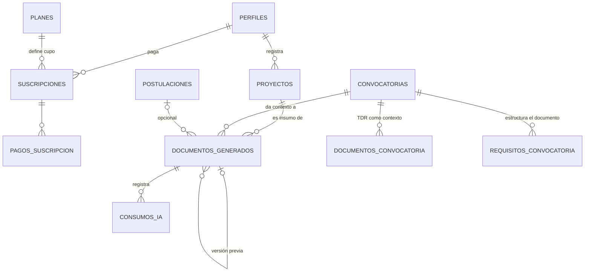

# Modelo de datos (26 tablas)

> Parte de la especificación del MVP **v6** · Plataforma de Gestión de Convocatorias.
> Índice general en `docs/README.md`. Contexto rápido en `CLAUDE.md`.

---

## 9. Modelo de datos

**26 tablas**: 12 base de la v2 (incluida `perfiles`), 10 del módulo de consultores y suscripciones de la v3, 3 del módulo de IA y `eventos_seguridad` de la extensión de seguridad v5, más columnas nuevas en proyectos, planes, suscripciones y perfiles. *Hasta la sesión 003 el documento decía "24 tablas": la cifra no contaba `perfiles` ni `eventos_seguridad`; el conjunto de tablas no cambió.*

### 9.1 Diagrama entidad–relación (módulo de IA y su conexión)



### 9.2 Columnas nuevas en tablas existentes

**PROYECTOS** *(enriquecido — RF-45)*

| Campo | Tipo | Nota |
|---|---|---|
| problema | text | Problema que resuelve |
| objetivo_general | text | |
| objetivos_especificos | text[] | Lista |
| poblacion_beneficiaria | text | |
| actividades | text | Actividades principales |
| resultados_esperados | text | |
| duracion_meses | int | |
| presupuesto_estimado | numeric | |
| experiencia_empresa | text | Trayectoria y capacidad |
| completitud | int | 0–100, calculado sobre los campos de contenido (RF-46) |

**PLANES** — se agrega `creditos_ia_mensuales` (int, RF-36)

**SUSCRIPCIONES** — se agregan `creditos_usados_periodo` (int), `creditos_extra` (int, paquetes adicionales que no se reinician) y `periodo_creditos_inicio` (date, ancla del reinicio mensual)

### 9.3 Tablas nuevas

**DOCUMENTOS_GENERADOS**

| Campo | Tipo | Restricción |
|---|---|---|
| id | uuid | PK |
| usuario_id | uuid | FK → perfiles, not null · **RLS** |
| proyecto_id | uuid | FK → proyectos, not null |
| convocatoria_id | uuid | FK → convocatorias, not null |
| postulacion_id | uuid | FK → postulaciones, **nullable** (se vincula si existe) |
| titulo | text | |
| contenido | text | Markdown estructurado por secciones |
| pendientes | text[] | Lista de campos marcados como pendientes (RF-57) |
| estado | text | check: `generando` \| `generado` \| `editado` \| `exportado` \| `error` |
| version | int | default 1 |
| documento_padre_id | uuid | FK → documentos_generados (regeneraciones) |
| plantilla_id | uuid | FK → plantillas_generacion (versión del prompt con que se generó) |
| ajustes_usados | int | default 0 (hasta 3 gratis — RN-17) |
| compartido_con_consultor_id | uuid | FK → perfiles, **nullable** — consultor autorizado a leer/editar; se limpia al revocar o si el encargo deja de estar `en_curso` (RN-22, RN-27, RF-71) |
| ultima_edicion_por | uuid | FK → perfiles, **nullable** — quién hizo el último cambio: la empresa o el consultor autorizado (RNF-11) *(nuevo v5)* |
| creado_at / actualizado_at | timestamptz | |

**PLANTILLAS_GENERACION** — la instrucción del generador como dato versionado (RF-63, CU-37)

| Campo | Tipo | Restricción |
|---|---|---|
| id | uuid | PK |
| nombre | text | not null |
| version | int | not null |
| contenido | text | **Aquí se carga el prompt propio**: instrucciones de estructura, tono, reglas de veracidad y manejo de pendientes |
| activa | boolean | solo una activa a la vez |
| creada_por | uuid | FK → perfiles (admin) |
| creado_at | timestamptz | default now() |

> `documentos_generados` guarda `plantilla_id` para saber con qué versión se produjo cada documento y poder comparar calidad entre iteraciones del prompt.

**CONSUMOS_IA** — bitácora de costo y auditoría (RF-52, RNF-24)

| Campo | Tipo | Restricción |
|---|---|---|
| id | uuid | PK |
| usuario_id | uuid | FK → perfiles |
| documento_id | uuid | FK → documentos_generados, nullable si falló antes de crearse |
| tipo | text | check: `generacion` \| `ajuste` |
| tokens_entrada / tokens_salida | int | |
| costo_estimado | numeric | |
| exito | boolean | **false ⇒ no descontó crédito** (RN-17) |
| mensaje_error | text | |
| fecha | timestamptz | default now() |

> `usuario_id` registra **quién originó** el consumo (puede ser el consultor autorizado que pidió el ajuste). El crédito descontado, sin embargo, siempre sale del cupo de la **empresa dueña del documento** — la capa de aplicación resuelve la suscripción a débitar por `documentos_generados.usuario_id` (el dueño), no por quien disparó la acción (RN-28) *(nuevo v5)*.

### 9.4 Índices adicionales

`documentos_generados (usuario_id)`, `documentos_generados (proyecto_id, convocatoria_id)`, `consumos_ia (usuario_id, fecha)`, `suscripciones (periodo_creditos_inicio)` para el job de reinicio.

### 9.5 Políticas RLS adicionales

| Tabla | Política |
|---|---|
| documentos_generados | La empresa dueña (`usuario_id = auth.uid()`) lee y edita `titulo`, `contenido` y `pendientes`. **El consultor con `compartido_con_consultor_id = auth.uid()` y encargo `en_curso` sobre ese proyecto puede leer y editar `contenido`/`pendientes`, nunca exportar** (RN-22, RN-27, RF-71/72, *ampliado en v5*). **Crear el documento, `ajustes_usados`, `estado`, `version`, `plantilla_id` y la autorización del consultor los escribe solo el servidor** al generar, ajustar, exportar, compartir o revocar: si el cliente pudiera escribir el contador de ajustes, podría ponerlo en 0 y saltarse RN-17 *(precisado en v6, sesión 003)*; admin puede leer para soporte |
| consumos_ia | Solo lectura del propio usuario; escritura desde el servidor; admin lee todo |

### 9.6 Cálculo del porcentaje de compatibilidad (RF-16)

```sql
-- Criterios evaluados: tipo_proyecto, sector, tipo_entidad, monto, ubicación
WITH coincidencias AS (
  SELECT c.id,
         COUNT(*) FILTER (WHERE cat.tipo = 'tipo_proyecto') > 0 AS m_tipo,
         COUNT(*) FILTER (WHERE cat.tipo = 'sector')        > 0 AS m_sector,
         COUNT(*) FILTER (WHERE cat.tipo = 'tipo_entidad')  > 0 AS m_entidad
  FROM convocatorias c
  JOIN convocatoria_categoria cc ON cc.convocatoria_id = c.id
  JOIN categorias cat            ON cat.id = cc.categoria_id
  JOIN proyecto_categoria pc     ON pc.categoria_id = cc.categoria_id
  WHERE pc.proyecto_id = :proyecto_id
    AND c.estado = 'publicada' AND c.fecha_cierre >= CURRENT_DATE
  GROUP BY c.id
)
-- % = (criterios coincidentes / 5) * 100, sumando monto dentro de rango y ubicación
```

El monto coincide si `monto_buscado` está dentro de `[monto_min, monto_max]`; la ubicación si es igual o la convocatoria es de cobertura nacional. El resultado se presenta como porcentaje con el desglose por criterio, y se acompaña siempre de la aclaración de RN-05.

### 9.7 Jobs automáticos (pg_cron)

```sql
-- Job 1 · cierre de convocatorias vencidas (RF-10)
UPDATE convocatorias SET estado='cerrada'
WHERE estado='publicada' AND fecha_cierre < CURRENT_DATE;

-- Job 2 · vencimiento de suscripciones con gracia (RF-39, RN-16)
UPDATE suscripciones SET estado='en_gracia'
WHERE estado IN ('activa','trial') AND fecha_vencimiento < CURRENT_DATE;
UPDATE suscripciones SET estado='vencida'
WHERE estado='en_gracia' AND fecha_vencimiento < CURRENT_DATE - INTERVAL '5 days';

-- Job 3 · reinicio mensual de créditos (RF-49, RN-18)
UPDATE suscripciones
SET creditos_usados_periodo = 0,
    periodo_creditos_inicio = periodo_creditos_inicio + INTERVAL '1 month'
WHERE estado IN ('activa','trial')
  AND periodo_creditos_inicio + INTERVAL '1 month' <= CURRENT_DATE;
```

### 9.8 Indicadores públicos de la landing (RF-44)

```sql
SELECT COUNT(*) AS convocatorias_vigentes,
       SUM(COALESCE(monto_max, monto_min)) AS monto_disponible,
       COUNT(DISTINCT entidad_convocante) AS entidades
FROM convocatorias
WHERE estado='publicada' AND fecha_cierre >= CURRENT_DATE;
```

Más el conteo de consultores aprobados. Se sirve con caché de una hora.

### 9.8b Extensión v5 — enlace oficial de postulación

**Columna nueva en CONVOCATORIAS** (RF-05, RF-09, RF-73, RN-01, RNF-29)

| Campo | Tipo | Restricción |
|---|---|---|
| url_postulacion | text | Validada en el servidor como `http`/`https` bien formada (RNF-29); **obligatoria para publicar** (RN-01) |

No requiere tabla ni política RLS nueva: hereda la misma política de `convocatorias` ya documentada en §9.10 (lectura pública si está publicada y vigente).

### 9.9 Extensión v5 — seguridad y auditoría

Cierra los vacíos detectados en la auditoría de seguridad de la arquitectura: cobertura de RLS incompleta, ausencia de MFA para administradores y falta de visibilidad sobre eventos de abuso (RNF-25..28).

**Nueva tabla EVENTOS_SEGURIDAD** (RNF-11, RNF-25..27, RF-65)

| Campo | Tipo | Restricción |
|---|---|---|
| id | uuid | PK |
| tipo | text | check: `login_fallido` \| `acceso_denegado` \| `limite_tasa` \| `mfa_activado` \| `mfa_fallido` |
| usuario_id | uuid | FK → perfiles, **nullable** (un login fallido puede no resolver a un usuario existente) |
| ip | inet | |
| ruta | text | endpoint o recurso afectado |
| detalle | text | |
| bloqueado_hasta | timestamptz | **nullable**; solo para `tipo = limite_tasa` — el bloqueo se evalúa comparando contra este valor, sin necesitar un job adicional |
| fecha | timestamptz | default now() |

Índices: `eventos_seguridad (usuario_id, fecha)`, `eventos_seguridad (tipo, fecha)`.

**Columna nueva en PERFILES**

| Campo | Tipo | Nota |
|---|---|---|
| mfa_habilitado | boolean | default false; debe ser `true` antes de que un perfil con rol administrador pueda operar funciones administrativas (RNF-28, CU-38) |

**Política RLS — EVENTOS_SEGURIDAD**

| Tabla | Política |
|---|---|
| eventos_seguridad | Solo lectura para el rol administrador; sin acceso de lectura para empresa o consultor; escritura únicamente desde código de servidor (nunca desde el cliente) |

> El conteo y bloqueo en tiempo real de RNF-27 (límite de tasa) vive en un almacén rápido fuera de Postgres (p. ej. Upstash Redis o Vercel Edge Config), para no sobrecargar la base con una escritura por request; solo el resultado — el bloqueo confirmado — se persiste en `eventos_seguridad` para auditoría y para que el administrador pueda liberarlo (CU-40).

### 9.9b Extensión v5 — contexto y contacto en encargos

Cierra el vacío del marketplace de consultores: la solicitud llevaba solo título y descripción libres, sin el contenido del proyecto ni una convocatoria asociada, y el contacto entre las partes no tenía un punto de revelación definido (RF-68..70).

**Columnas nuevas en ENCARGOS**

| Campo | Tipo | Restricción |
|---|---|---|
| tipo_ayuda | text | check: `convocatoria_especifica` \| `buscar_convocatoria` |
| convocatoria_id | uuid | FK → convocatorias, **nullable** (solo si `tipo_ayuda = convocatoria_especifica`) |
| postulacion_id | uuid | FK → postulaciones, **nullable** — autovinculado si ya existía una postulación en curso para ese par proyecto-convocatoria |
| motivo_cancelacion | text | **nullable** — se completa solo cuando `estado = cancelado`; lo escribe el trigger/job que produce la cancelación (suspensión del consultor o vencimiento de su suscripción, RN-29), nunca el usuario |

No se agrega tabla ni columna para el correo de contacto: se usa el que ya administra Supabase Auth (`auth.users.email`); la capa de aplicación decide **cuándo mostrarlo** (RF-70, RN-26), no dónde guardarlo.

**Política RLS adicional**

| Tabla | Política |
|---|---|
| proyectos, convocatorias (lectura por un consultor) | Un consultor puede leer el proyecto y la convocatoria vinculados a un `encargo` propio **solo mientras ese encargo esté `pendiente`, `en_curso` o `esperando_asignacion`** — no de forma permanente ni sobre otros proyectos de la misma empresa (RN-25) |

### 9.10 Cobertura de RLS — tablas base (v2/v3)

Hasta v4 solo estaba documentada la política de las tablas nuevas del módulo de IA (§9.5); las 21 tablas base no tenían su política explícita por escrito, aunque el diagrama y la arquitectura ya asumían "RLS por usuario". Esta sección traduce las reglas de aislamiento ya establecidas en RNF-03, RN-01, RN-04, RN-07, RN-08, RN-09, RN-12 y RN-22 a política explícita por tabla, cerrando ese vacío (RNF-25).

> Los nombres de tabla aquí usados son los referidos en los casos de uso, los requerimientos y el diagrama entidad–relación de v2/v3. Concílialos con el esquema real al escribir la migración del Sprint 0 si difieren en el detalle.

> **Precondición de todas estas políticas (RN-30, *nuevo v6*):** cada tabla con datos de usuario debe declarar su columna de propietario —`proyectos.usuario_id`, `postulaciones.usuario_id`, `documentos_generados.usuario_id`, `encargos.empresa_id` / `consultor_id`— antes de que la política pueda escribirse. La política RLS y el filtrado por propietario en la capa de aplicación son controles **complementarios**: se exigen los dos, no uno u otro.

| Tabla | Política |
|---|---|
| perfiles | Cada usuario lee y edita solo su propio registro (`id = auth.uid()`); el administrador lee todos |
| proyectos | Solo el dueño (`usuario_id = auth.uid()`) lee, edita y elimina; el administrador lee para soporte (RNF-03) |
| convocatorias, fuentes, categorias, convocatoria_categoria, requisitos_convocatoria, documentos_convocatoria | Lectura pública solo de las **publicadas y vigentes**; escritura exclusiva del administrador (RN-01, RN-07) |
| proyecto_categoria | Sigue la misma regla que `proyectos`: visible y editable solo por el dueño del proyecto asociado |
| postulaciones y su checklist/historial | Solo la empresa dueña de la postulación (`usuario_id = auth.uid()`); el administrador lee para soporte (RN-04, RNF-03) |
| perfil de consultor (portafolio, especialidades, descripción) | Lectura pública si `estado_perfil = aprobado`; edición solo por el propio consultor. **Sitio web, redes y hoja de vida quedan excluidos de la lectura pública en todos los casos: solo administrador, o la empresa que tenga una solicitud activa con ese consultor — la condición se evalúa sobre la pareja (empresa de la sesión, consultor), no sobre la existencia de cualquier solicitud** (RN-12, RF-80, RNF-16, *ampliado en v5; precisado en v6*) |
| encargos y sus avances | Visibles solo para la empresa y el consultor del encargo; el administrador lee todos (RN-08, RN-10, RNF-03) |
| calificaciones | Lectura pública (componen el rating); escritura solo por la empresa dueña del encargo calificado, una única vez, inmutable (RN-09, RNF-17) |
| planes | Lectura pública; escritura exclusiva del administrador |
| suscripciones, pagos_suscripcion | Cada suscriptor lee solo las propias; el administrador lee y escribe todas (RNF-20) |

### 9.11 Cómo se aplican las políticas *(nuevo v6, sesión 003)*

Decisiones de mecanismo tomadas al escribir las migraciones (`supabase/migrations/`). No cambian qué puede ver cada rol; fijan cómo se garantiza.

1. **Mínimo privilegio en escritura.** Lo que §9.5 y §9.10 no conceden expresamente al usuario lo escribe solo el servidor (API routes con `service_role`, RNF-26, o jobs de `pg_cron`): encargos y sus avances, calificaciones fuera de la inserción única, consumos de IA, eventos de seguridad, suscripciones y pagos. Esas tablas tienen política de lectura, sin política de escritura para `authenticated`.
2. **Columnas protegidas en filas editables.** Donde el usuario puede editar su propia fila, un trigger rechaza el cambio de las columnas que no le corresponden: en `perfiles`, `rol` y `mfa_habilitado`; en `consultor_perfiles`, `estado_perfil`, `motivo_rechazo`, `es_equipo_interno`, `revisado_por`/`revisado_at`, `rating_promedio` y `total_encargos_completados`; en `proyectos` y `postulaciones`, el propietario; en `documentos_generados`, todo salvo `titulo` (solo dueño), `contenido` y `pendientes`. El `service_role` no queda sujeto a estos triggers.
3. **Administrador = rol + MFA verificado.** Toda política que concede algo al administrador exige además `aal2` en el JWT de la sesión (RNF-28, RN-24). Un administrador sin segundo factor verificado se trata como un usuario sin privilegios.
4. **Contacto del consultor por columna.** RLS filtra filas, no columnas. `sitio_web` y `cv_path` quedan sin permiso de lectura directa para `anon` y `authenticated`, y se leen con la función `public.contacto_consultor(consultor_id)`, que los devuelve solo al propio consultor, al administrador o a la empresa con solicitud activa con él (RF-80). `consultor_redes` sigue la misma condición con RLS por fila.
5. **Solicitud activa** (RF-80) = existe un encargo de la pareja (empresa de la sesión, consultor) en estado `pendiente` o `en_curso`.
6. **Acceso derivado del consultor a documentos** (RN-27): la política no se fía de `compartido_con_consultor_id` sola; exige además un encargo `en_curso` de ese consultor sobre el proyecto del documento, evaluado en cada consulta.

---

