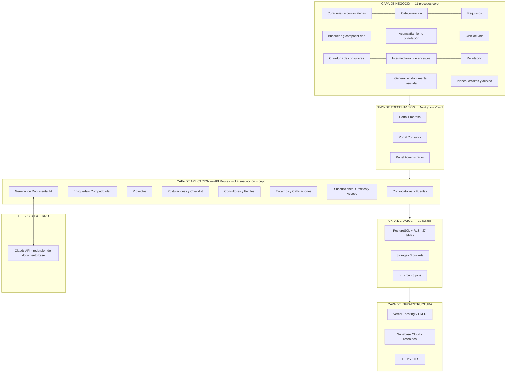
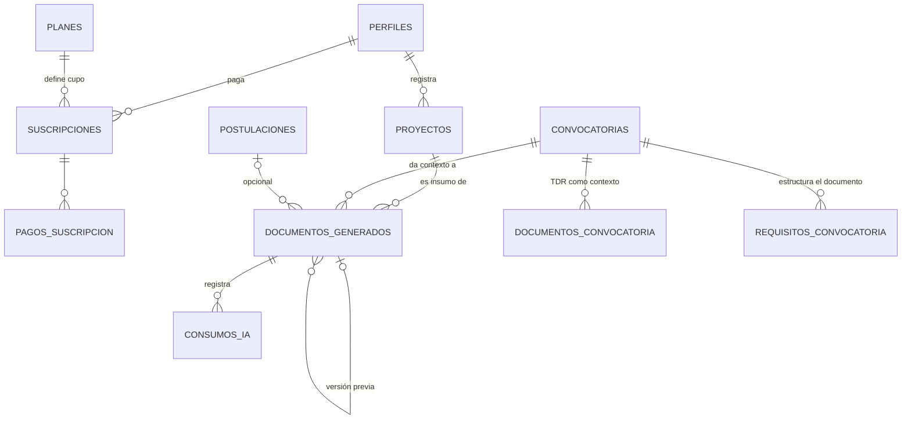

# Plataforma de Gestión de Convocatorias — Especificación completa del MVP (versión 6)

**Alcance:** Colombia · carga manual de convocatorias · **generación documental con IA** · red de consultores · suscripciones por rol (créditos de IA solo en los planes de empresa)
**Stack:** Next.js en Vercel + Supabase (PostgreSQL, Auth, Storage, pg_cron) + Claude API
**Fecha:** Septiembre 2026 · **Estado:** especificación de trabajo

> **Novedades de la v4:** módulo de **generación del documento base de postulación con IA** (a partir de un proyecto de la empresa adaptado a la convocatoria elegida), **créditos de IA por plan de suscripción**, **porcentaje de compatibilidad** en las sugerencias, **indicadores públicos del catálogo** en la landing, **chips de búsqueda sugerida**, y una **propuesta de planes y precios** construida sobre el benchmark de mercado.
>
> **Supuestos tomados en esta versión** (corregibles): el formulario de proyecto se enriquece con campos de contenido; la IA lee el TDR adjunto como contexto de generación; el trial queda en 7 días con 3 créditos (reducido desde 14 por decisión del Product Owner, 16-sep-2026); los precios de la sección 10 son una propuesta a validar.
>
> **Pendiente de incorporar:** la **plantilla de instrucción (prompt) propia** con la que se genera el documento. El diseño la trata como configuración administrable y versionada (RF-63, tabla `plantillas_generacion`), de modo que se cargue y se ajuste sin desplegar código.
>
> **Adenda v6, sesión 005 (acceso):** entrada con dos puertas (empresa o entidad / consultor), panel administrativo invisible (404) para quien no es administrador y administradores solo por invitación de un Propietario único. Ver `CU-14`, `CU-41..42`, `RF-84..87`, `RNF-35`, `RN-06`, `RN-31..32` y `docs/05 §9.12`. *El detalle del modelo de datos de esta adenda vive en los documentos separados.*
>
> **Adenda v5 (auditoría de seguridad + marketplace de consultores):** cobertura de RLS completa en las 26 tablas (27 desde la v6), MFA obligatorio para administradores, límite de tasa, saneamiento del TDR contra inyección de prompt, contexto de proyecto/convocatoria adjunto automáticamente al solicitar un consultor con tipo de ayuda explícito ("convocatoria específica" vs. "buscar convocatoria"), redes/sitio web del consultor condicionados a solicitud activa, y correo de contacto revelado solo al aceptar el encargo. Ver `CU-38..40`, `RF-64..70`, `RNF-25..28`, `RN-23..26`.

---

## Índice

1. [Objetivo y alcance del MVP](#1-objetivo-y-alcance-del-mvp)
2. [Actores](#2-actores)
3. [Casos de uso](#3-casos-de-uso)
4. [Requerimientos funcionales](#4-requerimientos-funcionales)
5. [Requerimientos no funcionales](#5-requerimientos-no-funcionales)
6. [Reglas de negocio](#6-reglas-de-negocio)
7. [Procesos core y no core del negocio](#7-procesos-core-y-no-core-del-negocio)
8. [Arquitectura de la solución](#8-arquitectura-de-la-solución)
9. [Modelo de datos](#9-modelo-de-datos)
10. [Modelo de negocio: planes, precios y créditos](#10-modelo-de-negocio-planes-precios-y-créditos)
11. [Metodología y cronograma](#11-metodología-y-cronograma)
12. [Métricas de éxito del MVP](#12-métricas-de-éxito-del-mvp)
13. [Análisis competitivo y diferenciación](#13-análisis-competitivo-y-diferenciación)
14. [Evolución posterior al MVP](#14-evolución-posterior-al-mvp)
15. [Matriz de trazabilidad](#15-matriz-de-trazabilidad)

---

## 1. Objetivo y alcance del MVP

El MVP valida tres hipótesis: (1) que una empresa encuentra la convocatoria correcta para su proyecto en una fracción del tiempo actual; (2) que la IA le ahorra el trabajo más pesado de la postulación —redactar el documento base adaptado a esa convocatoria—; y (3) que quien no tiene tiempo de gestionarla contrata un consultor a través de la plataforma. Los tres lados pagan suscripción.

### 1.1 Decisiones de alcance

| Decisión | Detalle |
|---|---|
| **Mercado** | Solo Colombia: Minciencias, cámaras de comercio, cooperación internacional, fondos regionales |
| **Ingesta** | Carga **manual** por un administrador: datos estructurados digitados + documentos adjuntos (TDR, términos, anexos). Sin scraping |
| **IA acotada** | La IA **no** estructura el catálogo ni hace matching semántico. Su único uso en el MVP es **generar el documento base de postulación** a partir del proyecto del usuario y del contexto de la convocatoria (datos estructurados + requisitos + TDR adjunto) |
| **Búsqueda sin IA** | Catálogo con filtros por categorías + sugerencias por cruce de atributos, presentadas como **porcentaje de compatibilidad** con desglose por criterio |
| **La plataforma no presenta la postulación** | La radicación se hace en el portal de la entidad convocante. La plataforma acompaña la **preparación**: encontrar, evaluar compatibilidad, generar el documento base, organizar el checklist y hacer seguimiento |
| **Red de consultores** | Tercer rol: perfil con portafolio, hoja de vida y redes; ingreso aprobado por administradores; encargos por tarea desde el proyecto (directorio o asignación interna); rating por encargo completado |
| **Modelo de ingresos** | Suscripción mensual o anual para empresas y consultores. Los planes de **empresa** se diferencian entre sí **por volumen de créditos de IA**; el plan de **consultor** no lleva cupo —no existe operación que pueda consumirlo (RN-28)— y se vende por presencia en el directorio y recepción de encargos *(precisado en v6)*. Trial de 7 días con 3 créditos, solo empresas *(mod. v6: antes 14)*. Piloto: activación manual; pasarela (Wompi) como primera evolución. La plataforma **no** intermedia el pago de los encargos (RN-14) |
| **Fuera del MVP** | Alertas por correo, extracción de TDR para poblar el esquema, matching semántico, scraping, pasarela en línea, comisión por encargo, marketplace de aliados, LATAM/Brasil, bóveda de documentos de la empresa (backlog — ver 14) |

### 1.2 Principio rector: veracidad del contenido generado

Heredado de la sección 6 del alcance inicial y ahora **operativo**: el documento generado por la IA **no completa datos, cifras ni antecedentes que el usuario no haya proporcionado**. Todo campo sin información de origen queda marcado en el documento como pendiente de completar, nunca inventado. El documento es una **base editable**, no una postulación lista: el usuario la revisa, la completa y la radica por su cuenta en el portal de la entidad.

---

## 2. Actores

| Actor | Descripción | Casos de uso |
|---|---|---|
| **Usuario Empresa o entidad** *(v6: entra por la puerta "Soy empresa o entidad")* | Suscriptor. Explora el catálogo, registra proyectos, genera documentos con IA, postula, hace seguimiento y contrata consultores | CU-07..14, CU-19..24, CU-28..30, CU-33..34 |
| **Consultor** | Suscriptor. Perfil aprobado por administrador; recibe y ejecuta encargos. **No genera documentos ni dispone de cupo propio de créditos de IA**: solo interviene sobre documentos que la empresa le autorice explícitamente (CU-34, RF-71), y esos ajustes los paga la empresa dueña (RN-28) *(precisado en v6)* | CU-14..18, CU-28..30, CU-34 |
| **Administrador de Contenido** | **Solo existe por invitación del Propietario (CU-41, CU-42) y con cuenta dedicada; el panel es invisible para cualquier otro usuario** *(v6)*. Fuentes y convocatorias; revisión y aprobación de consultores; asignaciones internas; planes, precios y suscripciones; **seguridad y auditoría** *(v5)* | CU-01..05, CU-25..27, CU-31, CU-37, **CU-38..40** |
| **Propietario de la plataforma** *(nuevo v6)* | Un único administrador designado fuera de la aplicación (RN-31). Además de todo lo del Administrador, es el único que invita administradores y revoca su acceso | CU-41, más los del Administrador |
| **Reloj del sistema** | pg_cron: cierre de convocatorias, vencimiento de suscripciones, reinicio mensual de créditos | CU-06, CU-32, CU-35 |
| **Servicio de IA (Claude API)** | Actor externo. Recibe el contexto de generación y devuelve el documento base | CU-33 |
| **Pasarela de pagos** | Actor externo, fase de evolución | CU-28, CU-29 |

---

## 3. Casos de uso

**38 casos de uso** en 10 módulos. Marcados *(mod. v4)* / *(nuevo v4)* los tocados en esa versión, y *(nuevo v5)* los agregados en la extensión de seguridad.

### Módulo A — Gestión de convocatorias (Administrador)

#### CU-01 · Parametrizar fuente

| Campo | Contenido |
|---|---|
| **Actor** | Administrador de Contenido |
| **Descripción** | Registrar o editar fuentes de convocatorias |
| **Precondiciones** | Sesión con rol administrador |
| **Flujo principal** | 1. Abre el módulo de fuentes. 2. Crea una fuente con nombre, tipo de entidad (pública/cámara/cooperante/fondo), URL y notas de parametrización. 3. El sistema guarda y la lista como activa |
| **Flujos alternos** | 3a. Editar. 3b. Desactivar (no se elimina: conserva convocatorias históricas) |
| **Postcondiciones** | Fuente disponible para asociar convocatorias |

#### CU-02 · Cargar convocatoria *(mod. v5)*

| Campo | Contenido |
|---|---|
| **Actor** | Administrador de Contenido |
| **Precondiciones** | Existe al menos una fuente activa |
| **Flujo principal** | 1. Crea la convocatoria asociada a una fuente. 2. Digita nombre, entidad convocante, descripción/objeto, monto mínimo y máximo, ubicación o cobertura, fecha de apertura y de cierre **y el enlace oficial de postulación (URL del portal de la entidad convocante)**. 3. Asigna categorías: tipo de proyecto, sector, tipo de entidad elegible. 4. Queda en estado **borrador** |
| **Flujos alternos** | 2a. Guardar incompleta y continuar después |
| **Incluye** | CU-03 |

#### CU-03 · Adjuntar documentos

| Campo | Contenido |
|---|---|
| **Actor** | Administrador de Contenido |
| **Descripción** | Adjuntar TDR, términos, anexos y formatos. Quedan disponibles para descarga del usuario **y como contexto de la generación con IA (CU-33)** |
| **Flujo principal** | 1. Adjunta archivos indicando su tipo. 2. Asigna nombre descriptivo. 3. Se almacenan en Supabase Storage vinculados a la convocatoria |
| **Flujos alternos** | 1a. Reemplazar o eliminar antes de publicar |
| **Relación** | Incluido en CU-02 |

#### CU-04 · Definir requisitos de postulación

| Campo | Contenido |
|---|---|
| **Actor** | Administrador de Contenido |
| **Descripción** | Lista de requisitos y documentos exigidos; genera el checklist (CU-11) y orienta la estructura del documento generado (CU-33) |
| **Flujo principal** | 1. Agrega ítems. 2. Define descripción, tipo (documento/condición), obligatoriedad y orden. 3. Guarda la lista |

#### CU-05 · Publicar convocatoria *(mod. v5)*

| Campo | Contenido |
|---|---|
| **Precondiciones** | Datos mínimos **(incluido el enlace oficial de postulación)** + ≥1 documento adjunto + requisitos definidos |
| **Flujo principal** | 1. Revisa la ficha. 2. "Publicar". 3. El sistema valida y cambia a **publicada** registrando quién y cuándo |
| **Flujos alternos** | 3a. Falla la validación → indica qué falta, **incluido un enlace de postulación faltante o inválido**. 3b. Despublicar. 3c. Editar (auditado) |

#### CU-06 · Cerrar convocatoria vencida (automático)

| Campo | Contenido |
|---|---|
| **Actor** | Reloj del sistema (pg_cron) |
| **Flujo principal** | Job diario: las publicadas con `fecha_cierre < hoy` pasan a **cerrada** y salen del catálogo, de las sugerencias y de la generación con IA |

### Módulo B — Búsqueda y descubrimiento (Usuario Empresa)

#### CU-07 · Explorar catálogo con filtros *(mod. v4)*

| Campo | Contenido |
|---|---|
| **Actor** | Usuario Empresa |
| **Descripción** | Camino directo de búsqueda, navegable sin suscripción activa (modo consulta) |
| **Precondiciones** | Sesión iniciada con cuenta de **empresa o entidad**. Visitantes y consultores no acceden al catálogo (RN-33) *(mod. v6)* |
| **Flujo principal** | 1. Abre el catálogo (publicadas y vigentes). 2. Busca por texto libre. 3. Aplica filtros combinables: tipo de proyecto, sector, entidad, rango de monto, ubicación, fecha de cierre. 4. Resultados en < 2 s |
| **Flujos alternos** | 2a. **Chips de búsqueda sugerida** clickeables ("innovación agro Antioquia", "cooperación internacional ambiental") que precargan filtros y enseñan a usar la herramienta *(nuevo v4)*. 4a. Sin resultados → chips alternativos y sugerencia de relajar filtros |

#### CU-08 · Ver detalle y descargar documentos *(mod. v4, mod. v5)*

| Campo | Contenido |
|---|---|
| **Precondiciones** | Sesión con cuenta de empresa o entidad (RN-33) *(mod. v6)* |
| **Flujo principal** | 1. Abre la convocatoria. 2. Ve datos completos, categorías, requisitos y fechas. 3. Descarga documentos (URLs firmadas). 4. Dispone de tres acciones: **"Postular"** (CU-11), **"Generar documento con IA"** (CU-33) y **"Ir al portal de la entidad"** — abre el enlace oficial de postulación en una pestaña nueva *(v5)* |

#### CU-09 · Registrar proyecto *(mod. v4 — enriquecido)*

| Campo | Contenido |
|---|---|
| **Actor** | Usuario Empresa |
| **Descripción** | El proyecto deja de ser solo un conjunto de atributos de filtrado y pasa a ser **el insumo de contenido de la generación con IA**. Se llena una vez y se reutiliza en todas las postulaciones |
| **Flujo principal** | 1. **Datos de clasificación** (los que alimentan filtros y sugerencias): nombre, monto buscado, ubicación, categorías (tipo de proyecto, sector, tipo de entidad). 2. **Datos de contenido** (los que alimentan la IA): problema que resuelve, objetivo general, objetivos específicos, población beneficiaria, actividades principales, resultados esperados, duración en meses, presupuesto estimado y experiencia o trayectoria de la empresa. 3. El sistema calcula y muestra un **indicador de completitud del proyecto**, advirtiendo que a mayor completitud, mejor el documento generado |
| **Flujos alternos** | 1a. Guardar con solo los datos de clasificación: sirve para buscar, pero al generar documento el sistema avisa qué falta. 2a. Editar o eliminar un proyecto propio |
| **Postcondiciones** | Proyecto disponible para sugerencias (CU-10), generación con IA (CU-33) y solicitud de consultor (CU-19). **Los campos que el indicador de completitud señala como faltantes se pueden diligenciar desde la propia ficha, sin volver al listado (RF-81)** *(ampliado en v6)* |

#### CU-10 · Obtener convocatorias sugeridas *(mod. v4 — porcentaje)*

| Campo | Contenido |
|---|---|
| **Precondiciones** | Proyecto registrado + suscripción activa o trial |
| **Flujo principal** | 1. Abre "Sugerencias" desde su proyecto. 2. El sistema cruza categorías proyecto × convocatoria vigente, más monto y ubicación. 3. Presenta cada resultado con un **porcentaje de compatibilidad** (criterios coincidentes sobre criterios evaluados) y el desglose de qué coincide y qué no. 4. Ordena de mayor a menor compatibilidad. 5. Responde en < 3 s |
| **Flujos alternos** | 2a. Sin coincidencias → indica qué atributo restringe más |
| **Nota** | El porcentaje es presentación del mismo cálculo determinístico de coincidencias: **no interviene IA** y así se comunica al usuario (RN-05) |

#### CU-36 · Ver indicadores públicos del catálogo *(nuevo v4)*

| Campo | Contenido |
|---|---|
| **Actor** | Visitante / Usuario Empresa |
| **Descripción** | La landing muestra contadores calculados en vivo desde el catálogo: convocatorias vigentes, monto total disponible en COP, número de entidades convocantes y consultores aprobados. **Son solo cifras agregadas: el visitante no ve ninguna convocatoria; para explorarlas debe registrarse como empresa o entidad (RN-33)** *(mod. v6)* |
| **Flujo principal** | 1. El visitante abre la landing. 2. El sistema calcula los indicadores sobre convocatorias publicadas vigentes (con caché de 1 hora). 3. Los muestra como prueba social junto al llamado a registrarse |
| **Postcondiciones** | Ninguna (consulta pública) |

### Módulo C — Postulación y seguimiento (Usuario Empresa)

#### CU-11 · Iniciar postulación

| Campo | Contenido |
|---|---|
| **Precondiciones** | Convocatoria publicada y vigente + suscripción activa o trial |
| **Flujo principal** | 1. "Postular" desde la ficha. 2. Opcionalmente vincula un proyecto. 3. Se crea la postulación **en preparación** y se **copian** los requisitos como checklist |
| **Flujos alternos** | 1a. Cerrada o despublicada → bloqueado. 1b. Sin suscripción → modal de suscripción |
| **Nota** | La postulación es un **expediente de preparación**: la radicación se hace en el portal de la entidad (RN-19) |

#### CU-12 · Gestionar checklist

| Campo | Contenido |
|---|---|
| **Flujo principal** | 1. Abre la postulación. 2. Marca ítems completados o pendientes. 3. El sistema recalcula el porcentaje de avance |

#### CU-13 · Actualizar estado de postulación *(mod. v5)*

| Campo | Contenido |
|---|---|
| **Flujo principal** | 1. Cambia el estado siguiendo el grafo declarado (RF-83): en preparación → presentada → en evaluación → aprobada/rechazada → cerrada; **solo se ofrecen los estados alcanzables desde el actual, y las transiciones terminales piden confirmación**. 2. Cada transición queda en el historial con quién y cuándo. **3. El detalle de la postulación ofrece "Generar documento con IA" (CU-33) si aún no existe un documento para ese proyecto-convocatoria, o "Editar documento" (CU-34) si ya existe. 4. Botón "Ir al portal de la entidad", que abre el enlace oficial de postulación en una pestaña nueva — refuerza que la radicación se hace ahí, no en la plataforma (RN-19). 5. Botón "Solicitar consultor" (CU-19), con el proyecto y la convocatoria de la postulación ya preseleccionados (tipo de ayuda fijo en "convocatoria específica") (RF-28)** |
| **Flujos alternos** | 1a. Panel con todas las postulaciones activas, avance y fechas. **3a. Si la postulación no tiene un proyecto vinculado (CU-11, flujo 2), el botón primero pide elegir o vincular uno antes de continuar a la generación. 5a. Igual restricción aplica a "Solicitar consultor": sin proyecto vinculado, primero pide elegir o vincularlo** |

### Módulo D — Cuenta

#### CU-14 · Registrarse / iniciar sesión *(mod. v6)*

| Campo | Contenido |
|---|---|
| **Actor** | Visitante (futura empresa o entidad, o consultor) |
| **Flujo principal** | 1. La entrada (landing, registro e inicio de sesión) muestra **dos puertas: "Soy empresa o entidad" y "Soy consultor"**. Ninguna pantalla pública ofrece el rol administrador (RF-84, RF-85). 2. **Registro:** elige la puerta, escribe correo y contraseña y confirma su correo; la puerta fija el rol de la cuenta. 3. Empresa → portal Empresa con trial de **7 días** y 3 créditos de IA. Consultor → portal Consultor con perfil "incompleto". 4. **Inicio de sesión:** correo y contraseña desde cualquiera de las dos puertas; la cuenta entra siempre al portal de su rol. 5. Recuperación de contraseña |
| **Flujos alternos** | 2a. El correo ya tiene cuenta → no se crea otra; se ofrece iniciar sesión. 4a. La puerta elegida no coincide con el rol de la cuenta → se le lleva a su portal real con el aviso "Tu cuenta es de empresa" / "Tu cuenta es de consultor". 4b. La cuenta es de administrador → pasa directo a la verificación en dos pasos (CU-38), sin ningún aviso que delate la existencia del panel |
| **Postcondiciones** | Cada cuenta tiene un único rol, fijado al registrarse. Este caso de uso **nunca** produce un administrador: ese rol solo nace de CU-41 (RN-06, RN-32) |

### Módulo E — Perfil del consultor (Consultor)

#### CU-15 · Registrarse como consultor

| Campo | Contenido |
|---|---|
| **Flujo principal** | 1. Se registra por la puerta **"Soy consultor"** (CU-14) *(mod. v6)*. 2. Se crea la cuenta y el perfil vacío. 3. Solo accede a la edición de su perfil hasta ser aprobado |

#### CU-16 · Crear y editar perfil de consultor

| Campo | Contenido |
|---|---|
| **Precondiciones** | Consentimiento de tratamiento de datos aceptado |
| **Flujo principal** | 1. Foto, nombre profesional, descripción. 2. Especialidades del catálogo de categorías. 3. Página web y redes (LinkedIn, Instagram, Facebook, otras). 4. Portafolio: proyectos previos con nombre, entidad, año, descripción y resultado. 5. Hoja de vida en PDF |
| **Flujos alternos** | Cambios de portafolio o redes tras la aprobación no requieren re-aprobación |
| **Nota** *(v5)* | El consultor los carga y el administrador los usa para verificar veracidad en CU-25; **la empresa solo los ve si tiene una solicitud activa con ese consultor** (RN-12, CU-21) |

#### CU-17 · Enviar perfil a revisión

| Campo | Contenido |
|---|---|
| **Precondiciones** | Mínimos: foto, descripción, ≥1 especialidad y hoja de vida |
| **Flujo principal** | 1. "Enviar a revisión". 2. Pasa a `en_revision` y entra a la bandeja de administradores. 3. Ve el estado de su solicitud |
| **Flujos alternos** | 3a. Rechazado → ve el motivo, corrige y reenvía sin límite |

#### CU-18 · Gestionar encargos *(mod. v5)*

| Campo | Contenido |
|---|---|
| **Precondiciones** | Perfil aprobado. Para aceptar nuevos: suscripción activa |
| **Flujo principal** | 1. Ve solicitudes: proyecto (contenido completo, RF-68), convocatoria si aplica, tarea y tipo de ayuda — si es "buscar convocatoria", ve los datos de clasificación del proyecto para orientar la búsqueda (RF-69). 2. **Acepta** (revela el correo de la empresa, RF-70) o **rechaza**. 3. Si el tipo de ayuda es "buscar convocatoria", reporta candidatas mediante notas de avance. 4. Registra notas de avance. 5. Marca finalización → la empresa puede calificar |
| **Flujos alternos** | **2a.** Suscripción vencida → termina los encargos en curso, no acepta nuevos. Igual que en CU-27, pasan a `cancelado` con motivo registrado ("Suscripción del consultor vencida") — mismo efecto en el dato, dos disparadores distintos (RN-10, RN-29). En el MVP este disparador es el job diario de `pg_cron` (CU-32); no tiene un botón equivalente en el prototipo mientras no exista ese job |

### Módulo F — Contratación de consultores (Usuario Empresa)

#### CU-19 · Solicitar consultor para una tarea *(mod. v5)*

| Campo | Contenido |
|---|---|
| **Precondiciones** | Proyecto registrado + suscripción activa o trial |
| **Flujo principal** | 1. "Solicitar consultor" en la ficha del proyecto. **2. Elige el tipo de ayuda: (a) ayuda con una convocatoria específica — busca por nombre y selecciona de su catálogo o postulaciones la convocatoria a la que quiere aplicar (RF-75); o (b) ayuda para encontrar una convocatoria — no selecciona ninguna.** 3. Describe la tarea (título y descripción, complementaria al contexto ya adjunto). **4. El sistema adjunta automáticamente los datos de contenido del proyecto y, si aplica, los de la convocatoria elegida y sus requisitos (RF-68).** 5. Elige camino: directorio (CU-20) o asignación interna (CU-23) |
| **Flujos alternos** | **1a.** También se abre directo desde la tarjeta del proyecto en el listado (`/proyectos`), sin entrar a la ficha completa — mismo modal, mismo resultado (RF-28). **2a.** Si elige "convocatoria específica" y ya existe una postulación en curso de ese proyecto a esa convocatoria, se vincula automáticamente — el consultor verá también el checklist. **2b.** Iniciado desde el detalle de una postulación (CU-13): el proyecto y la convocatoria quedan preseleccionados (tipo de ayuda fijo en "convocatoria específica"); si la postulación no tiene proyecto vinculado, primero pide vincular uno |

#### CU-20 · Explorar directorio de consultores *(mod. v5)*

| Campo | Contenido |
|---|---|
| **Descripción** | Solo consultores aprobados, activos y con suscripción vigente |
| **Flujo principal** | 1. Tarjetas con foto, nombre, rating, especialidades y encargos completados. 2. Filtra por especialidad y rating. 3. Entra al perfil de un consultor (CU-21), desde donde puede solicitarlo directamente sin depender de haber iniciado la solicitud desde CU-19 **(RF-74, nuevo v5)** |
| **Flujos alternos** | 1a. Directorio vacío → ofrece directamente la asignación interna. **1b. Si ya inició una solicitud desde la ficha de un proyecto (CU-19), un aviso lo recuerda y cada tarjeta lleva directo a confirmarla en el perfil elegido** |

#### CU-21 · Ver perfil del consultor *(mod. v5)*

| Campo | Contenido |
|---|---|
| **Flujo principal** | 1. Rating con reseñas, descripción, portafolio. **2. Sitio web, redes y hoja de vida solo si existe una solicitud activa entre ese consultor y la empresa que está mirando (RN-12, RF-80) — que otra empresa tenga una solicitud abierta con él no habilita a las demás; sin solicitud propia, esos campos aparecen ocultos con una nota de por qué. 3. Botón "Solicitar a este consultor": elige un proyecto propio (y, si aplica, el tipo de ayuda y la convocatoria — con buscador por nombre, RF-75 — igual que CU-19) o una postulación propia ya vinculada a un proyecto — la postulación resuelve proyecto y convocatoria en un solo paso. 4. Describe la tarea y confirma: crea el encargo `pendiente` vía directorio, el mismo resultado que CU-22, sin pasar antes por CU-19/CU-20 (RF-74, nuevo v5)** |
| **Flujos alternos** | **3a.** Si ya trae una solicitud iniciada desde su proyecto (CU-19 → CU-20), el botón pasa a ser "Solicitar para mi tarea" y usa esos datos en vez de abrir el selector. **3b.** Sin proyectos ni postulaciones propias → invita a crear un proyecto primero |
| **Nota** | La restricción de redes protege el sentido de la suscripción del consultor: si fueran públicas desde el perfil, la empresa podría contactarlo por fuera sin pasar nunca por la plataforma |

#### CU-22 · Enviar solicitud a un consultor *(mod. v5)*

| Campo | Contenido |
|---|---|
| **Flujo principal** | 1. Envía la solicitud: tarea + tipo de ayuda + contexto del proyecto y convocatoria ya adjuntos, sea desde CU-19 o elegidos directamente en el perfil del consultor (CU-21, RF-74). 2. Queda `pendiente`. **3. El consultor ve el contexto completo antes de decidir. 4. Acepta (→ `en_curso`): el sistema revela a ambas partes el correo de contacto de la otra (RF-70), o rechaza** |
| **Flujos alternos** | 4a. Rechazada → puede enviarla a otro o pasar a asignación interna; el correo **no** se revela |
| **Nota** *(v5)* | Tiene dos puntos de entrada equivalentes — desde el proyecto (CU-19 → CU-20 → CU-21) o directo desde el directorio/perfil (CU-20/21, RF-74) — ambos producen el mismo encargo `pendiente` vía `directorio` |

#### CU-23 · Solicitar asignación de consultor interno *(mod. v5)*

| Campo | Contenido |
|---|---|
| **Flujo principal** | 1. "Pedir que me asignen un consultor". 2. El encargo queda `esperando_asignacion` y notifica a los administradores, con el contexto ya adjunto (CU-19). 3. El admin asigna un consultor del equipo (CU-26). **4. Al asignarse (→ `en_curso`), el sistema revela a ambas partes el correo de contacto de la otra (RF-70)**. 5. La empresa lo ve como cualquier encargo en curso |

#### CU-24 · Calificar al consultor

| Campo | Contenido |
|---|---|
| **Precondiciones** | Encargo `completado` sin calificación previa |
| **Flujo principal** | 1. El sistema invita a calificar. 2. 1 a 5 estrellas + comentario opcional. 3. Se guarda (inmutable), se recalcula el rating y el encargo pasa a `calificado` |

### Módulo G — Gestión de consultores (Administrador)

#### CU-25 · Revisar solicitudes de ingreso

| Campo | Contenido |
|---|---|
| **Flujo principal** | 1. Bandeja de perfiles `en_revision`. 2. Revisa información, portafolio y hoja de vida. 3. **Aprueba** (entra al directorio y comienza su suscripción) o **rechaza con motivo obligatorio** |

#### CU-26 · Atender solicitudes de asignación interna *(mod. v5)*

| Campo | Contenido |
|---|---|
| **Flujo principal** | 1. Bandeja de encargos `esperando_asignacion`. 2. Revisa proyecto (contexto completo), tarea y tipo de ayuda. 3. Asigna un consultor del equipo interno. 4. El encargo pasa a `en_curso` y **el sistema revela el correo de contacto a empresa y consultor (RF-70)** |

#### CU-27 · Administrar consultores activos *(mod. v5)*

| Campo | Contenido |
|---|---|
| **Flujo principal** | 1. Lista con estado, rating y encargos. 2. **Suspende** (sale del directorio, conserva historial) o **reactiva**. **3. Al suspender, sus encargos `en_curso` pasan a `cancelado` de inmediato, con un motivo registrado ("Consultor suspendido por el administrador"); el historial y las calificaciones ya emitidas no se alteran (RN-29). 4. La misma acción revoca en cascada las autorizaciones de documento que tuviera sobre esos encargos, de modo que pierde el acceso al instante sin que la empresa tenga que intervenir (RF-76, RN-27)** |
| **Flujos alternos** | **3a.** Reactivar el perfil no revive los encargos cancelados — la empresa debe solicitar de nuevo si quiere retomar el trabajo con ese consultor |

### Módulo H — Suscripciones y créditos

#### CU-28 · Elegir plan y suscribirse *(mod. v4)*

| Campo | Contenido |
|---|---|
| **Descripción** | Planes por rol, modalidad mensual o anual (con descuento), **diferenciados por volumen de créditos de IA** |
| **Precondiciones** | Empresa: cuenta creada. Consultor: perfil aprobado (nunca paga antes) |
| **Flujo principal** | 1. Ve los planes de su rol con precios y créditos incluidos. 2. Elige plan y modalidad. 3. **Piloto:** pago acordado por fuera y activación por el administrador. **Con pasarela:** pago en línea y activación automática |
| **Postcondiciones** | Suscripción `activa` con fechas y cupo de créditos del periodo |

#### CU-29 · Renovar suscripción

| Campo | Contenido |
|---|---|
| **Flujo principal** | 1. Avisos al acercarse el vencimiento. 2. Vencida → `en_gracia` por 5 días. 3. Renovada → nueva fecha de vencimiento y cupo. 4. No renovada tras la gracia → `vencida` y se restringe el acceso |

#### CU-30 · Consultar estado de suscripción y consumo *(mod. v4)*

| Campo | Contenido |
|---|---|
| **Flujo principal** | 1. Ve plan, modalidad, fechas. 2. **Créditos de IA: incluidos, consumidos, disponibles y fecha de reinicio.** 3. Historial de pagos y comprobantes |

#### CU-31 · Gestionar planes y suscripciones (Administrador) *(mod. v4)*

| Campo | Contenido |
|---|---|
| **Flujo principal** | 1. Crea o edita planes: nombre, rol, precio mensual y anual, **créditos de IA mensuales**, activo — sin despliegue. 2. Activa suscripciones manualmente registrando el pago. 3. **Otorga paquetes de créditos adicionales.** 4. Suspende por falta de pago. 5. Tablero: activas, trial, en gracia, vencidas, suspendidas, y **consumo de IA del periodo** |

#### CU-32 · Restringir acceso por suscripción (Sistema)

| Campo | Contenido |
|---|---|
| **Flujo principal** | 1. Verificación en cada acción restringida, **en servidor y en RLS**. 2. Empresa sin suscripción: no postula, no ve sugerencias, no solicita consultor, no genera documentos (catálogo sí navegable). 3. Consultor sin suscripción: no aparece en directorio ni acepta nuevos encargos. 4. Job diario: `activa → en_gracia → vencida`. **5. Al pasar a `vencida`, los encargos `en_curso` del consultor se cancelan (RN-29) y con ellos se revocan en cascada sus autorizaciones de documento (RF-76) — mismo efecto que CU-27, con el job como disparador en vez del administrador** *(ampliado en v6)* |

#### CU-35 · Gestionar cupo de créditos de IA (Sistema) *(nuevo v4)*

| Campo | Contenido |
|---|---|
| **Actor** | Sistema / Reloj |
| **Descripción** | Contabilidad de créditos que hace viable el modelo de negocio y controla el costo de la API |
| **Flujo principal** | 1. Antes de cada generación verifica cupo disponible (créditos del plan no consumidos + créditos adicionales). 2. Descuenta **un crédito por generación exitosa**. 3. Registra el consumo con tokens y costo estimado para auditoría. 4. Job mensual: reinicia el cupo del periodo según la fecha de la suscripción |
| **Flujos alternos** | 1a. Sin cupo → bloquea con mensaje de mejora de plan o compra de paquete adicional. 2a. **Generación fallida (error o timeout) → no descuenta crédito** |
| **Postcondiciones** | Cupo actualizado y consumo auditado |

### Módulo I — Generación documental con IA *(nuevo v4)*

#### CU-33 · Generar documento base con IA *(mod. v6)*

| Campo | Contenido |
|---|---|
| **Actor** | Usuario Empresa, con apoyo del Servicio de IA. **El consultor no genera documentos**: no tiene proyectos propios (los proyectos son de la empresa, CU-09) y su plan no incluye cupo de créditos (RN-28). Su intervención sobre un documento se limita a CU-34, previa autorización explícita *(precisado en v6 — hasta v5 la línea de actor lo incluía sin darle flujo ni precondición viable)* |
| **Descripción** | Producir el borrador del documento de postulación adaptando un proyecto de la empresa a la convocatoria elegida |
| **Precondiciones** | Convocatoria publicada y vigente —**verificado en el servidor al generar, no solo al pintar el botón (RF-78)**— · al menos un proyecto propio registrado · suscripción activa o trial · **cupo de créditos disponible** (CU-35) |
| **Flujo principal** | 1. Desde la ficha de la convocatoria pulsa **"Generar documento con IA"**. 2. El sistema muestra la lista de sus proyectos con su indicador de completitud y el **cupo de créditos restante**. 3. Selecciona el proyecto con el que quiere aplicar. 4. El sistema arma el contexto: datos de contenido del proyecto + datos estructurados de la convocatoria + requisitos definidos por el admin (CU-04) + texto del TDR adjunto (CU-03). 5. Confirma la generación (se le advierte que consumirá un crédito). 6. El servicio de IA redacta el documento con la estructura derivada de los requisitos de la convocatoria; los datos sin fuente se marcan como pendientes. 7. Se descuenta el crédito, se guarda el documento y se muestra la vista previa (CU-34) |
| **Flujos alternos** | 1a. **Entrada simétrica:** desde la ficha del proyecto → "Generar documento para..." → selecciona convocatoria. 2a. Proyecto con baja completitud → advertencia de que el resultado será pobre y ofrecimiento de completarlo antes. 2b. Sin proyectos → invitación a crear uno. 3a. Sin cupo → bloqueo con opciones de mejora de plan o paquete adicional. 6a. **Falla la generación** (timeout o error del servicio) → mensaje claro, **sin descontar crédito**, con opción de reintentar. 7a. Si ya existe una postulación de ese proyecto a esa convocatoria, el documento queda vinculado a ella |
| **Postcondiciones** | Documento base guardado, asociado al par proyecto-convocatoria, con su lista de pendientes y su consumo registrado |

#### CU-34 · Revisar, ajustar y exportar el documento generado *(mod. v5; ampliado en v6)*

| Campo | Contenido |
|---|---|
| **Actor** | Usuario Empresa (dueña) / **Consultor autorizado, con permisos restringidos** |
| **Precondiciones** | Documento generado (CU-33). Para el consultor: encargo `en_curso` **y** autorización explícita de la empresa para ese documento (RN-22, RF-71). **Ambas condiciones se reevalúan en cada petición: el permiso guardado por sí solo no da acceso (RN-27)** |
| **Flujo principal** | 1. Ve el documento en pantalla por secciones, con los **pendientes resaltados** y su conteo. 2. Edita libremente el texto (sin costo). 3. Puede pedir **ajustes a la IA** en lenguaje natural ("más breve", "enfatiza el componente ambiental"): hasta 3 ajustes por documento sin consumir crédito. 4. Guarda los cambios. 5. **(Solo la empresa) Descarga el documento en Word** para completarlo y radicarlo en el portal de la entidad |
| **Flujos alternos** | 3a. Cuarto ajuste en adelante → cuenta como nueva generación (consume crédito **del cupo de la empresa**, sin importar si quien lo pidió fue la empresa o el consultor autorizado — RN-28). **3b. Si la empresa dueña no tiene cupo, el ajuste se rechaza sin consumir nada y sin tocar el documento; al consultor se le indica que debe avisarle (RF-77) — nunca se recurre al cupo de quien pidió el ajuste.** 5a. Regenerar desde cero → consume un crédito y crea una nueva versión, conservando la anterior (**solo la empresa** puede regenerar). 5b. Acceder después al documento desde el proyecto, la convocatoria o la postulación asociada. **5c. El consultor autorizado ve los pasos 1-4, pero no tiene el botón de descarga/exportar ni de regenerar. Pierde el acceso de inmediato tanto si la empresa revoca la autorización como si el encargo deja de estar `en_curso` — al completarse, cancelarse o rechazarse, al suspenderse su perfil o al vencer su suscripción: la revocación es automática y en cascada, no requiere que la empresa haga nada (RN-27, RF-76)** |
| **Postcondiciones** | Documento editado y exportado; el usuario es responsable de verificar y completar antes de radicar (RN-19, RN-22). Cada edición registra si la hizo la empresa o el consultor, **y cada acceso de lectura del consultor queda registrado, de modo que tras revocar la autorización pueda reconstruirse qué consultó mientras estuvo activa (RF-79, RNF-11)** |

#### CU-37 · Gestionar la plantilla de generación (Administrador) *(nuevo v4)*

| Campo | Contenido |
|---|---|
| **Actor** | Administrador |
| **Descripción** | Administrar la instrucción con la que la IA redacta el documento: es el activo de conocimiento del producto, no código |
| **Flujo principal** | 1. Consulta la plantilla activa con su versión. 2. La edita o crea una nueva versión (la anterior se conserva). 3. Marca cuál queda activa. 4. Cada documento generado registra con qué versión de plantilla se produjo, para poder comparar calidad entre versiones |
| **Flujos alternos** | 2a. Probar una versión en borrador antes de activarla |
| **Postcondiciones** | Plantilla vigente aplicada a las próximas generaciones, sin necesidad de desplegar |

### Módulo J — Seguridad y auditoría (Administrador) *(nuevo v5)*

#### CU-38 · Activar autenticación multifactor (MFA)

| Campo | Contenido |
|---|---|
| **Actor** | Administrador de Contenido |
| **Descripción** | Configura un segundo factor (TOTP) para su propia cuenta; requisito obligatorio para operar con rol administrador |
| **Precondiciones** | Cuenta de administrador creada por invitación del Propietario (CU-41) y activada (CU-42) *(mod. v6)* |
| **Flujo principal** | 1. Al iniciar sesión sin MFA activo, el sistema bloquea el acceso a las funciones administrativas y ofrece "Activar verificación en dos pasos". 2. Escanea el código QR con una app autenticadora. 3. Confirma con un código de 6 dígitos. 4. El sistema marca `mfa_habilitado = true` en su perfil y permite continuar |
| **Flujos alternos** | 3a. Código incorrecto → reintenta. 4a. Pérdida del segundo factor → recuperación asistida por soporte, fuera de la interfaz |
| **Postcondiciones** | La cuenta no puede volver a operar funciones administrativas sin el segundo factor verificado en cada inicio de sesión (RNF-28) |

#### CU-39 · Consultar eventos de seguridad

| Campo | Contenido |
|---|---|
| **Actor** | Administrador de Contenido |
| **Descripción** | Revisa el registro de eventos de seguridad: logins fallidos, accesos denegados a rutas administrativas, bloqueos por límite de tasa |
| **Precondiciones** | MFA activo (CU-38) |
| **Flujo principal** | 1. Abre el panel de seguridad. 2. Filtra por tipo de evento, usuario o rango de fecha. 3. Ve el detalle de cada evento: tipo, ruta, IP, usuario si aplica, fecha |
| **Postcondiciones** | Ninguna (consulta) |
| **Nota** | Alimentado por `eventos_seguridad` (RNF-11, RNF-25..27) |

#### CU-40 · Gestionar bloqueos por límite de tasa

| Campo | Contenido |
|---|---|
| **Actor** | Administrador de Contenido |
| **Descripción** | Revisa las cuentas o IPs bloqueadas temporalmente por exceder el límite de tasa (RNF-27) y puede liberarlas antes de que expiren, si determina que fue un falso positivo |
| **Precondiciones** | MFA activo (CU-38); existe al menos un bloqueo activo (`eventos_seguridad.bloqueado_hasta` en el futuro) |
| **Flujo principal** | 1. Ve la lista de bloqueos activos con motivo, usuario/IP y expiración. 2. Selecciona uno. 3. "Liberar ahora" (pone `bloqueado_hasta` en el pasado) o lo deja expirar solo |
| **Postcondiciones** | Bloqueo liberado y registrado en el evento correspondiente |

### Módulo K — Gestión de administradores (Propietario) *(nuevo v6)*

#### CU-41 · Gestionar administradores

| Campo | Contenido |
|---|---|
| **Actor** | Propietario de la plataforma |
| **Descripción** | Otorga y retira el acceso al panel administrativo. Es la **única** vía por la que una persona llega a ser administrador |
| **Precondiciones** | Sesión del Propietario con segundo factor verificado (CU-38) |
| **Flujo principal** | 1. Abre "Administradores" en el panel: ve los administradores activos, los revocados y las invitaciones pendientes, con quién hizo cada cosa y cuándo. 2. "Invitar administrador": escribe nombre y correo. 3. El sistema comprueba que el correo no tenga ya una cuenta (RN-32), registra la invitación con vencimiento a las 72 horas, crea la cuenta invitada como administrador y envía el enlace *(mod. v6, sesión 008)*. 4. Para retirar un acceso, elige un administrador → "Revocar acceso" → confirma. 5. El sistema le quita todo privilegio desde la siguiente petición, cierra sus sesiones y bloquea la cuenta (RF-87) |
| **Flujos alternos** | 3a. El correo ya tiene cuenta de empresa o consultor → se rechaza: el administrador usa una cuenta dedicada. 3b. Ya hay una invitación pendiente para ese correo → se ofrece reenviarla o cancelarla. 4a. Intenta revocarse a sí mismo → no se permite (RN-31) |
| **Postcondiciones** | Cada invitación, cancelación y revocación queda en `eventos_seguridad` con el Propietario que la hizo (RF-65) |
| **Nota** | Para cualquier otro usuario —incluido un administrador que no es Propietario— esta sección responde 404 (RF-85, RF-86). El Propietario se designa fuera de la aplicación (RN-31) |

#### CU-42 · Activar la cuenta de administrador invitada

| Campo | Contenido |
|---|---|
| **Actor** | Persona invitada |
| **Precondiciones** | Invitación pendiente y vigente (CU-41) |
| **Flujo principal** | 1. Abre el enlace del correo. 2. Define su contraseña. 3. Activa el segundo factor (CU-38). 4. Entra al panel administrativo |
| **Flujos alternos** | 1a. Invitación vencida, cancelada o ya usada → mensaje genérico de enlace no válido; debe pedir una nueva al Propietario. 1b. El enlace caducó (dura menos que la invitación) pero la invitación sigue vigente → pide al Propietario que lo reenvíe *(sesión 008)*. 3a. La invitación vence antes de activar el segundo factor → la cuenta queda sin privilegios |
| **Postcondiciones** | Cuenta con rol administrador, sin portal de empresa ni de consultor y sin suscripción (RN-32). La invitación queda marcada como aceptada |

### Relaciones y dependencias

- CU-03 **incluido en** CU-02 · CU-05 **exige** CU-02+03+04 · CU-11 **incluye** el checklist desde CU-04.
- CU-33 usa la plantilla activa definida en CU-37.
- CU-33 **depende de** CU-09 (contenido del proyecto), CU-03 y CU-04 (contexto de la convocatoria) y CU-35 (cupo). CU-34 **extiende** CU-33.
- CU-19 **nace dentro de** CU-09; CU-22 y CU-23 son **caminos alternos**; CU-24 solo sobre encargos completados.
- **CU-20/CU-21 son también un punto de entrada del flujo de solicitud, no solo un destino de CU-19** *(RF-74, nuevo v5)*: desde el directorio o la ficha del consultor la empresa elige proyecto o postulación en el propio perfil y confirma — el resultado es el mismo encargo `pendiente` vía `directorio` que produce CU-22 al llegar desde CU-19 → CU-20.
- CU-25 es **precondición** de CU-20. CU-32 y CU-35 son **precondiciones transversales** de CU-10, CU-11, CU-18, CU-19, CU-20 y CU-33.
- **CU-41 es la única puerta de entrada al rol administrador** *(nuevo v6)*: CU-42 la completa y CU-38 es su último paso. CU-14 nunca produce administradores (RN-06, RN-31, RN-32).
- **CU-38 (MFA activo) es precondición transversal de todo caso de uso del Administrador** (CU-01..05, CU-25..27, CU-31, CU-37, CU-39, CU-40, **CU-41**): sin segundo factor verificado no hay acceso a funciones administrativas (RNF-28).
- **CU-19 adjunta contexto (RF-68/69) que CU-22, CU-23, CU-26 y CU-18 heredan** — ninguno de esos cuatro vuelve a pedir esa información. El correo de contacto (RF-70) se revela en el mismo punto en los tres caminos de aceptación: CU-22 (directorio), CU-26 (asignación interna) — nunca antes de `en_curso` (RN-26).
- **CU-34 (compartir con el consultor) es independiente de CU-22/CU-23/CU-26**: el encargo `en_curso` es precondición necesaria pero no suficiente — sin la autorización explícita de RF-71, el consultor no ve el documento aunque el encargo esté activo (RN-22, RN-27).
- **CU-33/CU-34 tienen ahora tres puntos de entrada simétricos** (RF-53, *v5*): la ficha de la convocatoria (CU-08), la ficha del proyecto (CU-09) y el detalle de la postulación (CU-13) — los tres resuelven al mismo documento del par proyecto-convocatoria, no crean copias distintas.

### Ciclos de vida

| Objeto | Estados |
|---|---|
| Convocatoria | `borrador → publicada → cerrada / despublicada` |
| Postulación | `en_preparacion → presentada → en_evaluacion → aprobada / rechazada → cerrada` |
| Perfil de consultor | `incompleto → en_revision → aprobado / rechazado → suspendido / reactivado` |
| Encargo | `pendiente → en_curso / rechazado → completado → calificado` · variante `esperando_asignacion` · `cancelado` |
| Suscripción | `trial → activa → en_gracia (5 días) → vencida → suspendida` |
| **Documento generado** | `generando → generado → editado → exportado` · `error` (no consume crédito) |
| **Bloqueo por límite de tasa** *(nuevo v5)* | `activo → liberado (manual)` / `expirado (automático)` |

---

## 4. Requerimientos funcionales

**83 requerimientos** (68 Must, 15 Should).

### 4.1 Gestión de usuarios y acceso

| ID | Requerimiento | CU | Prioridad |
|---|---|---|---|
| RF-01 | Registro con elección entre **empresa o entidad** y **consultor**; la elección fija el rol de la cuenta. Ninguna pantalla pública ofrece el rol administrador, que solo se obtiene por invitación del Propietario (RF-86). El registro de empresa inicia el trial de **7 días** con 3 créditos *(mod. v6)* | CU-14 | Must |
| RF-02 | Autenticar y restringir las funciones administrativas al rol administrador; **para cualquier otro usuario, autenticado o no, el panel no existe** (RF-85) *(mod. v6)* | CU-14 | Must |
| RF-03 | Recuperación de contraseña por correo | CU-14 | Should |
| RF-84 | La entrada —landing, registro e inicio de sesión— presenta **dos puertas: "Soy empresa o entidad" y "Soy consultor"**. En el registro la puerta fija el rol. En el inicio de sesión solo orienta: la cuenta entra siempre al portal de su rol y, si la puerta no coincide, se le informa y se le lleva al correcto. Una cuenta de administrador no recibe ese aviso y pasa directo a la verificación en dos pasos *(nuevo v6)* | CU-14 | Must |
| RF-85 | El panel administrativo es **invisible para quien no es administrador**: toda ruta `/admin/*`, la verificación `/mfa` y todo endpoint `/api/admin/*` responden **404, indistinguible de una ruta inexistente**, a visitantes, empresas y consultores. Ningún portal, correo ni página pública enlaza al panel, y sus páginas llevan `noindex`. El intento se registra igualmente como `acceso_denegado` (RF-65) *(nuevo v6)* | CU-14, 41 | Must |

### 4.2 Fuentes y convocatorias (administrador)

| ID | Requerimiento | CU | Prioridad |
|---|---|---|---|
| RF-04 | Crear, editar y desactivar fuentes con nombre, tipo de entidad, URL y notas | CU-01 | Must |
| RF-05 | Crear convocatoria con nombre, entidad, descripción, monto, ubicación, fechas **y el enlace oficial de postulación (URL del portal de la entidad)** *(mod. v5)* | CU-02 | Must |
| RF-06 | Clasificar en categorías: tipo de proyecto, sector y tipo de entidad elegible | CU-02 | Must |
| RF-07 | Adjuntar documentos (TDR, términos, anexos, formatos) con nombre descriptivo | CU-03 | Must |
| RF-08 | Registrar la lista de requisitos exigidos como ítems individuales | CU-04 | Must |
| RF-09 | Publicar solo con datos mínimos **(incluido un enlace de postulación válido)** y ≥1 documento; permitir despublicar y editar *(mod. v5)* | CU-05 | Must |
| RF-10 | Cerrar automáticamente las convocatorias vencidas | CU-06 | Must |

### 4.3 Búsqueda y descubrimiento

| ID | Requerimiento | CU | Prioridad |
|---|---|---|---|
| RF-11 | Catálogo **exclusivo de cuentas de empresa o entidad autenticadas** (RN-33) de publicadas vigentes con búsqueda por texto libre. **Las cerradas quedan fuera del listado por defecto (RN-02); pueden consultarse activando el filtro explícito "incluir convocatorias cerradas", que las marca como tales y mantiene deshabilitadas sus acciones** *(mod. v6)* | CU-07 | Must |
| RF-12 | Filtros combinables: tipo de proyecto, sector, entidad, monto, ubicación, cierre | CU-07 | Must |
| RF-13 | Ficha de detalle con datos, requisitos y descarga de documentos | CU-08 | Must |
| RF-14 | Registrar proyectos con sus datos de clasificación | CU-09 | Must |
| RF-15 | Sugerencias desde un proyecto ordenadas por coincidencias. Requiere suscripción. **Solo se incluyen convocatorias publicadas y vigentes a la fecha: una convocatoria cuya fecha de cierre ya pasó queda excluida aunque el job diario de cierre (CU-06) todavía no la haya marcado** *(mod. v6)* | CU-10 | Must |
| RF-16 | Mostrar cada sugerencia con **porcentaje de compatibilidad** y desglose de criterios que coinciden y que no *(mod. v4)* | CU-10 | Must |
| RF-43 | **Chips de búsqueda sugerida** clickeables en el buscador y en el estado sin resultados, que precargan combinaciones de filtros *(nuevo v4)* | CU-07 | Should |
| RF-44 | **Indicadores públicos del catálogo** en la landing (convocatorias vigentes, monto total disponible en COP, entidades convocantes, consultores aprobados), calculados en vivo con caché de 1 hora. **La cifra real debe ser legible desde el primer fotograma: si se anima el conteo, la animación no puede dejar a la vista un valor distinto del real más allá de una transición imperceptible, porque esa primera lectura es la que capturan las vistas previas y los usuarios que solo echan un vistazo** *(nuevo v4; precisado en v6)* **Son agregados calculados en el servidor que no exponen ninguna convocatoria individual (RN-33)** *(mod. v6)* | CU-36 | Should |

### 4.4 Proyectos enriquecidos *(nuevo v4)*

| ID | Requerimiento | CU | Prioridad |
|---|---|---|---|
| RF-45 | El proyecto debe capturar, además de sus datos de clasificación, **datos de contenido**: problema que resuelve, objetivo general, objetivos específicos, población beneficiaria, actividades principales, resultados esperados, duración en meses, presupuesto estimado y experiencia de la empresa | CU-09 | Must |
| RF-46 | Mostrar un **indicador de completitud del proyecto** con los campos faltantes y su efecto sobre la calidad del documento generado. **El indicador es accionable: desde él se llega a la edición del campo que falta (RF-81)** *(mod. v6)* | CU-09 | Must |
| RF-47 | Permitir generar documentos sobre un proyecto incompleto, advirtiendo previamente del resultado limitado | CU-09, CU-33 | Should |

### 4.5 Postulación y seguimiento

| ID | Requerimiento | CU | Prioridad |
|---|---|---|---|
| RF-17 | Iniciar postulación generando el checklist automáticamente. Requiere suscripción | CU-11 | Must |
| RF-18 | Marcar ítems del checklist y mostrar porcentaje de avance | CU-12 | Must |
| RF-19 | Estados de la postulación con historial fechado, **según el grafo de transiciones declarado en RF-83** *(mod. v6)* | CU-13 | Must |
| RF-20 | Panel del usuario con postulaciones activas, avance y fechas de cierre | CU-12, 13 | Should |
| RF-21 | Impedir postulaciones sobre convocatorias cerradas o despublicadas | CU-06, 11 | Must |

### 4.6 Perfil del consultor

| ID | Requerimiento | CU | Prioridad |
|---|---|---|---|
| RF-22 | Registro con rol consultor en estado "perfil incompleto" con acceso restringido | CU-15 | Must |
| RF-23 | Perfil con foto, nombre profesional, descripción, especialidades, sitio web, redes, portafolio y hoja de vida en PDF | CU-16 | Must |
| RF-24 | Envío a revisión solo con los mínimos completos | CU-17 | Must |
| RF-25 | Mostrar el motivo de rechazo y permitir corregir y reenviar | CU-17 | Must |

### 4.7 Directorio y encargos

| ID | Requerimiento | CU | Prioridad |
|---|---|---|---|
| RF-26 | Directorio solo con consultores aprobados, activos y con suscripción vigente, con filtros por especialidad y rating | CU-20 | Must |
| RF-27 | Perfil completo visible; **hoja de vida, sitio web y redes sociales solo para admins y para la empresa que tenga la solicitud activa con ese consultor** — el alcance exacto del filtro lo fija RF-80 *(mod. v5; precisado en v6)* | CU-21 | Should |
| RF-28 | Acción "Solicitar consultor": **exige elegir tipo de ayuda (convocatoria específica, con selector, o búsqueda de convocatoria) antes de confirmar**; la descripción de la tarea es complementaria. Disponible en la ficha del proyecto, **en la tarjeta del proyecto en el listado (`/proyectos`, mismo modal) y, de forma simétrica, en el detalle de una postulación (CU-13) — ahí el proyecto y la convocatoria quedan preseleccionados (tipo de ayuda fijo en "convocatoria específica"); si la postulación no tiene proyecto vinculado, primero pide vincular uno** *(mod. v5 — antes solo desde la ficha del proyecto)* | CU-19, **13** | Must |
| RF-29 | Solicitud de encargo con su ciclo de estados | CU-22 | Must |
| RF-30 | El consultor acepta o rechaza cada solicitud | CU-18, 22 | Must |
| RF-31 | Asignación interna con bandeja para administradores | CU-23, 26 | Must |
| RF-32 | Registro de avances y marcación de finalización | CU-18 | Must |
| RF-33 | Calificación única por encargo con recálculo del rating. **El contador de encargos completados del consultor avanza al completarse el encargo (CU-18), no al calificarlo: la calificación es potestad de la empresa y puede no llegar nunca, sin que eso deba restarle trayectoria al consultor** *(mod. v6)* | CU-24 | Must |
| **RF-68** | El sistema adjunta automáticamente al encargo los datos de contenido del proyecto (problema, objetivo, población, presupuesto, etc.) y, si se eligió convocatoria específica, sus datos y requisitos — visibles para el consultor desde que recibe la solicitud, antes de aceptar o rechazar *(nuevo v5)* | CU-19, 22 | Must |
| **RF-69** | Cuando el tipo de ayuda es "buscar convocatoria", mostrar al consultor los datos de clasificación del proyecto (categorías, monto buscado, ubicación); el consultor reporta convocatorias candidatas mediante los avances del encargo *(nuevo v5)* | CU-19, 18 | Should |
| **RF-70** | Al aceptar una solicitud de encargo — por directorio o por asignación interna — revelar a empresa y consultor el correo de contacto de la contraparte; no visible mientras el encargo esté `pendiente` o `esperando_asignación` *(nuevo v5)* | CU-18, 22, 23, 26 | Must |
| **RF-71** | Permitir a la empresa autorizar o revocar, para un consultor con encargo `en_curso`, acceso de **lectura, edición manual y solicitud de ajustes con IA** a un documento generado específico — **nunca descarga**; sin autorización explícita el consultor no lo ve, aunque el encargo esté activo *(nuevo v5)* | CU-34, 18 | Must |
| **RF-72** | Bloquear en el servidor el endpoint de exportación del documento (`.../exportar`) para cualquier usuario distinto al dueño (la empresa), incluido un consultor autorizado a editarlo — refuerza RNF-20: la restricción no depende de ocultar el botón en la interfaz *(nuevo v5)* | CU-34 | Must |
| **RF-73** | Mostrar un botón "Ir al portal de la entidad" en la ficha de la convocatoria y en el detalle de la postulación, que abre el enlace oficial de postulación en una pestaña nueva sin salir de la sesión actual. **En el detalle de la postulación es la acción primaria de la pantalla y se presenta con mayor prominencia visual que cualquier otra —incluida "Solicitar consultor"—: si el producto sostiene que la radicación ocurre en el portal de la entidad (RN-19), la interfaz no puede contradecirlo con su jerarquía** *(nuevo v5; precisado en v6)* | CU-08, 13 | Must |
| **RF-74** | Permitir a la empresa solicitar un consultor directamente desde el directorio o su ficha de perfil, eligiendo en el mismo flujo **(a)** un proyecto propio (y opcionalmente el tipo de ayuda: convocatoria específica o buscar convocatoria) **o (b)** una postulación propia ya vinculada a un proyecto — fija automáticamente proyecto y convocatoria — sin depender de haber iniciado la solicitud antes desde la ficha del proyecto (CU-19) *(nuevo v5)* | CU-20, 21, 22 | Must |
| **RF-75** | El selector de "convocatoria específica" dentro de los flujos de solicitud de consultor (RF-28, RF-74) incluye un campo de búsqueda por texto que filtra las convocatorias vigentes por nombre mientras el usuario escribe, en vez de un menú desplegable con toda la lista — relevante a medida que crece el catálogo (RNF-04) *(nuevo v5)* | CU-19, 21 | Should |

### 4.8 Gestión de consultores (administrador)

| ID | Requerimiento | CU | Prioridad |
|---|---|---|---|
| RF-34 | Bandeja de revisión con aprobar o rechazar con motivo obligatorio | CU-25 | Must |
| RF-35 | Suspender y reactivar conservando historial. **Al suspender, cancela de inmediato los encargos `en_curso` del consultor y registra el motivo; reactivar no los revive** *(mod. v5)* | CU-27 | Should |

### 4.9 Suscripciones y créditos

| ID | Requerimiento | CU | Prioridad |
|---|---|---|---|
| RF-36 | Planes administrables por rol con precio mensual, anual **y créditos de IA mensuales**, sin despliegue *(mod. v4)* | CU-31 | Must |
| RF-37 | Trial automático de **7 días** con 3 créditos al registrarse una empresa, único por cuenta; consultores sin trial *(mod. v6)* | CU-28 | Must |
| RF-38 | Activación, renovación y suspensión manual por el administrador, con el modelo preparado para pasarela sin cambios de esquema | CU-28, 31 | Must |
| RF-39 | Job diario de vencimientos con periodo de gracia de 5 días | CU-29, 32 | Must |
| RF-40 | Verificación de suscripción en cada acción restringida, incluida la generación con IA | CU-32 | Must |
| RF-41 | Vista del suscriptor con plan, fechas e historial de pagos; el **cupo de créditos** se muestra únicamente en los planes que lo incluyen — el plan de consultor no lo lleva (RN-28) *(mod. v4; precisado en v6)* | CU-30 | Should |
| RF-42 | Tablero admin de suscripciones por estado **y consumo de IA del periodo** *(mod. v4)* | CU-31 | Should |
| RF-48 | Descontar **un crédito por generación exitosa**; las generaciones fallidas no consumen crédito *(nuevo v4)* | CU-35 | Must |
| RF-49 | Reiniciar el cupo mensualmente según la fecha de la suscripción, también en planes anuales; los créditos no consumidos **no se acumulan** *(nuevo v4)* | CU-35 | Must |
| RF-50 | Bloquear la generación sin cupo mostrando opciones de mejora de plan o compra de paquete adicional *(nuevo v4)* | CU-35 | Must |
| RF-51 | Permitir al administrador otorgar paquetes de créditos adicionales a una suscripción *(nuevo v4)* | CU-31 | Should |
| RF-52 | Registrar cada consumo de IA (tipo, tokens, costo estimado, éxito o fallo) para auditoría y control de costo *(nuevo v4)* | CU-35 | Must |

### 4.10 Generación documental con IA *(nuevo v4)*

| ID | Requerimiento | CU | Prioridad |
|---|---|---|---|
| RF-53 | Ofrecer la acción "Generar documento con IA" (o "Editar documento" si ya existe uno para ese par proyecto-convocatoria) en la ficha de la convocatoria, en la ficha del proyecto y, de forma simétrica, **en el detalle de la postulación** *(mod. v5 — antes solo cubría convocatoria y proyecto)* | CU-33, 34, 13 | Must |
| RF-54 | Presentar la lista de proyectos del usuario con su completitud y el cupo de créditos restante antes de generar | CU-33 | Must |
| RF-55 | Construir el contexto de generación con: datos de contenido del proyecto, datos estructurados de la convocatoria, requisitos definidos por el administrador y texto del TDR adjunto | CU-33 | Must |
| RF-56 | Generar el documento estructurado según los requisitos de la convocatoria; ante ausencia de requisitos, usar una estructura estándar (resumen, problema y justificación, objetivos, población, metodología y actividades, resultados, presupuesto, cronograma, experiencia) | CU-33 | Must |
| RF-57 | Marcar en el documento todo dato sin fuente como pendiente de completar y listar los pendientes al usuario | CU-33, 34 | Must |
| RF-58 | Mostrar el documento en vista previa editable, permitir edición libre sin costo y guardar los cambios | CU-34 | Must |
| RF-59 | Permitir hasta 3 ajustes solicitados a la IA en lenguaje natural por documento sin consumir crédito; a partir del cuarto se consume | CU-34 | Should |
| RF-60 | Exportar el documento a Word (.docx) | CU-34 | Must |
| RF-61 | Guardar cada documento asociado al par proyecto-convocatoria y, si existe, a la postulación correspondiente; conservar las versiones de regeneración | CU-33, 34 | Must |
| RF-62 | Mostrar estado de progreso durante la generación e informar con claridad cualquier fallo, con opción de reintentar | CU-33 | Must |
| RF-63 | La **plantilla de instrucción (prompt)** del generador debe estar almacenada como configuración editable y versionada por el administrador —nunca incrustada en el código—, permitiendo ajustarla, probar variantes y saber con qué versión se generó cada documento | CU-37 | Must |

### 4.11 Seguridad administrativa *(nuevo v5)*

| ID | Requerimiento | CU | Prioridad |
|---|---|---|---|
| RF-64 | Exigir verificación en dos pasos (MFA/TOTP) antes de permitir que una sesión con rol administrador opere cualquier función administrativa | CU-38 | Must |
| RF-65 | Registrar cada evento de seguridad (login fallido, acceso denegado, bloqueo por límite de tasa, activación/fallo de MFA, **invitación, cancelación y revocación de administradores** *(mod. v6)*) con tipo, usuario si aplica, IP, ruta y fecha | CU-39 | Must |
| RF-66 | Aplicar límite de tasa por usuario e IP en los endpoints de la capa de aplicación, en especial en la generación con IA, de forma independiente al cupo de créditos | CU-40 | Must |
| RF-67 | Permitir al administrador liberar manualmente un bloqueo por límite de tasa antes de su expiración | CU-40 | Should |
| RF-86 | Solo el **Propietario de la plataforma** invita administradores, reenvía o cancela invitaciones y revoca accesos. La invitación va a un correo **sin cuenta previa**, vence a las 72 horas y es de un solo uso; el enlace del correo puede caducar antes y se reenvía mientras la invitación siga vigente. Una cuenta invitada solo tiene privilegios mientras su invitación esté vigente o aceptada *(precisado en la sesión 008)*. Para cualquier otro usuario, incluido un administrador que no es Propietario, la sección y sus endpoints responden 404 (RN-06, RN-31, RN-32) *(nuevo v6)* | CU-41, 42 | Must |
| RF-87 | Revocar un administrador surte efecto **en la siguiente petición**, sin esperar a que caduque su sesión: pierde todo privilegio en el servidor y en RLS, se cierran sus sesiones y la cuenta queda bloqueada. Su perfil se conserva para la auditoría *(nuevo v6)* | CU-41 | Must |

### 4.12 Autorización y aislamiento *(nuevo v6)*

Requerimientos derivados de la auditoría de implementación. Traducen a comportamiento exigible las reglas RN-12, RN-27, RN-28 y RN-30, que hasta ahora declaraban el *qué* sin fijar el *cómo se hace cumplir*.

| ID | Requerimiento | CU | Prioridad |
|---|---|---|---|
| RF-76 | **Revocar automáticamente en cascada** las autorizaciones de documento de un consultor cuando el encargo que las sustenta sale de `en_curso` (completado, cancelado o rechazado), cuando el administrador suspende su perfil o cuando vence su suscripción. La revocación no depende de una acción manual de la empresa (RN-27, RN-29) | CU-27, 32, 34 | Must |
| RF-77 | Validar el cupo de la **empresa dueña** del documento antes de aplicar cualquier ajuste con IA solicitado por un consultor autorizado; sin cupo disponible se rechaza sin consumir crédito y sin modificar el documento, con un mensaje dirigido al consultor que le indique que debe avisar a la empresa (RN-28, RNF-20) | CU-34 | Must |
| RF-78 | Verificar **en el servidor** que la convocatoria esté `publicada` y vigente antes de generar un documento o crear una postulación sobre ella; la restricción no puede depender de deshabilitar el botón en la interfaz, del mismo modo que RF-72 protege la exportación (RN-03, RNF-20) | CU-11, 33 | Must |
| RF-79 | Registrar cada **acceso de lectura** de un consultor a un documento autorizado, no solo las ediciones, de modo que tras revocar la autorización pueda reconstruirse qué consultó mientras estuvo activa (RNF-11) | CU-34 | Should |
| RF-80 | Revelar sitio web, redes sociales y hoja de vida de un consultor únicamente cuando exista una solicitud activa **entre ese consultor y la empresa autenticada**; la existencia de solicitudes de otras empresas no habilita la visibilidad. **Una solicitud es activa mientras su encargo está `pendiente` o `en_curso`**; al completarse, calificarse, rechazarse o cancelarse, los datos vuelven a ocultarse (RN-12, RNF-16) *(precisado en v6, sesión 003)* | CU-21 | Must |

### 4.13 Usabilidad de los flujos *(nuevo v6)*

Requerimientos derivados de la auditoría de interfaz. Cada uno corrige un punto donde la aplicación informa correctamente pero no deja actuar, o donde la presentación contradice lo que el producto afirma.

| ID | Requerimiento | CU | Prioridad |
|---|---|---|---|
| RF-81 | Permitir **completar y editar los datos de contenido del proyecto desde la propia ficha del proyecto**, en el mismo lugar donde el indicador de completitud enumera los campos que faltan. Todo enlace o aviso que invite a "completar el proyecto" —incluido el de la pantalla de generación cuando la completitud es baja (RF-47)— debe conducir a un punto donde la edición sea posible, nunca a una pantalla que solo describa la carencia | CU-09, 33 | Must |
| RF-82 | El comparador de planes muestra, para cada plan, **los atributos que efectivamente lo diferencian —en particular el cupo de créditos de IA mensual—** leídos del dato del plan y no de una lista de beneficios fija en el código (RNF-14). Dos planes de distinto precio nunca presentan el mismo conjunto de beneficios: si el usuario no puede ver en qué se diferencian, no puede elegir | CU-28, 31 | Must |
| RF-83 | Las transiciones de estado de la postulación siguen un **grafo declarado**: la interfaz ofrece únicamente los estados alcanzables desde el actual, el servidor rechaza cualquier otro, y las transiciones terminales o difíciles de revertir piden confirmación explícita antes de aplicarse | CU-13 | Must |

---

## 5. Requerimientos no funcionales

**34 RNF.** Críticos para el piloto: RNF-01..04, 07, 08, 11, 12, 16, 17, 20, 21, 24, 25, 26, 27, 28, 29 y **30..34** *(ampliado en las auditorías de implementación e interfaz v6)*.

### 5.1 Seguridad

| ID | Atributo | Requerimiento | Verificación |
|---|---|---|---|
| RNF-01 | Autenticación y acceso | Contraseñas con hash seguro; funciones administrativas inaccesibles para otros roles incluso vía API | Empresa/consultor a endpoints admin → **404** (RNF-35) *(mod. v6)* |
| RNF-02 | Cifrado | HTTPS/TLS en tránsito; archivos cifrados en reposo | Escaneo TLS y de buckets |
| RNF-03 | Aislamiento de datos | Cada empresa ve solo sus proyectos, postulaciones, encargos **y documentos generados**; cada consultor solo sus encargos. Perfiles aprobados visibles salvo la hoja de vida. **Ningún endpoint de listado devuelve registros de otro propietario, ni siquiera parcialmente (RN-30)** *(criterio precisado en v6)* | Prueba cruzada entre 2 empresas y 2 consultores, **ejecutada listado por listado** (`/proyectos`, `/postulaciones`, `/documentos`, `/encargos`): cada cuenta ve exclusivamente lo propio |
| RNF-25 | **Cobertura de RLS** | Row Level Security habilitado y con política explícita en las 27 tablas sin excepción; ninguna tabla nueva se despliega sin su política escrita y probada *(nuevo v5)* | Revisión de esquema: cada tabla tiene ≥1 política activa; lectura cruzada por tabla entre 2 cuentas → denegada |
| RNF-26 | **Gobierno de credenciales elevadas** | La `service_role key` de Supabase solo se referencia en código de servidor (API routes, jobs de `pg_cron`); nunca en el bundle del cliente ni en variables `NEXT_PUBLIC_*` *(nuevo v5)* | Búsqueda de la key en el bundle compilado del cliente → 0 resultados |
| RNF-27 | **Límite de tasa** | Los endpoints de la capa de aplicación —en especial la generación con IA— aplican límite de tasa por usuario e IP, independiente del cupo de créditos. **Si el almacén que lo sostiene no responde, rige RNF-33: se rechaza, no se permite** *(ampliado en v6)* | Ráfaga de requests por encima del límite → 429 antes de agotar el cupo real |
| RNF-28 | **Autenticación reforzada de administradores** | Toda cuenta con rol administrador exige verificación en dos pasos (MFA/TOTP) para iniciar sesión; no se completa el login admin sin un segundo factor activo *(nuevo v5)* | Login admin sin MFA configurado → flujo obligatorio de activación antes de continuar |
| RNF-29 | **Validación del enlace oficial de postulación** | El enlace debe ser una URL `http`/`https` bien formada, verificada en el servidor antes de guardar (no solo en el cliente); se rechaza cualquier otro esquema *(nuevo v5)* | Guardar `javascript:`, una cadena inválida o un dominio malformado → rechazado con mensaje claro |
| RNF-30 | **Autorización por rol en rutas y endpoints** | Cada ruta de portal y cada endpoint declara explícitamente los roles admitidos. El acceso con un rol distinto se rechaza con 403 —**con 404 en el panel administrativo, RNF-35** *(mod. v6)*— y se registra como `acceso_denegado` en `eventos_seguridad`. **Ningún control de rol vive solo en la interfaz**: ocultar un enlace o deshabilitar un botón no constituye autorización. Generaliza RNF-01, que hasta ahora solo cubría las funciones administrativas *(nuevo v6)*. **Cerrado por defecto:** una ruta o endpoint que no declara sus roles responde 404 *(sesión 007)* | Matriz rol × ruta ejecutada completa. En particular: consultor → `/convocatorias/[id]/generar` y `/documentos` → 403; empresa y consultor → cualquier ruta `/admin` → **404** (RNF-35); y el evento `acceso_denegado` correspondiente presente en `eventos_seguridad` |
| RNF-31 | **Defensa ante instrucciones incrustadas en documentos de terceros** | El texto extraído del TDR y demás adjuntos se sanea antes de entrar al prompt (RN-23): se neutralizan las instrucciones dirigidas al modelo y se aplica el tope de tamaño de contexto. La técnica empleada queda documentada, no implícita *(nuevo v6)* | Corpus de al menos 10 TDR con instrucciones incrustadas conocidas (ignorar reglas previas, revelar el prompt, alterar la estructura) → ninguna ejecutada por el modelo; el documento generado conserva la estructura derivada de los requisitos |
| RNF-32 | **Retención y eliminación de contenido** | Se declara el plazo de conservación de los documentos generados, los registros de consumo de IA y el contenido enviado al proveedor externo, más el procedimiento de eliminación a petición del titular. Complementa RNF-16 (que cubre el perfil del consultor) y RNF-24 (que informa del tratamiento pero no del plazo), conforme a la Ley 1581 de 2012 *(nuevo v6)* | Política de retención publicada en los términos; solicitud de eliminación ejecutada extremo a extremo sobre una cuenta de prueba, incluidos documentos generados y bitácora de consumos |
| RNF-33 | **Degradación segura de los controles** | Cuando un control de seguridad depende de un servicio externo y este no responde, la operación protegida se **rechaza** (fail-closed), nunca se permite por omisión. Aplica en particular al almacén del límite de tasa de RNF-27, que vive fuera de Postgres *(nuevo v6)* | Simulacro con el almacén de límite de tasa caído → la generación con IA responde 503/429, no 200; el incidente queda registrado |
| RNF-34 | **Lenguaje de cara al usuario** | La interfaz **no muestra identificadores internos de la especificación** (`CU-xx`, `RF-xx`, `RNF-xx`, `RN-xx`) ni nomenclatura técnica del esquema: las reglas se explican con palabras que el usuario reconoce. Los identificadores son trazabilidad del equipo y viven en la documentación y en los comentarios del código, nunca en el texto renderizado *(nuevo v6)* | Búsqueda de los patrones `CU-`, `RF-`, `RNF-` y `RN-` sobre el texto visible de las tres portales → 0 resultados |
| RNF-35 | **Panel administrativo oculto** | Para quien no es administrador, `/admin/*`, `/mfa` y `/api/admin/*` son indistinguibles de una ruta que no existe, y ningún recurso servido a visitantes, empresas o consultores revela la ruta del panel. Las páginas del panel no se indexan *(nuevo v6)* | Para cada ruta y endpoint administrativo, comparar la respuesta a anónimo, empresa y consultor con la de una ruta inventada: mismo código 404 y misma página. Buscar `/admin` en el HTML y el JavaScript servidos a esas sesiones: 0 coincidencias. El panel no figura en el `sitemap` ni en `robots.txt` |

### 5.2 Rendimiento

| ID | Atributo | Requerimiento | Verificación |
|---|---|---|---|
| RNF-04 | Catálogo | Búsqueda y filtros < 2 s con hasta 1.000 convocatorias | Prueba de carga |
| RNF-05 | Sugerencias | Cruce de atributos y cálculo de compatibilidad < 3 s | SQL indexado; prueba de carga |
| RNF-06 | Documentos | Descarga de 20 MB inicia < 3 s; carga admin hasta 50 MB | Archivos límite |
| RNF-21 | **Generación con IA** | La generación puede tardar hasta 120 s; queda excluida de los umbrales anteriores. Debe mostrar progreso y no bloquear la navegación; si excede el tope, falla de forma controlada sin consumir crédito *(nuevo v4)* | Medición sobre 20 generaciones con TDR reales |

### 5.3 Usabilidad

| ID | Atributo | Requerimiento | Verificación |
|---|---|---|---|
| RNF-07 | Idioma y simplicidad | Interfaz en español; flujos completables sin capacitación. **El texto respeta la gramática del español en todos los estados: concordancia de número en contadores y plazos ("cierra en 1 día" / "en 3 días"), género y puntuación** *(ampliado en v6)* | Prueba con 3 usuarios piloto; **revisión de los textos con valor 0, 1 y n en cada contador, plazo y listado** |
| RNF-08 | Responsivo | Usable en escritorio y móvil; panel admin puede ser solo escritorio. **Ninguna barra de navegación —incluida la pública, previa al ingreso— desborda el ancho de la pantalla; cuando una barra se desplaza en horizontal, lo indica visualmente para que no se pierdan sus últimas opciones** *(ampliado en v6)* | Revisión en 3 tamaños, **incluida la landing sin sesión a 375 px: ningún elemento sobresale del viewport ni obliga a desplazamiento horizontal de la página** |

### 5.4 Disponibilidad y respaldo

| ID | Atributo | Requerimiento | Verificación |
|---|---|---|---|
| RNF-09 | Disponibilidad | 99 % en horario hábil colombiano durante el piloto | Monitoreo de uptime |
| RNF-10 | Respaldos | Copia diaria de BD y archivos; restauración probada | Simulacro de restauración |

### 5.5 Integridad y trazabilidad

| ID | Atributo | Requerimiento | Verificación |
|---|---|---|---|
| RNF-11 | Trazabilidad | Auditoría de creación y publicación de convocatorias, aprobación de consultores, historial de postulaciones y encargos, **consumos de IA** y **accesos de lectura de un consultor a un documento autorizado (RF-79)** *(ampliado en v6)* | Revisión de campos de auditoría; tras revocar una autorización debe poder reconstruirse qué consultó el consultor mientras estuvo activa |
| RNF-12 | Consistencia | Integridad referencial sin registros huérfanos | Restricciones del esquema |
| RNF-17 | Integridad del rating | Una calificación por encargo, inmutable, promedio no editable | Segunda calificación → rechazada |

### 5.6 Escalabilidad y mantenibilidad

| ID | Atributo | Requerimiento | Requerimiento |
|---|---|---|---|
| RNF-13 | Evolución | El esquema soporta scraping y matching semántico futuros sin migración; suscripciones preparadas para pasarela | Revisión de diseño |
| RNF-14 | Catálogos administrables | Categorías, planes y cupos de créditos son datos, no código | Cambio desde el panel admin sin despliegue |
| RNF-15 | Portabilidad | Lógica portable; PostgreSQL estándar exportable; Next.js desplegable en otros entornos | Export de BD + despliegue alterno |
| RNF-22 | **Independencia del proveedor de IA** | La construcción del contexto y el parseo del resultado se aíslan tras una interfaz propia, de modo que cambiar de proveedor o de modelo no exija reescribir el módulo *(nuevo v4)* | Revisión de diseño del servicio de generación |

### 5.7 Datos personales y contenido generado

| ID | Atributo | Requerimiento | Verificación |
|---|---|---|---|
| RNF-16 | Protección de datos personales | Datos del consultor bajo consentimiento explícito (Ley 1581 de 2012). Hoja de vida solo por URLs firmadas con expiración **máxima de 15 minutos** *(precisado en v5)*. Derecho a eliminación del perfil. **La visibilidad de hoja de vida, sitio web y redes es por pareja empresa-consultor, nunca global (RN-12, RF-80)** *(precisado en v6)* | Acceso directo a la URL del CV sin autorización → denegado; URL reutilizada pasados 15 min → denegada. **Prueba cruzada: dos empresas sobre el mismo consultor, una con solicitud activa y otra sin ella → solo la primera ve contacto, CV y redes** |
| RNF-18 | Archivos de perfil | Foto ≤5 MB (JPG/PNG); hoja de vida ≤10 MB (PDF); validación en cliente y servidor | Archivos límite y tipos inválidos |
| RNF-19 | Rendimiento del directorio | Listado con filtros < 2 s con hasta 500 consultores | Prueba de carga |
| RNF-20 | Enforcement en servidor | Suscripción y cupo verificados en la capa de aplicación y en RLS, nunca solo en UI; cambios de estado auditados | API directa sin cupo → 403; bitácora |
| RNF-23 | **Veracidad del contenido generado** | El documento no incluye datos, cifras ni antecedentes que no provengan del proyecto del usuario o de la convocatoria; los vacíos se marcan como pendientes y nunca se completan por inferencia. La interfaz declara que el documento es una base sujeta a revisión humana *(nuevo v4)* | Revisión experta de 10 documentos generados con proyectos deliberadamente incompletos: cero datos inventados |
| RNF-24 | **Transparencia y control del uso de IA** | Los términos informan que el contenido del proyecto y de la convocatoria se procesa con un proveedor externo de IA. Cada generación registra tokens y costo estimado; existe un tope de tamaño de contexto por generación *(nuevo v4)* | Revisión de términos y de la bitácora de consumos |

---

## 6. Reglas de negocio

| ID | Regla |
|---|---|
| RN-01 | Una convocatoria es visible solo cuando el admin completa datos mínimos —**incluido el enlace oficial de postulación**—, adjunta ≥1 documento, define requisitos y publica *(ampliado en v5)* |
| RN-02 | Convocatoria vencida pasa automáticamente a "cerrada". Queda **excluida de las sugerencias y de la generación con IA sin excepción**, y **fuera del listado del catálogo por defecto**; solo reaparece en el catálogo si el usuario activa el filtro explícito de convocatorias cerradas, donde se muestra marcada como tal y con sus acciones deshabilitadas (RF-11, RN-03) *(precisado en v6)* |
| RN-03 | No se puede postular ni generar documentos sobre convocatorias cerradas o despublicadas |
| RN-04 | El checklist se genera copiando los requisitos vigentes al postular; ediciones posteriores no alteran postulaciones en curso |
| RN-05 | El porcentaje de compatibilidad es un cálculo determinístico de coincidencias, no una predicción de éxito ni un resultado de IA, y así se comunica; la decisión de postular es del usuario |
| RN-06 | El rol administrador **solo lo otorga el Propietario de la plataforma, por invitación** (CU-41). Todo registro de autoservicio nace como empresa o consultor, y ningún dato enviado por el usuario al registrarse puede producir un administrador *(mod. v6)* |
| RN-07 | Fuentes y convocatorias no se eliminan físicamente: se desactivan o despublican |
| RN-08 | Un consultor aparece en el directorio solo si: perfil aprobado + no suspendido + suscripción activa |
| RN-09 | Una calificación por encargo completado, emitida solo por la empresa de ese encargo, inmutable |
| RN-10 | Consultor con suscripción vencida termina sus encargos en curso pero no recibe nuevos |
| RN-11 | Trial de **7 días** *(mod. v6)* con 3 créditos, único por cuenta de empresa; el consultor paga desde su aprobación; los administradores no pagan |
| RN-12 | La hoja de vida, **el sitio web y las redes sociales** solo son visibles para administradores y para **la empresa que tiene la solicitud activa con ese consultor** — la visibilidad es por pareja empresa-consultor, nunca global: que otra empresa tenga una solicitud abierta no habilita a las demás. Sin solicitud propia, la empresa solo ve descripción, especialidades, portafolio (sin links de contacto) y rating *(ampliado en v5; precisado en v6)* |
| RN-13 | Todo rechazo de perfil lleva motivo obligatorio; reenvíos sin límite |
| RN-14 | El pago del servicio de consultoría se acuerda entre empresa y consultor fuera de la plataforma; los ingresos vienen de las suscripciones |
| RN-15 | La suspensión de un consultor no borra su historial |
| RN-16 | Suscripción vencida: 5 días de gracia con avisos antes de restringir |
| RN-17 | **Un crédito por generación exitosa.** Las ediciones manuales no cuestan; los ajustes pedidos a la IA son gratuitos hasta 3 por documento; del cuarto en adelante consumen crédito. Una generación fallida nunca consume crédito |
| RN-18 | **Los créditos se reinician cada mes** según la fecha de la suscripción, también en planes anuales, y **no se acumulan** de un periodo al siguiente. Los créditos de paquetes adicionales sí permanecen hasta agotarse |
| RN-19 | **La plataforma no radica postulaciones.** La presentación se hace en el portal de la entidad convocante; el documento generado es un insumo de preparación y así se comunica |
| RN-20 | **El documento generado es responsabilidad final del usuario**, quien debe verificarlo y completar los pendientes antes de usarlo |
| RN-21 | Un proyecto incompleto puede usarse para generar, pero el sistema advierte previamente que el resultado será limitado |
| RN-22 | Los documentos generados pertenecen a la empresa que los generó y solo son visibles para ella. **El consultor con encargo `en_curso` sobre ese proyecto puede leer, editar el contenido y solicitar ajustes con IA únicamente si la empresa lo autoriza explícitamente para ese documento — la aceptación del encargo, por sí sola, nunca da acceso. El consultor autorizado nunca puede exportar/descargar el documento; esa acción es exclusiva de la empresa dueña** *(precisado en v5)* |
| RN-23 | El contenido extraído de documentos adjuntos (TDR) que alimenta la generación con IA se sanitiza antes de incluirse en el prompt, removiendo instrucciones incrustadas dirigidas al modelo *(nuevo v5)* |
| RN-24 | Ninguna tabla del esquema se despliega sin RLS habilitado y su política definida: es un requisito de diseño desde el Sprint 0, no una revisión posterior *(nuevo v5)* |
| RN-25 | Un consultor con un encargo `pendiente`, `en_curso` o `esperando_asignación` sobre un proyecto puede ver el contenido de **ese** proyecto (y la convocatoria asociada, si el tipo de ayuda es "convocatoria específica") — limitado a ese encargo, no al resto de proyectos de la empresa *(nuevo v5)* |
| RN-26 | El correo de contacto entre empresa y consultor solo se revela cuando el encargo pasa a `en_curso` (por aceptación en directorio o por asignación interna del administrador); nunca mientras está `pendiente` o `esperando_asignación`, ni tras un rechazo o cancelación *(nuevo v5)* |
| RN-27 | La autorización de un documento generado a un consultor solo puede otorgarse mientras el encargo esté `en_curso`; la empresa puede revocarla en cualquier momento, lo que oculta el documento al consultor sin eliminarlo ni afectar el encargo. **La autorización es derivada, no almacenada: el acceso se evalúa en cada petición como (autorización explícita ∧ encargo `en_curso`), de modo que al perderse cualquiera de las dos condiciones el acceso cesa por sí solo, sin intervención manual de la empresa.** Un permiso guardado nunca basta por sí mismo *(nuevo v5; precisado en v6)* |
| RN-28 | **El consultor no tiene cupo propio de créditos de IA**: su plan no incluye ninguno, porque no existe operación que pueda consumirlo (generar exige proyecto propio, que el consultor no tiene). Por eso, cuando el ajuste con IA sobre un documento lo solicita un consultor autorizado, el consumo —si aplica, a partir del cuarto ajuste (RN-17)— se descuenta **siempre** del cupo de la **empresa** dueña del documento. **Queda prohibido cualquier caso de respaldo que cargue el consumo a quien dispara la acción:** si no hay encargo `en_curso` tampoco hay acceso al documento (RN-27), luego no existe situación en la que haga falta un cupo alternativo *(nuevo v5; ampliado en v6)* |
| RN-29 | Suspender un consultor (CU-27) cancela de inmediato sus encargos `en_curso` — pasan a `cancelado` con un motivo registrado — sin alterar el historial ni las calificaciones ya emitidas; reactivar el perfil no los revive. El vencimiento de la suscripción del consultor (RN-10, CU-18) produce el mismo efecto sobre el dato, con un disparador distinto (el job diario, CU-32, en vez de una acción del administrador). **Ambos disparadores arrastran también la revocación de las autorizaciones de documento (RF-76)** *(nuevo v5; ampliado en v6)* |
| RN-30 | **Toda entidad de datos de usuario —proyecto, postulación, documento generado, encargo— declara su propietario como columna del esquema, y ningún endpoint de listado se sirve sin filtrar por el propietario de la sesión.** El filtrado en la capa de aplicación no sustituye a la política RLS ni al revés: se exigen los dos. Es requisito de diseño desde el Sprint 0, igual que RN-24, no una revisión posterior *(nuevo v6)* |
| RN-31 | Existe **un único Propietario de la plataforma**. Se designa y se cambia **solo fuera de la aplicación** —consola de la base de datos con credenciales de servicio—, nunca desde una pantalla ni un endpoint. Es administrador con MFA, no puede revocarse a sí mismo y es la única cuenta que otorga o retira el rol administrador *(nuevo v6)* |
| RN-32 | **Cuenta de administrador dedicada:** un correo que ya tiene cuenta de empresa o de consultor no puede recibir una invitación de administrador, y una cuenta de administrador no tiene portal de empresa ni de consultor, ni suscripción. Un rol por cuenta *(nuevo v6)* |
| RN-33 | **El catálogo de convocatorias es exclusivo de las cuentas de empresa o entidad registradas**, con o sin suscripción vigente. Visitantes y consultores no ven convocatorias: el público solo recibe los indicadores agregados de la landing (RF-44) y el consultor solo la convocatoria vinculada a su encargo (RN-25). El administrador las ve todas *(nuevo v6)* |

---

## 7. Procesos core y no core del negocio

### 7.1 Procesos CORE

| # | Proceso | Descripción | Tipo | Trazabilidad |
|---|---|---|---|---|
| 1 | Curaduría y carga de convocatorias | Fuentes, datos completos y documentos. Un catálogo desactualizado mata el producto | Core operativo | CU-01..03 |
| 2 | Categorización | Taxonomía consistente; de ella dependen filtros, compatibilidad y especialidades | Core operativo | CU-02 |
| 3 | Definición de requisitos | El know-how de "saber postular", que además **estructura el documento generado** | Core operativo | CU-04, CU-33 |
| 4 | Búsqueda y compatibilidad | Catálogo con filtros y porcentaje de compatibilidad | Core de producto | CU-07..10 |
| 5 | Acompañamiento de la postulación | Checklist y estados | Core de producto | CU-11..13 |
| 6 | Ciclo de vida de la convocatoria | Publicación validada, vigencia, cierre | Core de producto | CU-05, 06 |
| 7 | Curaduría de la red de consultores | Aprobación con revisión humana, suspensión | Core operativo | CU-25, 27 |
| 8 | Intermediación de encargos | Solicitud → aceptación/asignación → ejecución → calificación | Core de producto | CU-18..24, 26 |
| 9 | Reputación | Rating por encargo; activo acumulativo no copiable | Core de producto | CU-24 |
| 10 | **Generación documental asistida** | Construcción del contexto, redacción con veracidad garantizada y control de calidad del resultado. **Es la funcionalidad de mayor valor percibido y la que sostiene la diferenciación por precio** | Core de producto | CU-33, 34 |
| 11 | Gestión de planes, créditos y acceso | Estrategia de precios y cupos + enforcement | Core de producto/negocio | CU-31, 32, 35 |

### 7.2 Procesos NO CORE

| # | Proceso | Cómo se resuelve |
|---|---|---|
| 12 | Autenticación y cuentas | Supabase Auth |
| 13 | Almacenamiento de archivos | Supabase Storage (3 buckets) |
| 14 | Infraestructura y despliegue | Vercel + Supabase |
| 15 | Respaldos | Supabase Pro |
| 16 | **Provisión del modelo de IA** | Claude API — se consume como servicio; la lógica propia está en la construcción del contexto y las reglas de veracidad, no en el modelo |
| 17 | Cobro de suscripciones | Manual en piloto → pasarela Wompi/PayU |
| 18 | Soporte | Correo / WhatsApp en el piloto |
| 19 | Mercadeo y adquisición | Redes, gremios, cámaras de comercio |

---

## 8. Arquitectura de la solución

### 8.1 Vista general por capas



### 8.2 Capa de presentación — rutas

Cada ruta declara los roles que admite (RNF-30). El rol se verifica en el servidor mediante `requireRole(...)`; ocultar un enlace de navegación no constituye autorización.

**Portal Empresa** (navbar: Convocatorias · Mis proyectos · Mis documentos · Mis postulaciones · Consultores · Mi suscripción). **Rol admitido: `empresa`** en todas las rutas del grupo, salvo `/` que es pública:

| Ruta | Pantalla | Rol | CU |
|---|---|---|---|
| `/` | Landing con **indicadores del catálogo** y registro por rol | pública | CU-14, CU-36 |
| `/convocatorias` | Catálogo con búsqueda, filtros y **chips sugeridos**; las cerradas quedan fuera por defecto y solo aparecen bajo filtro explícito (RF-11, RN-02) | empresa | CU-07 |
| `/convocatorias/[id]` | Ficha con botones **"Postular"**, **"Generar documento con IA"** e **"Ir al portal de la entidad"** *(v5)* | empresa | CU-08, 11, 33 |
| `/convocatorias/[id]/generar` | Selección de proyecto, aviso de cupo y confirmación | empresa | CU-33 |
| `/proyectos` · `/proyectos/[id]` | Lista y ficha del proyecto con **indicador de completitud accionable —los campos faltantes se editan aquí mismo (RF-81)**—, botón "Solicitar consultor" y "Generar documento para..." | empresa | CU-09, 19, 33 |
| `/proyectos/[id]/sugerencias` | Sugerencias con **% de compatibilidad** y desglose | empresa | CU-10 |
| `/documentos` | Documentos generados: proyecto, convocatoria, pendientes, versión — **solo los de la empresa de la sesión (RN-30)** | empresa | CU-34 |
| `/documentos/[id]` | Vista previa editable, ajustes con IA, exportar a Word, **interruptor de compartir con el consultor del encargo `en_curso`** | empresa (dueña) | CU-34 |
| `/consultores` · `/consultores/[id]` | Directorio y perfil — **redes/web/CV solo con solicitud activa de la empresa de la sesión (RF-80)**; **botón "Solicitar a este consultor" con selector de proyecto o postulación (RF-74)** | empresa | CU-20, 21 |
| `/encargos` | Solicitudes y encargos + calificar | empresa | CU-22..24 |
| `/postulaciones` · `/postulaciones/[id]` | Panel y detalle con checklist, historial, botón **"Generar/Editar documento con IA"** y **"Ir al portal de la entidad"** —**acción primaria de la pantalla (RF-73)**—, con el cambio de estado limitado al grafo de transiciones (RF-83) *(v5; mod. v6)* | empresa | CU-12, 13 |
| `/suscripcion` | Plan, **cupo de créditos**, historial de pagos y comparador de planes **con los atributos que los diferencian leídos del dato del plan (RF-82)** | empresa | CU-28..30 |

**Portal Consultor** — **rol admitido: `consultor`** en todo el grupo: `/consultor/perfil` (editor + estado de revisión), `/consultor/encargos` (bandeja en 3 pestañas), `/consultor/documentos` (**solo los autorizados explícitamente — lectura, edición y ajustes con IA; sin botón de exportar**, RF-71/72) y `/consultor/suscripcion` (sin cupo de créditos: el plan de consultor no lo incluye — RN-28). **Ninguna ruta del Portal Empresa es accesible con rol `consultor`** (RNF-30): en particular `/convocatorias/[id]/generar` y `/documentos`, cuyo acceso desde ese rol devuelve 403.

**Panel Administrador:** dashboard ampliado con perfiles en revisión, encargos por asignar, suscripciones y **consumo de IA**; `/admin/fuentes`, `/admin/convocatorias/[id]`, `/admin/categorias`, `/admin/consultores/revision`, `/admin/consultores`, `/admin/encargos`, `/admin/planes` (con créditos), `/admin/suscripciones` (con paquetes adicionales), **`/admin/plantillas`** (editor y versiones del prompt de generación — CU-37) y **`/admin/seguridad`** (activación de MFA, eventos de seguridad y bloqueos por límite de tasa — CU-38..40, *nuevo v5*). **Rol admitido: `admin`** en todo el grupo. Ninguna ruta bajo `/admin` es accesible sin rol administrador (RNF-30) **ni** sin MFA verificado (RNF-28); son dos comprobaciones independientes y ambas se hacen en el servidor.

### 8.3 Capa de aplicación — servicios y endpoints

| Servicio | Endpoints principales | Reglas |
|---|---|---|
| **Autorización** *(nuevo v6)* | Middleware `requireRole(...roles)` aplicado a **toda** ruta de portal y **todo** endpoint: declara los roles admitidos, responde 403 al resto y escribe el evento `acceso_denegado` en `eventos_seguridad`. Se compone con `requireMFA()` en `/admin`, y con `requireSubscription()` / `requireCredits()` donde aplique | RNF-30, RNF-01, RN-06 |
| Convocatorias y Fuentes | `GET/POST /api/fuentes` · `GET/POST/PATCH /api/convocatorias` (incluye `urlPostulacion`, validada como `http`/`https` — RNF-29) · `POST /api/convocatorias/[id]/publicar` (400 si falta o es inválida) · `.../documentos` | RN-01, RN-07 |
| Búsqueda y Compatibilidad | `GET /api/convocatorias?filtros` · `GET /api/proyectos/[id]/sugerencias` (devuelve % y desglose) · `GET /api/indicadores` (landing, cacheado) | RN-05, RF-16, RF-44 |
| Proyectos | `GET/POST/PATCH/DELETE /api/proyectos` (incluye campos de contenido y completitud) | RLS por usuario |
| Postulaciones | `POST /api/postulaciones` (**verifica estado y vigencia de la convocatoria en el servidor, RF-78**) · `PATCH /api/checklist/[itemId]` · `POST /api/postulaciones/[id]/estado` | RN-03, RN-04 |
| Consultores y Perfiles | `GET/PATCH /api/consultor/perfil` · `POST .../enviar-revision` · `GET /api/consultores` · `GET /api/consultores/[id]` (**omite web, redes y CV salvo solicitud activa de la empresa autenticada — RF-80**) · `GET /api/consultores/[id]/cv` | RN-08, RN-12, RNF-16 |
| Encargos y Calificaciones | `POST /api/encargos` (incluye `tipoAyuda` + `convocatoriaId?` — adjunta contexto automáticamente, RF-68/69) · `.../responder` (revela `correoContacto` de la contraparte al aceptar, RF-70) · `.../avances` · `.../completar` · `.../calificar` · `POST /api/admin/encargos/[id]/asignar` (revela `correoContacto` al asignar) | RN-09, RN-10, RN-25, RN-26 |
| Suscripciones, Créditos y Acceso | `GET /api/planes` · `GET /api/suscripcion` (incluye cupo) · `POST /api/admin/suscripciones/activar` · `POST /api/admin/suscripciones/[id]/creditos` · middlewares `requireSubscription()` y **`requireCredits()`** | RN-11, RN-16, RN-17, RN-18 |
| **Generación Documental IA** | `POST /api/documentos/generar` (proyectoId + convocatoriaId — **verifica en el servidor que la convocatoria siga `publicada` y vigente antes de actuar, RF-78**) · `GET/PATCH /api/documentos/[id]` · `POST /api/documentos/[id]/ajustar` (**valida el cupo de la empresa dueña antes de aplicar, también cuando lo pide el consultor — RF-77; sin cupo, 402/403 sin modificar el documento**) · `POST /api/documentos/[id]/compartir` / `.../revocar` (autoriza o quita al consultor — solo el dueño, solo con encargo `en_curso`, RF-71). **El acceso se evalúa como (autorización ∧ encargo `en_curso`) en cada petición, no como permiso almacenado (RN-27), y se revoca en cascada al cerrarse el encargo, suspenderse el perfil o vencer la suscripción (RF-76)** · `GET /api/documentos/[id]/exportar` (devuelve .docx — **403 si quien llama no es el dueño**, RF-72) · `GET/POST /api/admin/plantillas` | RN-17, RN-19..22, 27, 28, RNF-23 |
| **Seguridad y auditoría** *(nuevo v5)* | Enrolamiento y verificación de MFA vía Supabase Auth (`/auth/mfa/enroll`, `/auth/mfa/verify`) · `GET /api/admin/eventos-seguridad?filtros` · `POST /api/admin/eventos-seguridad/[id]/liberar` · middlewares `requireRole()` (toda ruta y endpoint — RNF-30), `requireMFA()` (toda ruta `/admin`) y `requireRateLimit()` (endpoints públicos y de generación con IA; **fail-closed si su almacén no responde — RNF-33**) | RNF-25..28, RN-23, RN-24 |

**Flujo interno del servicio de generación:** valida suscripción y cupo → **verifica límite de tasa (RNF-27)** → arma el contexto (proyecto + convocatoria + requisitos + texto del TDR **saneado de instrucciones incrustadas**, con tope de tamaño — RN-23) → invoca Claude API con instrucciones de veracidad y estructura → parsea el resultado y extrae los pendientes → guarda el documento y registra el consumo → descuenta el crédito. Si algo falla antes del guardado, **no se descuenta**. El .docx se genera bajo demanda desde el contenido guardado, sin ocupar un cuarto bucket.

### 8.4 Capa de datos

27 tablas con RLS **habilitado y con política explícita en todas, sin excepción** (RNF-25 — ver `docs/05-modelo-de-datos.md` §9.10 para las tablas base y §9.5 para las del módulo de IA) · Storage con 3 buckets (`documentos-convocatorias`, `fotos-consultores`, `hojas-de-vida` privado, URLs firmadas de máximo 15 min — RNF-16) · **pg_cron con 3 jobs diarios**: cierre de convocatorias, vencimiento de suscripciones con gracia y **reinicio mensual de créditos** · triggers para el rating del consultor.

La `service_role key` de Supabase —que puede saltarse RLS— se usa **únicamente** dentro de las API routes de servidor y los jobs de `pg_cron`; nunca se referencia en código de cliente ni en variables `NEXT_PUBLIC_*` (RNF-26). El límite de tasa (RNF-27) se implementa en un almacén rápido fuera de Postgres (p. ej. Upstash Redis o Vercel Edge Config); solo el bloqueo confirmado se persiste en `eventos_seguridad` para auditoría. **Si ese almacén no responde, la operación protegida se rechaza en lugar de permitirse (fail-closed, RNF-33)**: un control de seguridad que depende de un servicio externo no puede volverse opcional cuando el servicio cae.

Toda tabla con datos de usuario lleva su columna de propietario y ningún listado se sirve sin filtrar por ella (RN-30); el filtrado en la capa de aplicación y la política RLS son controles complementarios, no alternativos.

---

## 9. Modelo de datos

**26 tablas**: 21 de la v3 + 3 del módulo de IA, más columnas nuevas en proyectos, planes y suscripciones. La extensión de seguridad v5 (§9.9, §9.10) agrega la tabla `eventos_seguridad`, una columna en `perfiles` y documenta la política RLS que faltaba para las 21 tablas base.

### 9.1 Diagrama entidad–relación (módulo de IA y su conexión)



### 9.2 Columnas nuevas en tablas existentes

**PROYECTOS** *(enriquecido — RF-45)*

| Campo | Tipo | Nota |
|---|---|---|
| problema | text | Problema que resuelve |
| objetivo_general | text | |
| objetivos_especificos | text[] | Lista |
| poblacion_beneficiaria | text | |
| actividades | text | Actividades principales |
| resultados_esperados | text | |
| duracion_meses | int | |
| presupuesto_estimado | numeric | |
| experiencia_empresa | text | Trayectoria y capacidad |
| completitud | int | 0–100, calculado sobre los campos de contenido (RF-46) |

**PLANES** — se agrega `creditos_ia_mensuales` (int, RF-36)

**SUSCRIPCIONES** — se agregan `creditos_usados_periodo` (int), `creditos_extra` (int, paquetes adicionales que no se reinician) y `periodo_creditos_inicio` (date, ancla del reinicio mensual)

### 9.3 Tablas nuevas

**DOCUMENTOS_GENERADOS**

| Campo | Tipo | Restricción |
|---|---|---|
| id | uuid | PK |
| usuario_id | uuid | FK → perfiles, not null · **RLS** |
| proyecto_id | uuid | FK → proyectos, not null |
| convocatoria_id | uuid | FK → convocatorias, not null |
| postulacion_id | uuid | FK → postulaciones, **nullable** (se vincula si existe) |
| titulo | text | |
| contenido | text | Markdown estructurado por secciones |
| pendientes | text[] | Lista de campos marcados como pendientes (RF-57) |
| estado | text | check: `generando` \| `generado` \| `editado` \| `exportado` \| `error` |
| version | int | default 1 |
| documento_padre_id | uuid | FK → documentos_generados (regeneraciones) |
| plantilla_id | uuid | FK → plantillas_generacion (versión del prompt con que se generó) |
| ajustes_usados | int | default 0 (hasta 3 gratis — RN-17) |
| compartido_con_consultor_id | uuid | FK → perfiles, **nullable** — consultor autorizado a leer/editar; se limpia al revocar o si el encargo deja de estar `en_curso` (RN-22, RN-27, RF-71) |
| ultima_edicion_por | uuid | FK → perfiles, **nullable** — quién hizo el último cambio: la empresa o el consultor autorizado (RNF-11) *(nuevo v5)* |
| creado_at / actualizado_at | timestamptz | |

**PLANTILLAS_GENERACION** — la instrucción del generador como dato versionado (RF-63, CU-37)

| Campo | Tipo | Restricción |
|---|---|---|
| id | uuid | PK |
| nombre | text | not null |
| version | int | not null |
| contenido | text | **Aquí se carga el prompt propio**: instrucciones de estructura, tono, reglas de veracidad y manejo de pendientes |
| activa | boolean | solo una activa a la vez |
| creada_por | uuid | FK → perfiles (admin) |
| creado_at | timestamptz | default now() |

> `documentos_generados` guarda `plantilla_id` para saber con qué versión se produjo cada documento y poder comparar calidad entre iteraciones del prompt.

**CONSUMOS_IA** — bitácora de costo y auditoría (RF-52, RNF-24)

| Campo | Tipo | Restricción |
|---|---|---|
| id | uuid | PK |
| usuario_id | uuid | FK → perfiles |
| documento_id | uuid | FK → documentos_generados, nullable si falló antes de crearse |
| tipo | text | check: `generacion` \| `ajuste` |
| tokens_entrada / tokens_salida | int | |
| costo_estimado | numeric | |
| exito | boolean | **false ⇒ no descontó crédito** (RN-17) |
| mensaje_error | text | |
| fecha | timestamptz | default now() |

> `usuario_id` registra **quién originó** el consumo (puede ser el consultor autorizado que pidió el ajuste). El crédito descontado, sin embargo, siempre sale del cupo de la **empresa dueña del documento** — la capa de aplicación resuelve la suscripción a débitar por `documentos_generados.usuario_id` (el dueño), no por quien disparó la acción (RN-28) *(nuevo v5)*.

### 9.4 Índices adicionales

`documentos_generados (usuario_id)`, `documentos_generados (proyecto_id, convocatoria_id)`, `consumos_ia (usuario_id, fecha)`, `suscripciones (periodo_creditos_inicio)` para el job de reinicio.

### 9.5 Políticas RLS adicionales

| Tabla | Política |
|---|---|
| documentos_generados | La empresa dueña (`usuario_id = auth.uid()`) lee y edita `titulo`, `contenido` y `pendientes`. **El consultor con `compartido_con_consultor_id = auth.uid()` y encargo `en_curso` sobre ese proyecto puede leer y editar `contenido`/`pendientes`, nunca exportar** (RN-22, RN-27, RF-71/72, *ampliado en v5*). **Crear el documento, `ajustes_usados`, `estado`, `version`, `plantilla_id` y la autorización del consultor los escribe solo el servidor** al generar, ajustar, exportar, compartir o revocar: si el cliente pudiera escribir el contador de ajustes, podría ponerlo en 0 y saltarse RN-17 *(precisado en v6, sesión 003)*; admin puede leer para soporte |
| consumos_ia | Solo lectura del propio usuario; escritura desde el servidor; admin lee todo |

### 9.6 Cálculo del porcentaje de compatibilidad (RF-16)

```sql
-- Criterios evaluados: tipo_proyecto, sector, tipo_entidad, monto, ubicación
WITH coincidencias AS (
  SELECT c.id,
         COUNT(*) FILTER (WHERE cat.tipo = 'tipo_proyecto') > 0 AS m_tipo,
         COUNT(*) FILTER (WHERE cat.tipo = 'sector')        > 0 AS m_sector,
         COUNT(*) FILTER (WHERE cat.tipo = 'tipo_entidad')  > 0 AS m_entidad
  FROM convocatorias c
  JOIN convocatoria_categoria cc ON cc.convocatoria_id = c.id
  JOIN categorias cat            ON cat.id = cc.categoria_id
  JOIN proyecto_categoria pc     ON pc.categoria_id = cc.categoria_id
  WHERE pc.proyecto_id = :proyecto_id
    AND c.estado = 'publicada' AND c.fecha_cierre >= CURRENT_DATE
  GROUP BY c.id
)
-- % = (criterios coincidentes / 5) * 100, sumando monto dentro de rango y ubicación
```

El monto coincide si `monto_buscado` está dentro de `[monto_min, monto_max]`; la ubicación si es igual o la convocatoria es de cobertura nacional. El resultado se presenta como porcentaje con el desglose por criterio, y se acompaña siempre de la aclaración de RN-05.

### 9.7 Jobs automáticos (pg_cron)

```sql
-- Job 1 · cierre de convocatorias vencidas (RF-10)
UPDATE convocatorias SET estado='cerrada'
WHERE estado='publicada' AND fecha_cierre < CURRENT_DATE;

-- Job 2 · vencimiento de suscripciones con gracia (RF-39, RN-16)
UPDATE suscripciones SET estado='en_gracia'
WHERE estado IN ('activa','trial') AND fecha_vencimiento < CURRENT_DATE;
UPDATE suscripciones SET estado='vencida'
WHERE estado='en_gracia' AND fecha_vencimiento < CURRENT_DATE - INTERVAL '5 days';

-- Job 3 · reinicio mensual de créditos (RF-49, RN-18)
UPDATE suscripciones
SET creditos_usados_periodo = 0,
    periodo_creditos_inicio = periodo_creditos_inicio + INTERVAL '1 month'
WHERE estado IN ('activa','trial')
  AND periodo_creditos_inicio + INTERVAL '1 month' <= CURRENT_DATE;
```

### 9.8 Indicadores públicos de la landing (RF-44)

```sql
SELECT COUNT(*) AS convocatorias_vigentes,
       SUM(COALESCE(monto_max, monto_min)) AS monto_disponible,
       COUNT(DISTINCT entidad_convocante) AS entidades
FROM convocatorias
WHERE estado='publicada' AND fecha_cierre >= CURRENT_DATE;
```

Más el conteo de consultores aprobados. Se sirve con caché de una hora.

### 9.8b Extensión v5 — enlace oficial de postulación

**Columna nueva en CONVOCATORIAS** (RF-05, RF-09, RF-73, RN-01, RNF-29)

| Campo | Tipo | Restricción |
|---|---|---|
| url_postulacion | text | Validada en el servidor como `http`/`https` bien formada (RNF-29); **obligatoria para publicar** (RN-01) |

No requiere tabla ni política RLS nueva: hereda la misma política de `convocatorias` ya documentada en §9.10 (lectura pública si está publicada y vigente).

### 9.9 Extensión v5 — seguridad y auditoría

Cierra los vacíos detectados en la auditoría de seguridad de la arquitectura: cobertura de RLS incompleta, ausencia de MFA para administradores y falta de visibilidad sobre eventos de abuso (RNF-25..28).

**Nueva tabla EVENTOS_SEGURIDAD** (RNF-11, RNF-25..27, RF-65)

| Campo | Tipo | Restricción |
|---|---|---|
| id | uuid | PK |
| tipo | text | check: `login_fallido` \| `acceso_denegado` \| `limite_tasa` \| `mfa_activado` \| `mfa_fallido` \| `admin_invitado` \| `invitacion_cancelada` \| `admin_revocado` *(los tres últimos, v6 — RF-65)* |
| usuario_id | uuid | FK → perfiles, **nullable** (un login fallido puede no resolver a un usuario existente) |
| ip | inet | |
| ruta | text | endpoint o recurso afectado |
| detalle | text | |
| bloqueado_hasta | timestamptz | **nullable**; solo para `tipo = limite_tasa` — el bloqueo se evalúa comparando contra este valor, sin necesitar un job adicional |
| fecha | timestamptz | default now() |

Índices: `eventos_seguridad (usuario_id, fecha)`, `eventos_seguridad (tipo, fecha)`.

**Columna nueva en PERFILES**

| Campo | Tipo | Nota |
|---|---|---|
| mfa_habilitado | boolean | default false; debe ser `true` antes de que un perfil con rol administrador pueda operar funciones administrativas (RNF-28, CU-38) |

**Política RLS — EVENTOS_SEGURIDAD**

| Tabla | Política |
|---|---|
| eventos_seguridad | Solo lectura para el rol administrador; sin acceso de lectura para empresa o consultor; escritura únicamente desde código de servidor (nunca desde el cliente) |

> El conteo y bloqueo en tiempo real de RNF-27 (límite de tasa) vive en un almacén rápido fuera de Postgres (p. ej. Upstash Redis o Vercel Edge Config), para no sobrecargar la base con una escritura por request; solo el resultado — el bloqueo confirmado — se persiste en `eventos_seguridad` para auditoría y para que el administrador pueda liberarlo (CU-40).

### 9.9b Extensión v5 — contexto y contacto en encargos

Cierra el vacío del marketplace de consultores: la solicitud llevaba solo título y descripción libres, sin el contenido del proyecto ni una convocatoria asociada, y el contacto entre las partes no tenía un punto de revelación definido (RF-68..70).

**Columnas nuevas en ENCARGOS**

| Campo | Tipo | Restricción |
|---|---|---|
| tipo_ayuda | text | check: `convocatoria_especifica` \| `buscar_convocatoria` |
| convocatoria_id | uuid | FK → convocatorias, **nullable** (solo si `tipo_ayuda = convocatoria_especifica`) |
| postulacion_id | uuid | FK → postulaciones, **nullable** — autovinculado si ya existía una postulación en curso para ese par proyecto-convocatoria |
| motivo_cancelacion | text | **nullable** — se completa solo cuando `estado = cancelado`; lo escribe el trigger/job que produce la cancelación (suspensión del consultor o vencimiento de su suscripción, RN-29), nunca el usuario |

No se agrega tabla ni columna para el correo de contacto: se usa el que ya administra Supabase Auth (`auth.users.email`); la capa de aplicación decide **cuándo mostrarlo** (RF-70, RN-26), no dónde guardarlo.

**Política RLS adicional**

| Tabla | Política |
|---|---|
| proyectos, convocatorias (lectura por un consultor) | Un consultor puede leer el proyecto y la convocatoria vinculados a un `encargo` propio **solo mientras ese encargo esté `pendiente`, `en_curso` o `esperando_asignacion`** — no de forma permanente ni sobre otros proyectos de la misma empresa (RN-25) |

### 9.10 Cobertura de RLS — tablas base (v2/v3)

Hasta v4 solo estaba documentada la política de las tablas nuevas del módulo de IA (§9.5); las 21 tablas base no tenían su política explícita por escrito, aunque el diagrama y la arquitectura ya asumían "RLS por usuario". Esta sección traduce las reglas de aislamiento ya establecidas en RNF-03, RN-01, RN-04, RN-07, RN-08, RN-09, RN-12 y RN-22 a política explícita por tabla, cerrando ese vacío (RNF-25).

> Los nombres de tabla aquí usados son los referidos en los casos de uso, los requerimientos y el diagrama entidad–relación de v2/v3. Concílialos con el esquema real al escribir la migración del Sprint 0 si difieren en el detalle.

> **Precondición de todas estas políticas (RN-30, *nuevo v6*):** cada tabla con datos de usuario debe declarar su columna de propietario —`proyectos.usuario_id`, `postulaciones.usuario_id`, `documentos_generados.usuario_id`, `encargos.empresa_id` / `consultor_id`— antes de que la política pueda escribirse. La política RLS y el filtrado por propietario en la capa de aplicación son controles **complementarios**: se exigen los dos, no uno u otro.

| Tabla | Política |
|---|---|
| perfiles | Cada usuario lee y edita solo su propio registro (`id = auth.uid()`); el administrador lee todos |
| proyectos | Solo el dueño (`usuario_id = auth.uid()`) lee, edita y elimina; el administrador lee para soporte (RNF-03) |
| convocatorias, fuentes, categorias, convocatoria_categoria, requisitos_convocatoria, documentos_convocatoria | Lectura pública solo de las **publicadas y vigentes**; escritura exclusiva del administrador (RN-01, RN-07) |
| proyecto_categoria | Sigue la misma regla que `proyectos`: visible y editable solo por el dueño del proyecto asociado |
| postulaciones y su checklist/historial | Solo la empresa dueña de la postulación (`usuario_id = auth.uid()`); el administrador lee para soporte (RN-04, RNF-03) |
| perfil de consultor (portafolio, especialidades, descripción) | Lectura pública si `estado_perfil = aprobado`; edición solo por el propio consultor. **Sitio web, redes y hoja de vida quedan excluidos de la lectura pública en todos los casos: solo administrador, o la empresa que tenga una solicitud activa con ese consultor — la condición se evalúa sobre la pareja (empresa de la sesión, consultor), no sobre la existencia de cualquier solicitud** (RN-12, RF-80, RNF-16, *ampliado en v5; precisado en v6*) |
| encargos y sus avances | Visibles solo para la empresa y el consultor del encargo; el administrador lee todos (RN-08, RN-10, RNF-03) |
| calificaciones | Lectura pública (componen el rating); escritura solo por la empresa dueña del encargo calificado, una única vez, inmutable (RN-09, RNF-17) |
| planes | Lectura pública; escritura exclusiva del administrador |
| suscripciones, pagos_suscripcion | Cada suscriptor lee solo las propias; el administrador lee y escribe todas (RNF-20) |

### 9.11 Cómo se aplican las políticas *(nuevo v6, sesión 003)*

Decisiones de mecanismo tomadas al escribir las migraciones (`supabase/migrations/`). No cambian qué puede ver cada rol; fijan cómo se garantiza.

1. **Mínimo privilegio en escritura.** Lo que §9.5 y §9.10 no conceden expresamente al usuario lo escribe solo el servidor (API routes con `service_role`, RNF-26, o jobs de `pg_cron`): encargos y sus avances, calificaciones fuera de la inserción única, consumos de IA, eventos de seguridad, suscripciones y pagos. Esas tablas tienen política de lectura, sin política de escritura para `authenticated`.
2. **Columnas protegidas en filas editables.** Donde el usuario puede editar su propia fila, un trigger rechaza el cambio de las columnas que no le corresponden: en `perfiles`, `rol` y `mfa_habilitado`; en `consultor_perfiles`, `estado_perfil`, `motivo_rechazo`, `es_equipo_interno`, `revisado_por`/`revisado_at`, `rating_promedio` y `total_encargos_completados`; en `proyectos` y `postulaciones`, el propietario; en `documentos_generados`, todo salvo `titulo` (solo dueño), `contenido` y `pendientes`. El `service_role` no queda sujeto a estos triggers.
3. **Administrador = rol + MFA verificado.** Toda política que concede algo al administrador exige además `aal2` en el JWT de la sesión (RNF-28, RN-24). Un administrador sin segundo factor verificado se trata como un usuario sin privilegios.
4. **Contacto del consultor por columna.** RLS filtra filas, no columnas. `sitio_web` y `cv_path` quedan sin permiso de lectura directa para `anon` y `authenticated`, y se leen con la función `public.contacto_consultor(consultor_id)`, que los devuelve solo al propio consultor, al administrador o a la empresa con solicitud activa con él (RF-80). `consultor_redes` sigue la misma condición con RLS por fila.
5. **Solicitud activa** (RF-80) = existe un encargo de la pareja (empresa de la sesión, consultor) en estado `pendiente` o `en_curso`.
6. **Acceso derivado del consultor a documentos** (RN-27): la política no se fía de `compartido_con_consultor_id` sola; exige además un encargo `en_curso` de ese consultor sobre el proyecto del documento, evaluado en cada consulta.
7. **Lecturas agregadas por necesidad.** La empresa sigue viendo las convocatorias cerradas o despublicadas que están vinculadas a sus postulaciones, encargos o documentos, porque si no su historial quedaría sin nombre. También ve el perfil de los consultores con los que tuvo encargos, aunque estén suspendidos (RN-15). Estos vínculos se resuelven con funciones `security definer` para evitar recursión entre políticas.
8. **`fuentes` solo para el administrador.** Son configuración interna (notas de parametrización) y el portal público no las muestra; la "lectura pública" de §9.10 aplica a convocatorias, categorías y a las tablas hijas de la convocatoria.

---

## 10. Modelo de negocio: planes, precios y créditos

### 10.1 Benchmark de referencia (verificado en el análisis competitivo)

| Plataforma | Precio | Qué incluye |
|---|---|---|
| OpenGrants (EE.UU.) | USD $9/mes · $99/año | Solo búsqueda de convocatorias; trial de 7 días |
| FundRobin (R.U.) | £39–£159/mes (~USD $50–200) | Flujo completo; **diferenciado por número de borradores con IA y usuarios** |
| Capital Hub Latam (Col.) | No publica precios | IA de proyectos, análisis de convocatorias con puntaje, academia |
| Innpactia (Col.) | Freemium | Conexión con fondos e inversionistas |

**Lecturas:** el mercado ya cobra por volumen de borradores con IA, exactamente el eje que adoptamos; y hay espacio entre el buscador barato y la suite cara.

### 10.2 Propuesta de planes *(a validar con los pilotos)*

| Plan | Rol | Mensual | Anual | Créditos IA/mes | Incluye |
|---|---|---|---|---|---|
| **Trial** | Empresa | Gratis 7 días *(mod. v6)* | — | 3 | Todo el producto |
| **Empresa Esencial** | Empresa | COP $89.000 | COP $890.000 (2 meses gratis) | 10 | Catálogo, sugerencias, postulaciones, encargos |
| **Empresa Pro** | Empresa | COP $189.000 | COP $1.890.000 | 30 | Lo anterior + soporte prioritario y más usuarios |
| **Consultor** | Consultor | COP $69.000 | COP $690.000 | — | Perfil en directorio, recepción de encargos, acceso a los documentos que la empresa le autorice (RF-71) |
| **Paquete adicional** | Empresa | COP $39.000 | — | +10 (no expiran) | Compra puntual |

En dólares, los planes de empresa quedan alrededor de USD $22 y $47 mensuales: por encima del buscador simple y por debajo de la suite británica, coherente con la capacidad de pago local.

### 10.3 Sostenibilidad del costo de IA

El costo por generación depende del tamaño del TDR y del documento producido, pero está en el orden de **centavos de dólar**, no de dólares. Contra un plan de COP $89.000 con 10 créditos, el costo de IA representa una fracción menor de la suscripción, dejando margen cómodo. Aun así, el diseño incorpora tres controles: tope de tamaño de contexto por generación (RNF-24), registro de tokens y costo por consumo (RF-52), y el propio sistema de cupos. **Antes de fijar los números definitivos hay que medir el costo real sobre 20 generaciones con TDR colombianos reales**, tarea explícita del Sprint de IA.

---

## 11. Metodología y cronograma

### 11.1 Scrum

Sprints de 2 semanas. Planning, Daily, Review con demostración sobre datos reales, Retrospectiva. Definición de terminado: probado, desplegado en preview de Vercel y validado por el Product Owner.

### 11.2 Roles

Product Owner (fundador/socio) · Scrum Master (líder técnico) · 2 desarrolladores full-stack · **1 ingeniero de IA a medio tiempo desde el Sprint 6** (diseño de prompts, evaluación de calidad y control de costo) · Diseñador UX medio tiempo · Administrador de contenido.

### 11.3 Cronograma v4 (18 semanas, 9 sprints)

| Sprint | Semanas | Contenido | Hito |
|---|---|---|---|
| 0 | 1–2 | Setup Vercel + Supabase, esquema completo (27 tablas), RLS, auth con 3 roles, CI/CD | H0: entorno y modelo desplegados |
| 1 | 3–4 | Panel admin de convocatorias: fuentes, carga, categorías, documentos, requisitos, publicación validada | H1: 20 convocatorias reales publicadas |
| 2 | 5–6 | Catálogo público: búsqueda, filtros, chips sugeridos, ficha de detalle, indicadores de la landing | H2: catálogo navegable con prueba social |
| 3 | 7–8 | Proyectos enriquecidos con completitud + sugerencias con % de compatibilidad | H3: los dos caminos de búsqueda operando |
| 4 | 9–10 | Postulaciones: checklist, avance, estados con historial; job de cierre | H4: ciclo de preparación completo |
| 5 | 11–12 | Suscripciones: planes con créditos, trial, activación manual, enforcement, jobs de vencimiento y reinicio | H5: acceso restringido y cupos operando |
| 6 | 13–14 | **Generación documental con IA**: construcción de contexto, prompts con reglas de veracidad, vista previa editable, ajustes, exportación a Word, medición de costo real | **H6: primer documento generado, editado y exportado, con costo por generación medido** |
| 7 | 15–16 | Módulo consultor completo: perfil, revisión y aprobación, directorio, encargos de punta a punta y calificaciones | H7: primer encargo completado y calificado |
| 8 | 17–18 | Estabilización, pruebas RNF (carga, seguridad, RLS cruzado, veracidad sobre 10 documentos, restauración), piloto y producción | H8: MVP v4 en producción con usuarios piloto |

---

## 12. Métricas de éxito del MVP

| Métrica | Meta |
|---|---|
| Convocatorias vigentes publicadas | ≥ 50 |
| Empresas piloto con al menos una postulación con checklist | ≥ 3 |
| **Documentos generados con IA durante el piloto** | ≥ 20 |
| **Documentos generados que el usuario exporta y usa** (señal de utilidad real) | ≥ 60 % de los generados |
| **Datos inventados detectados en la auditoría de veracidad** | 0 |
| **Costo promedio de IA por documento** | Dentro del margen previsto del plan |
| Consultores aprobados en el directorio | ≥ 5 |
| Encargos completados y calificados | ≥ 2 |
| Conversión de trial a suscripción paga | ≥ 30 % |
| Reducción del tiempo de preparación frente al proceso manual | ≥ 50 % |

---

## 13. Análisis competitivo y diferenciación

| Plataforma | Fortaleza | Qué tomamos | Qué no hacen |
|---|---|---|---|
| **Capital Hub Latam** (Colombia) | IA de proyectos, puntaje de convocatorias 1–100 %, academia. Modelo híbrido plataforma + consultoría | La idea del **puntaje porcentual** de compatibilidad | Directorio abierto de consultores con reputación verificable |
| **Innpactia** (Colombia) | Volumen curado (+19.000 oportunidades, 23 países) y prueba social como argumento central | **Indicadores del catálogo en la landing** | Acompañamiento de la postulación ni generación documental |
| **OpenGrants** (EE.UU.) | Buscador de +8.000 grants, búsqueda en lenguaje natural, precio de entrada bajo, **marketplace de grant writers** | **Chips de búsqueda sugerida**; validación del modelo de consultores y del trial corto | Checklist ni seguimiento de la postulación |
| **FundRobin** (R.U.) | Flujo Find→Know→Draft→Manage; "IA aterrizada" con revisión humana; **precios por volumen de borradores** | **Cobro por volumen de generaciones**; refuerzo del principio de veracidad; reutilización del contenido del proyecto | Mercado colombiano ni red de consultores |

**Diferenciación central:** ninguna de las cuatro integra en un solo producto el catálogo colombiano curado, la generación del documento base adaptado a cada convocatoria con veracidad garantizada, el checklist de preparación y un directorio de consultores aprobados con reputación. El competidor a vigilar es Capital Hub Latam por geografía y modelo.

---

## 14. Evolución posterior al MVP

| Fase | Contenido | Base ya preparada |
|---|---|---|
| E1 | **Pasarela Wompi**: cobro en línea, renovación automática y venta directa de paquetes de créditos | Campo `medio` en pagos; estados y cupos |
| E2 | Alertas por correo: convocatorias compatibles, plazos, encargos, renovaciones y cupo por agotarse | Proyectos, categorías y eventos registrados |
| E3 | **Perfil documental de la empresa**: registro de documentos recurrentes (RUT, cámara de comercio, estados financieros) con **control de vigencia**, que marca automáticamente los ítems del checklist y avisa de vencimientos. *Backlog validado en el análisis competitivo; se pospone porque no prueba las hipótesis del MVP* | Checklist y requisitos ya modelados |
| E4 | Extracción de TDR con IA para **poblar el esquema**: el admin pasa de digitar a validar | El TDR ya se procesa como contexto en E-MVP |
| E5 | Matching semántico y "consultores sugeridos para tu proyecto" | pgvector nativo + especialidades sobre el mismo catálogo |
| E6 | Puntaje predictivo de probabilidad de éxito (estilo Capital Hub), con histórico propio de postulaciones | Estados e historial de postulaciones |
| E7 | Scraping de fuentes (Radar) | Fuentes parametrizadas |
| E8 | Comisión por encargo / pagos protegidos | Historial de encargos y calificaciones |
| E9 | Informes de avance y cierre de proyectos aprobados | Esquema de convocatoria ganadora |
| E10 | Expansión LATAM hispanohablante → Brasil | Arquitectura multi-fuente |

---

## 15. Matriz de trazabilidad

| Caso de uso | RF | RNF / RN |
|---|---|---|
| CU-01 Parametrizar fuente | RF-04 | RN-07 |
| CU-02 Cargar convocatoria *(v5: enlace oficial)* | RF-05, 06 | RNF-11, 14, 29 |
| CU-03 Adjuntar documentos | RF-07 | RNF-02, 06 |
| CU-04 Definir requisitos | RF-08 | RN-04 |
| CU-05 Publicar *(v5: exige enlace válido)* | RF-09 | RN-01, RNF-11, 29 |
| CU-06 Cierre automático | RF-10 | RN-02, RNF-12 |
| CU-07 Catálogo y chips *(v6: cerradas fuera del listado por defecto; solo empresas)* | RF-11, 12, 43 | RNF-04, **RN-02, RN-33** |
| CU-08 Detalle y descargas *(v5: enlace al portal; v6: solo empresas)* | RF-13, **73** | RNF-06, **RN-33** |
| CU-09 Proyecto enriquecido *(v6: completitud accionable)* | RF-14, 45, 46, 47, **81** | RN-21, RNF-03, **RNF-07** |
| CU-10 Sugerencias con % *(v6: solo vigentes)* | RF-15, 16 | RN-05, RNF-05, **RN-02** |
| CU-11 Iniciar postulación *(v6: vigencia verificada en servidor)* | RF-17, 21, **78** | RN-03, 04, 19, **RNF-20** |
| CU-12 Checklist | RF-18, 20 | — |
| CU-13 Estados *(v5: generar/editar documento, enlace al portal, solicitar consultor; v6: grafo de transiciones y jerarquía del portal)* | RF-19, 20, 28, 53, 73, **83** | RNF-11, 12, **RN-19** |
| CU-14 Cuenta *(v6: dos puertas, panel oculto)* | RF-01, 02, 03, **84, 85** | RNF-01, **30, 35**, RN-06, **32** |
| CU-15..17 Perfil consultor | RF-22..25 | RN-13, RNF-16, 18 |
| CU-18 Encargos (consultor) *(v5: contexto, contacto)* | RF-30, 32, **68, 69, 70** | RN-10, **29**, RN-25, RN-26, RF-40 |
| CU-19..23 Contratación *(v5: contexto, tipo de ayuda, contacto, solicitud directa, buscador; v6: visibilidad por pareja empresa-consultor)* | RF-26, 28..31, 68, 69, 70, 74, 75, **80** | RN-08, 12, 25, 26, RNF-19, **RNF-16, 30** |
| CU-24 Calificar *(v6: contador al completar)* | RF-33 | RN-09, RNF-17 |
| CU-25..27 Gestión consultores *(CU-26 v5: contacto; CU-27 v5: cancela encargos en curso; v6: revoca autorizaciones en cascada)* | RF-34, 35, 70, **76** | RN-13, 15, 26, 29, RNF-11, **RN-27** |
| CU-28..30 Suscripción *(v6: comparador con atributos reales)* | RF-37, 38, 41, **82** | RN-11, 16, **RNF-14** |
| CU-31 Planes y suscripciones | RF-36, 42, 51 | RNF-14, 20 |
| CU-32 Enforcement *(v6: revocación en cascada al vencer)* | RF-40, 39, **76** | RNF-20, RN-08, 10, **RN-27, 29** |
| **CU-33 Generar documento** *(v6: actor solo empresa; vigencia verificada en servidor)* | RF-53..57, 62, 48, **78** | RN-17, 19, 20, 21, RNF-21, 23, 24, **RN-28, RNF-30** |
| **CU-34 Revisar y exportar** *(v5: acceso del consultor; v6: autorización derivada, cupo y traza)* | RF-58..61, 71, 72, **76, 77, 79** | RN-20, 22, 27, 28, RNF-23, **RNF-11, 20** |
| **CU-35 Cupo de créditos** | **RF-48, 49, 50, 52** | **RN-17, 18, RNF-20, 24** |
| **CU-36 Indicadores landing** *(v6: cifra legible en reposo; solo agregados)* | **RF-44** | RNF-04, **RNF-07, RN-33** |
| **CU-37 Plantilla de generación** *(v4 — ausente de la matriz hasta v6)* | **RF-63** | **RNF-14, 22, 23** |
| **CU-38 Activar MFA** *(v5; v6: la cuenta nace de CU-41/42)* | **RF-64** | **RNF-28**, RN-06 |
| **CU-39 Eventos de seguridad** *(v5)* | **RF-65** | **RNF-11, 25, 26, 27** |
| **CU-40 Bloqueos por límite de tasa** *(v5)* | **RF-66, 67** | **RNF-27, 33** |
| **CU-41 Gestionar administradores** *(nuevo v6)* | **RF-65, 85, 86, 87** | **RN-06, 31, 32, RNF-28, 30, 35** |
| **CU-42 Activar cuenta de administrador invitada** *(nuevo v6)* | **RF-03, 64, 86** | **RN-32, RNF-28** |
| **Transversal — autorización y aislamiento** *(nuevo v6)* | **RF-76..80** | **RNF-03, 11, 16, 20, 30..33, RN-12, 27, 28, 30** |
| **Transversal — usabilidad de los flujos** *(nuevo v6)* | **RF-81, 82, 83** | **RNF-07, 08, 14, 34** |

---

*Especificación del MVP v6 (v4 + adenda de seguridad y marketplace v5 + auditoría de implementación v6) · Plataforma de Gestión de Convocatorias · Septiembre 2026. Diagramas complementarios: `Arquitectura_Empresarial_MVP_v4.png` y `Modelo_de_Datos_IA_Creditos.png`, más los de la v2 y v3 para la base y el módulo de consultores.*
